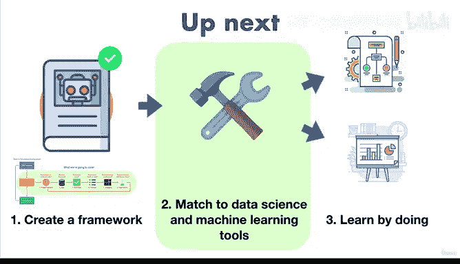

# 24：实验 🧪

在本节课中，我们将学习机器学习项目流程中的第六步：实验。我们将了解实验的重要性，以及如何通过迭代尝试不同的方法和工具来优化模型。

---

## 概述

上一节我们介绍了建模步骤，本节中我们来看看实验环节。实验是机器学习项目中至关重要的一步，它意味着不断尝试、评估和改进，以找到最佳解决方案。

机器学习项目是一个高度迭代的过程。你可能会尝试一种方法，发现效果不佳，然后尝试另一种，如此循环往复。在实践中，遵循一个清晰的流程（如我们目前所学的框架）可以将机器学习项目转化为工具匹配项目。我们将学习如何应用这个流程，并为每个步骤匹配合适的工具。

## 实验在流程中的位置

以下是机器学习项目的六个核心步骤，实验是其中的最后一步，但也是贯穿始终的迭代循环的一部分：

1.  **问题定义**
2.  **数据**
3.  **评估**
4.  **特征**
5.  **建模**
6.  **实验**

这个过程是高度迭代的。例如，当有人给你一个数据集并要求你从中发现洞见时，你会从第一步“定义问题”开始。接着进行第二步“查看数据”，这部分也称为数据分析。同时，你会基于问题定义评估指标（第三步），并检查数据的不同特征（第四步）。

对数据有初步了解后，你决定使用发现的特征构建一个机器学习模型来预测某个目标，这就是第五步“建模”。你的第一个模型可能表现不错，输入与问题匹配良好，并产生了不错的输出。

## 实验实践：一个例子

在提交初步报告后，你的项目经理可能会询问模型是否可以进一步改进以获得更好的结果。这时，你就进入了第六步：实验。

以下是实验过程中可能采取的行动：

*   **尝试不同的模型**：例如，从 `model_1` 切换到 `model_2`，观察其性能。
*   **调整输入**：如果新模型效果仍不理想，可以尝试稍微改变输入特征。
*   **改变输出目标**：根据反馈，调整你希望模型预测的目标变量，并尝试另一个新模型。

如果这些步骤看起来有些复杂，请不要担心。在本课程中，我们将通过大量的动手实践项目来熟练掌握这个过程。

## 课程进展回顾

还记得课程开始时我们提到的三个主要学习阶段吗？

1.  创建一个框架。
2.  将框架与数据科学和机器学习工具相匹配。
3.  通过实践来学习。

经过前几节课的学习，我们已经完成了第一步。我们获得了一个可用于机器学习项目建模部分的框架。这个框架非常清晰：从问题定义到数据、评估、特征、建模，最后是实验，整个过程是迭代的。

接下来，我们将学习可以应用哪些工具来将这个框架落实到不同的项目中。当然，为了掌握这一切，我们将亲自动手，编写机器学习代码并创建我们自己的项目。

## 总结

本节课中我们一起学习了机器学习工作流程中的实验步骤。我们了解到实验是一个基于反馈进行迭代和优化的关键阶段，可能涉及尝试不同的模型、调整输入数据或改变输出目标。记住，你可以随时查看课程资源部分以获取所需的额外材料，那里汇总了我们讨论过的所有内容。