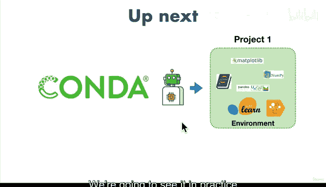

# 29：什么是Conda？🐍

在本节课中，我们将学习Conda的概念，理解它与Anaconda和Miniconda的区别，并了解它如何作为数据科学家的“个人助理”来管理代码包和项目环境。

---

上一节我们介绍了Anaconda和Miniconda的区别。本节中，我们来看看Conda本身。

如果Anaconda和Miniconda是数据科学家的“五金店”和“工作台”，那么Conda就像是数据科学家的“个人助理”。它能帮助你设置工作台，在需要时订购新工具，复制你正在使用的工具集以与他人分享，以及更多功能。

正式来说，Anaconda和Miniconda被称为**软件发行版**，而Conda被称为**包管理器**。

还记得“包”是什么吗？一个包是他人编写、可供你使用的代码集合。Conda帮助你下载、安装和管理这些包。

当你下载Anaconda或Miniconda并安装到电脑上时，Conda会随之一起安装。因为我们使用的是Miniconda，它只包含Python等基础工具来帮助你起步，而不是像Anaconda那样包含全部数据科学工具库。但Miniconda同样附带了Conda。

我知道一开始这可能令人困惑，相信我，我也花了一些时间才理解。Conda允许我们做的是安装其他工具。所以，我们有了Miniconda这个基础，电脑上有了Python，然后我们使用包管理器Conda来安装其他包。

你可能会想：丹尼尔，为什么我们要这样做？这看起来太复杂了，步骤这么多。是的，我已经有了电脑，你却告诉我需要下载Miniconda。Miniconda附带Conda，而Conda像个帮我安装别人编写的代码包的个人助理。我完全理解你，我刚开始时也一样。但在与不同团队合作后，我开始明白为每个项目建立这种设置是多么重要。

接下来，我们将看到Conda——我们数据科学工具的“个人助理”——如何帮助我们创建一个**环境**，该环境包含可用于不同项目的不同包。

我理解你可能现在有点困惑，这个概念我也花了一些时间才理解。但我们将在课程中通过一系列不同的实例来实践它。

---

本节课中，我们一起学习了Conda作为包管理器的核心角色，它如何与Miniconda配合工作，以及它通过创建和管理环境来支持不同项目的重要性。