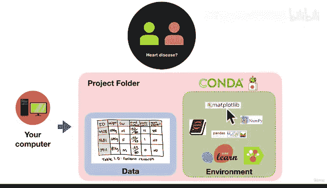

#  31：Mac 环境设置 🍎


在本节课中，我们将学习如何在 Mac 操作系统上为数据科学和机器学习项目设置开发环境。我们将从下载和安装必要的软件开始，逐步创建项目文件夹和虚拟环境，并最终启动一个 Jupyter Notebook 来验证我们的设置。

---

## 概述

设置一个结构清晰、工具齐全的开发环境是进行数据科学和机器学习工作的第一步。本节课将引导你完成在 Mac 上使用 Miniconda 和 Conda 来搭建这样一个环境的过程。我们将创建一个项目文件夹，并在其中建立一个包含常用数据科学库（如 Pandas、NumPy、Matplotlib 和 Scikit-learn）的独立虚拟环境。

---

## 环境设置流程图

上一节我们介绍了课程的目标，本节中我们来看看实现这个目标的具体步骤。以下是设置环境的整体流程：


这个流程图概括了我们将要执行的主要步骤。对于初学者，这个过程可能看起来有些复杂，但请放心，我们会一步步详细讲解。一旦你掌握了这个流程，它将成为你未来所有数据科学项目的基础。

---

## 第一步：下载并安装 Miniconda

首先，我们需要在电脑上安装 Miniconda。Miniconda 是一个轻量级的 Conda 发行版，它比完整的 Anaconda 占用更少的空间（约 200 MB），但包含了我们所需的核心工具。

1.  打开浏览器，访问 Miniconda 的官方网站。
2.  由于我们使用的是 Mac OS，请选择对应的 Mac 版本进行下载。
3.  确保下载的是最新版本（基于 Python 3），因为 Python 2 已在 2020 年逐步停止支持。
4.  下载文件格式为 `.pkg` 的安装包。

下载完成后，打开安装包。你将看到 Miniconda3 的安装向导。按照提示进行操作：

*   点击“继续”。
*   阅读并同意软件许可协议。
*   选择“仅为我安装”选项。
*   确认安装位置（默认位置即可）。
*   点击“安装”并等待安装完成。

安装成功后，你的电脑就具备了 Conda 这个强大的包和环境管理工具。

---

## 第二步：创建项目文件夹

安装好 Miniconda 后，我们需要为项目创建一个独立的工作空间。我们将使用 Mac 的“终端”应用程序通过命令行来完成这个操作。

以下是创建项目文件夹的步骤：

1.  打开“终端”应用程序。
2.  你会注意到命令行提示符前出现了 `(base)`，这表示你当前处于 Conda 的“基础”环境中。
3.  使用 `cd`（change directory）命令切换到桌面目录：
    ```bash
    cd Desktop
    ```
4.  使用 `mkdir`（make directory）命令创建一个名为 `sample_project` 的文件夹：
    ```bash
    mkdir sample_project
    ```
5.  使用 `ls`（list）命令查看桌面上的文件，确认文件夹已创建成功。

现在，你已经在桌面上创建了一个名为 `sample_project` 的空项目文件夹。未来，你可以为每个新项目创建类似的文件夹，以保持工作井然有序。

---

## 第三步：创建虚拟环境

接下来，我们将在项目文件夹内创建一个独立的虚拟环境。虚拟环境就像一个隔离的工具箱，里面只包含当前项目所需的特定版本的库，避免了不同项目之间的依赖冲突。

以下是创建虚拟环境的命令和解释：

1.  首先，进入刚创建的项目文件夹：
    ```bash
    cd sample_project
    ```
2.  使用 Conda 命令创建环境。我们将创建一个包含 Pandas、NumPy、Matplotlib 和 Scikit-learn 的环境：
    ```bash
    conda create --prefix ./ml_env pandas numpy matplotlib scikit-learn
    ```
    *   `conda create`：告诉 Conda 我们要创建一个新环境。
    *   `--prefix ./ml_env`：指定环境的创建路径。`./` 表示当前目录（即 `sample_project`），环境将被命名为 `ml_env` 并创建在该文件夹内。
    *   `pandas numpy matplotlib scikit-learn`：这是我们要安装到环境中的核心数据科学库列表。

运行命令后，Conda 会分析这些库的依赖关系，并列出所有将要下载和安装的包。输入 `y` 并回车确认，Conda 就会开始自动下载和安装所有必要的组件。

安装完成后，Conda 会提示你激活环境的命令。环境 `ml_env` 现在已创建在 `sample_project` 文件夹中。

---

## 第四步：激活环境并启动 Jupyter Notebook

环境创建好后，我们需要激活它才能使用其中的工具。激活后，我们将启动 Jupyter Notebook，这是一个在浏览器中运行、非常适合进行数据分析和探索的交互式笔记本。

以下是具体步骤：

1.  根据上一步的提示，或使用以下命令激活环境（请将路径替换成你自己的）：
    ```bash
    conda activate /Users/YourUsername/Desktop/sample_project/ml_env
    ```
    激活成功后，命令行提示符会从 `(base)` 变为 `(ml_env)`，表明你现在处于新创建的环境中。
2.  你可以使用 `conda env list` 命令查看所有环境，星号 `*` 会标记出当前激活的环境。
3.  现在，在激活的 `ml_env` 环境中，启动 Jupyter Notebook：
    ```bash
    jupyter notebook
    ```
    执行该命令后，你的默认浏览器会自动打开 Jupyter Notebook 的界面。

在 Jupyter Notebook 中，你可以新建一个 Python 笔记本，并尝试导入我们安装的库来验证环境是否工作正常：

```python
import pandas as pd
import numpy as np
import matplotlib.pyplot as plt
from sklearn import datasets
```

如果没有报错，恭喜你！你的 Mac 数据科学开发环境已经成功搭建完毕。


---

## 总结




本节课中，我们一起学习了如何在 Mac 上设置数据科学开发环境。我们完成了从下载 Miniconda、创建项目文件夹、使用 Conda 建立独立的虚拟环境，到最终启动 Jupyter Notebook 的完整流程。这个环境为你后续的机器学习项目打下了坚实的基础，确保每个项目都能在干净、可控的依赖关系中运行。记住这个流程，它将成为你数据科学生涯中的标准操作。