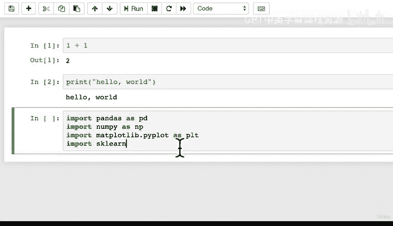
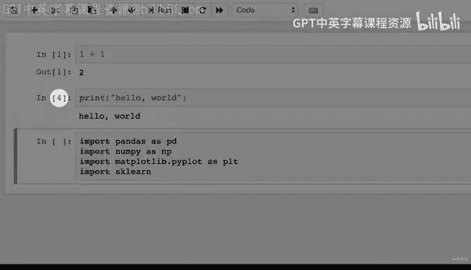
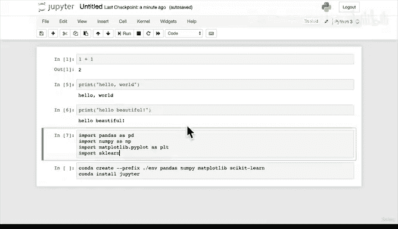
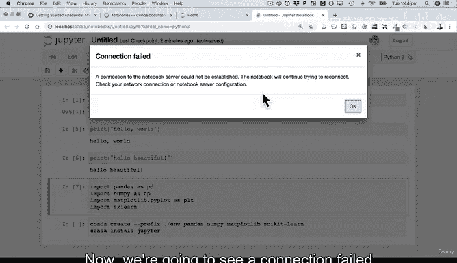
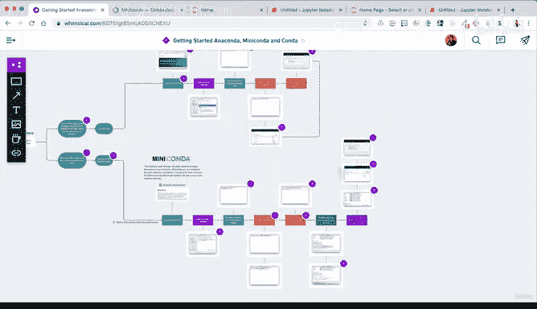

# 32：Mac环境设置2 🛠️


在本节课中，我们将学习如何启动Jupyter Notebook，安装缺失的包，并验证我们的数据科学环境是否已正确设置。我们将通过实际操作来确保所有必要的工具（如pandas、NumPy、Matplotlib和scikit-learn）都可在Jupyter Notebook中正常使用。

---

## 启动Jupyter Notebook

要启动Jupyter Notebook，请在终端中输入以下命令：

```bash
jupyter notebook
```

如果你不确定Jupyter Notebook是什么，不必担心。我们后续会有专门章节介绍如何使用它。目前你只需知道，Jupyter Notebook是一个可以编写Python代码（特别是机器学习和数据科学代码）、添加文本说明并与他人分享工作的平台。它就像一个可以在线共享的大型工作区。

我们按下回车键。然而，可能会遇到以下错误：

```
jupyter: command not found
```

---

## 安装缺失的Jupyter包

上一节我们介绍了如何使用Conda创建环境并安装核心包。本节中我们来看看为什么会出现上述错误。

错误的原因是我们在创建环境时，漏掉了`jupyter`这个包。回顾之前的安装命令：

```bash
conda create --prefix ./env pandas numpy matplotlib scikit-learn
```

这个命令安装了`pandas`、`numpy`、`matplotlib`和`scikit-learn`，但没有安装`jupyter`。因此，我们需要单独安装它。

以下是修复步骤：

1.  使用Conda安装Jupyter包：

    ```bash
    conda install jupyter
    ```

    `conda install`命令用于安装缺失的包或工具。我们本可以将`jupyter`添加到最初的安装命令末尾，但这里我们故意漏掉它以演示这个修复过程。

2.  按下回车后，Conda会查询网络并列出将要安装的新包。输入`y`确认安装。

这个过程可能需要几秒钟。虽然当前步骤看起来有些冗长，但一旦理解核心概念，未来为新项目创建环境几乎可以简化为一行命令。现在，我们按部就班地操作，既能理解概念，也能为未来的项目建立一个基础环境。

---

## 验证环境设置

安装完成后，我们再次尝试启动Jupyter Notebook：





```bash
jupyter notebook
```

这次命令应该成功执行，并在浏览器中打开Jupyter界面。你会看到当前目录（`sample_project`）下的文件列表。

现在，让我们在Jupyter Notebook中验证其他核心数据科学库是否可用。

1.  在Jupyter界面中，点击“New” -> “Python 3”创建一个新的Notebook。
2.  在第一个单元格中，输入以下代码来导入我们安装的关键库：

    ```python
    import pandas as pd
    import numpy as np
    import matplotlib.pyplot as plt
    import sklearn
    print("Hello, beautiful")
    ```

    *   `import`语句告诉Python去获取这些工具，以便我们在Notebook中使用。
    *   `pandas`通常缩写为`pd`，`numpy`缩写为`np`，`matplotlib.pyplot`缩写为`plt`，`scikit-learn`缩写为`sklearn`。这些是社区惯例，可以节省打字时间。

3.  按`Shift + Enter`运行这个单元格。如果每个导入语句都没有报错，并且成功打印出信息，则说明环境设置成功。

---

## 理解工作流程与项目结构

让我们回顾一下整个设置过程的核心命令和工作流：

```bash
# 1. 在项目文件夹内创建环境并安装核心包
conda create --prefix ./env pandas numpy matplotlib scikit-learn



# 2. 激活该环境
conda activate ./env

# 3. 在已激活的环境中安装jupyter
conda install jupyter



# 4. 启动Jupyter Notebook
jupyter notebook
```

我们做了什么？
*   在计算机上创建了一个项目文件夹（例如`sample_project`）。
*   在该文件夹内，使用Conda创建了一个独立的环境（`./env`）。
*   在该环境中安装了`pandas`、`numpy`、`matplotlib`、`scikit-learn`和`jupyter`。
*   现在，项目文件夹内既包含了我们的工作环境（工具集），也包含了我们编写的代码（Jupyter Notebook文件）。

这种将所有内容（环境、代码、数据）放在一个项目文件夹中的方式，极大地方便了工作的管理和共享。你可以轻松地将整个文件夹发送给同事，他们就能获得完全一致的工作环境。

---

## 关闭环境与退出Jupyter

上一节我们介绍了如何启动和进入环境，本节中我们来看看如何正确地退出。

当你结束一天的工作或想切换到其他项目时，需要执行以下步骤：

1.  **关闭Jupyter Notebook服务器**：
    *   回到启动Jupyter的终端窗口。
    *   按下 `Ctrl + C` 组合键。
    *   终端会询问是否要关闭服务器，输入 `y` 确认。
    *   之后可能会看到“连接失败”的提示，这是正常的，因为服务器已关闭。

2.  **停用当前Conda环境**：
    *   服务器关闭后，你可能仍处于激活的`env`环境中。
    *   要退出当前环境，回到基础的`base`环境，请输入：

        ```bash
        conda deactivate
        ```

    *   命令提示符将从`(env)`变回`(base)`。在`base`环境中，之前安装的`jupyter`等包是不可用的。

3.  **重新激活环境**：
    *   当你下次想继续在此项目上工作时，需要重新激活该环境。请进入你的项目目录，然后运行：

        ```bash
        conda activate ./env
        ```

    *   请注意，此命令路径（`./env`）取决于你创建环境时的具体位置和名称，你需要根据自己项目的实际情况进行调整。

---

## 总结 🎯

本节课中我们一起学习了Mac环境下数据科学工作流的后续步骤：

1.  **启动与问题排查**：学习了如何启动Jupyter Notebook，并解决了因缺少`jupyter`包而导致的“command not found”错误。
2.  **安装缺失包**：使用 `conda install jupyter` 命令在已创建的环境中补充安装必要的工具。
3.  **环境验证**：在Jupyter Notebook中成功导入 `pandas`、`numpy`、`matplotlib` 和 `scikit-learn`，验证了环境设置正确。
4.  **工作流回顾**：梳理了从创建项目文件夹、建立独立环境、安装包到启动工作的完整流程，其核心是使用Conda管理项目特定的依赖。
5.  **退出与切换**：掌握了如何安全地关闭Jupyter服务器以及使用 `conda deactivate`/`conda activate` 在不同项目环境间切换。



现在，你已经拥有了一个包含所有必要工具、独立且可复现的数据科学工作环境，可以开始进行数据分析和机器学习模型的探索了。如果在设置过程中遇到问题，请务必查阅课程资源部分提供的流程图和补充指南。