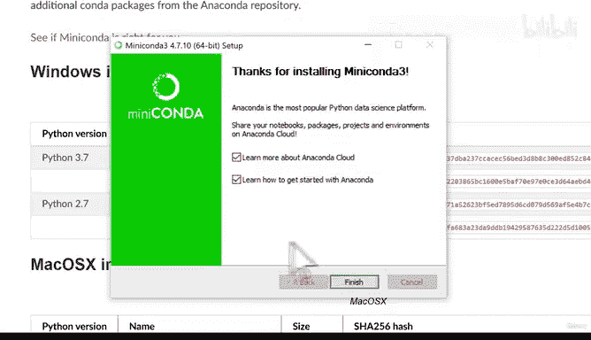
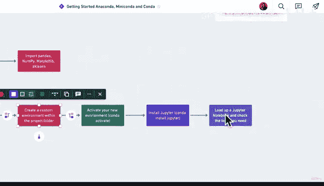

# 33：Windows环境设置 🖥️

在本节课中，我们将学习如何在Windows操作系统上设置数据科学与机器学习的工作环境。我们将从零开始，逐步安装必要的工具，并建立一个标准化的项目工作流程。

## 概述

你可能看到过类似的工作流程图，但对其中提到的Miniconda、Jupyter、Python等工具感到陌生。这很正常，理解这种工作流程需要一些时间。本节课将专门针对Windows用户，详细介绍如何搭建这个环境。如果你使用的是Mac，请参考对应的Mac版本教程。

我们将从你现有的计算机开始，逐步设置项目文件夹，并使用Conda（我们数据科学工具的“个人助理”）来创建独立的虚拟环境。请注意，这种工作流程适用于每一个新项目。虽然本节课我们只是设置一个示例项目，但在本课程后续的实践项目中，你都会重复这个流程。现在，让我们先通过这个练习来熟悉整个设置过程。

## 详细步骤

以下是搭建环境的完整步骤流程图，你可以在课程资源区找到它。我们选择使用Miniconda，因为它是数据科学家的“工作台”，相比Anaconda占用空间小10倍，但提供了Conda的全部核心功能。

具体步骤如下：
1.  下载Miniconda。
2.  将其安装到计算机。
3.  测试安装是否成功。
4.  创建项目文件夹并进入。
5.  在项目文件夹内创建一个虚拟环境。
6.  激活新环境，以便使用环境中安装的工具。
7.  安装Jupyter。
8.  启动Jupyter Notebook并检查所需工具。

现在，让我们开始动手操作。

### 第一步：下载Miniconda

首先，打开你的网页浏览器。

在搜索栏中输入“Miniconda download”并搜索。点击搜索结果中的链接，你将进入Miniconda的官方下载页面，网址类似下图所示。

在下载页面，你会看到多个选项和链接。由于我们正在设置Windows版本，请下载Windows版的Miniconda。如果你使用macOS，请寻找对应的macOS版本。

我们选择最新版本，即“Miniconda3 Windows 64-bit”的Python 3.7版本。因为Python 2.7在2020年后已不再维护，所以我们将专注于Python 3及以上版本。点击该链接进行下载。

下载完成后，系统可能会对文件进行安全扫描。请等待下载完成。下载的文件图标（Miniconda图标）可能会出现在屏幕底部的任务栏，如果没有，请检查你的“下载”文件夹，找到刚刚下载的文件，其名称应类似下图所示。

### 第二步：安装Miniconda

找到下载的安装文件并双击打开，你将看到安装向导界面。

接下来，我们只需按照向导提示逐步操作：点击“Next”，同意许可协议（“I Agree”）。

我们保持推荐设置，点击“Install”开始安装。你可能会看到Anaconda的Logo，但请不要困惑，我们安装的确实是Miniconda，请关注Miniconda的安装进程。

选择“Just Me”（仅为我安装），保持推荐路径，点击“Next”。

在我的例子中，安装路径是用户目录下的`Users/Daniel/Miniconda3`。你可以选择其他位置，但确保路径易于访问。用户文件夹对我来说很方便，所以我保持原路径。

再次确认保持推荐设置（不勾选“Add Miniconda to my PATH environment variable”选项，安装程序提示不推荐勾选此选项）。然后点击“Install”并等待安装完成。

安装完成后，取消勾选所有可选选项（例如“Learn more about Anaconda Cloud”），然后点击“Finish”。

至此，如果你已跟随上述步骤操作，你的计算机上应该已经成功安装了Miniconda。

## 本节总结

在本节中，我们完成了环境设置流程的前两步：下载并安装了Miniconda。为了防止本节课内容过长，我们将在下一个视频中继续完成剩余的步骤，包括测试安装、创建项目文件夹以及后续所有操作。我们下个视频见。