# 34：Windows环境设置（第二部分） 🖥️


在本节课中，我们将继续学习如何在Windows系统上设置机器学习和数据科学的工作环境。我们将从上一节下载并安装Miniconda之后开始，逐步完成创建项目文件夹、构建自定义环境、安装必要工具并启动Jupyter Notebook的完整流程。

---

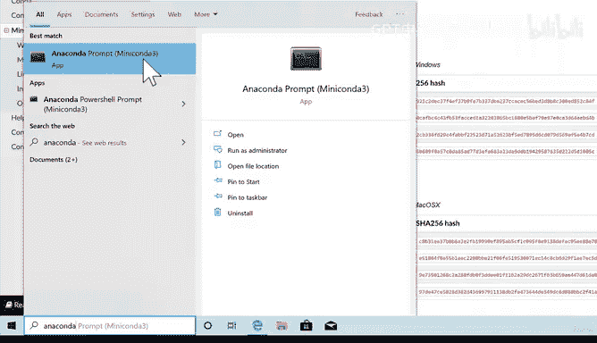

## 环境测试与项目文件夹创建

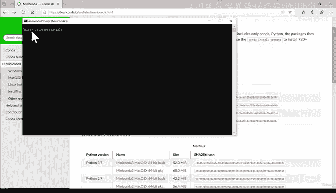

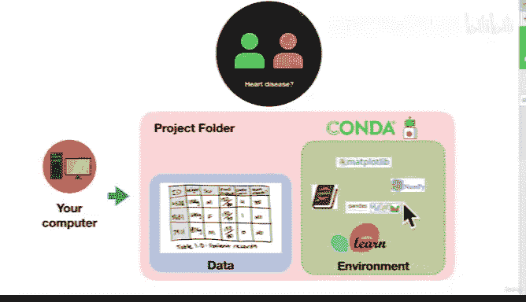

上一节我们介绍了如何下载并安装Miniconda。本节中，我们来看看如何测试安装是否成功，并创建我们的第一个项目文件夹。

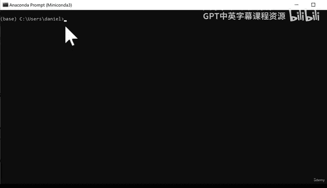

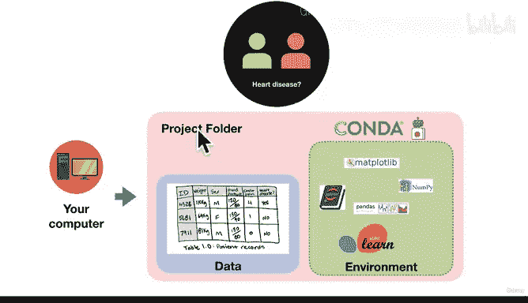

首先，我们需要测试Miniconda是否已正确安装。可以通过搜索并打开“Anaconda Prompt”来完成。这是一个命令行工具，类似于Mac OS中的终端，允许你输入代码指令并让计算机执行。

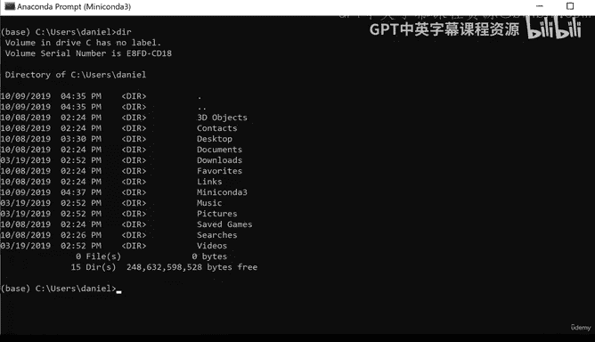

打开Anaconda Prompt后，你会看到类似 `(base) C:\Users\你的用户名>` 的提示符。这里的 `(base)` 表示你当前处于Conda的默认基础环境中。

接下来，我们需要创建一个项目文件夹来存放我们的工作文件。我们将把这个文件夹创建在桌面上，以便于访问。

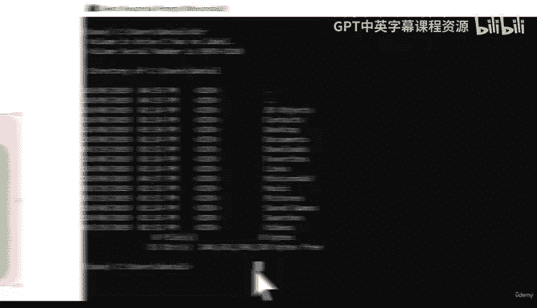

以下是创建项目文件夹的步骤：

1.  首先，查看当前目录下的文件夹列表。可以使用 `dir` 命令（directory的缩写）。
2.  然后，切换到桌面目录。使用 `cd desktop` 命令（cd代表change directory）。
3.  最后，在桌面上创建新文件夹。使用 `mkdir 文件夹名` 命令（mkdir代表make directory）。

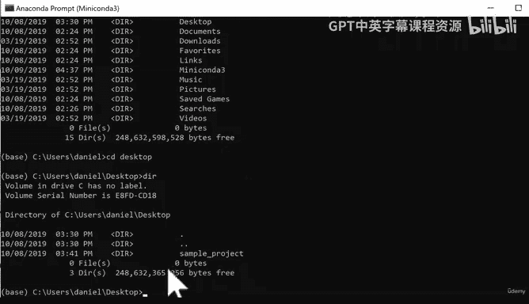

例如，我们将创建一个名为“sample_project_one”的文件夹。

```bash
cd desktop
mkdir sample_project_one
```

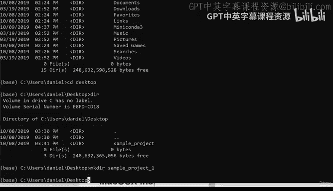

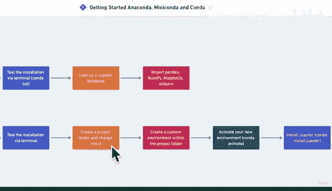

创建完成后，我们需要进入这个新文件夹，以便后续操作都在此目录下进行。

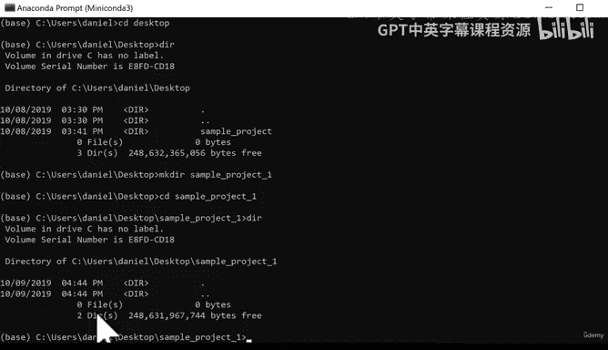

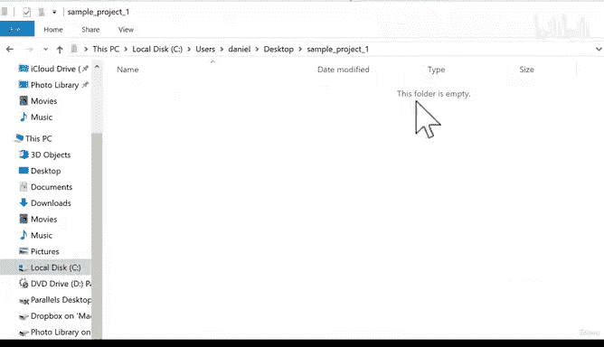

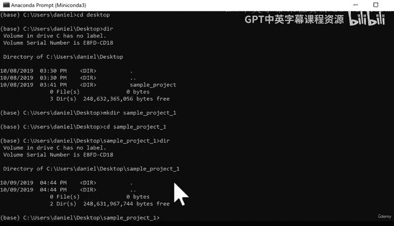

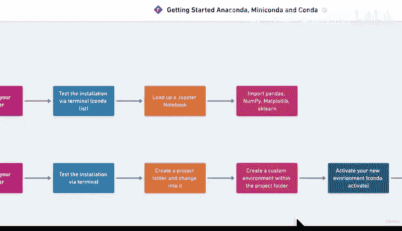

```bash
cd sample_project_one
```

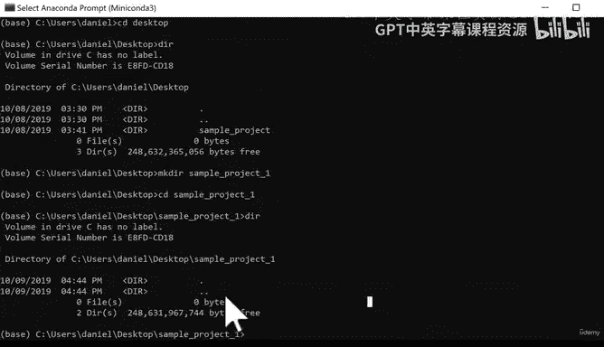

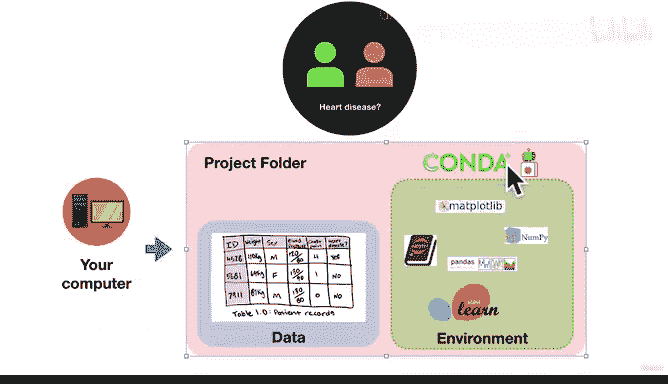

现在，我们已经成功创建并进入了项目文件夹。接下来，我们将在这个文件夹内使用Conda创建一个自定义的、包含我们所需工具的环境。

---

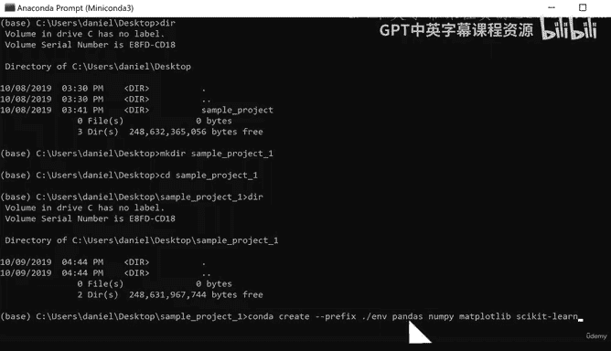

## 使用Conda创建自定义环境

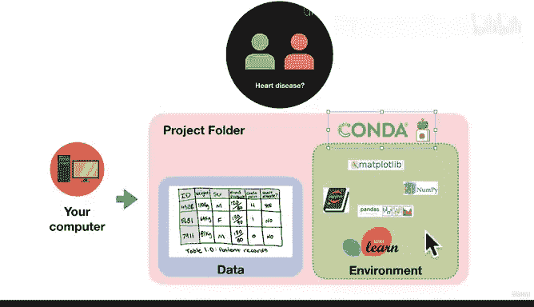

上一节我们创建了项目文件夹。本节中，我们将使用Conda在这个文件夹内创建一个隔离的Python环境，并安装核心的数据科学库。

环境就像是一个独立的工作区，里面包含了项目所需的所有特定版本的软件包，而不会影响你计算机上的其他项目。我们将创建一个名为 `env`（environment的缩写）的环境。

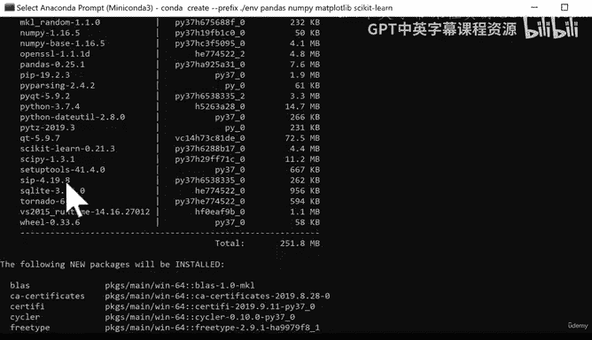

我们将使用以下命令来创建环境并一次性安装多个核心库：

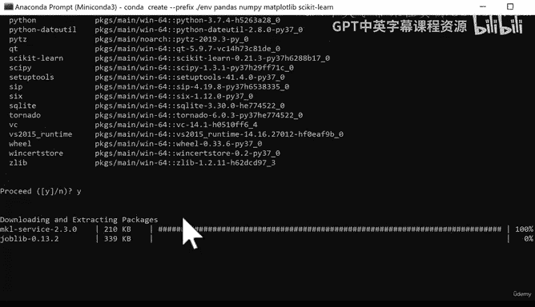

```bash
conda create --prefix ./env pandas numpy matplotlib scikit-learn
```

让我们分解一下这个命令：
*   `conda create`： 告诉Conda我们要创建一个新环境。
*   `--prefix ./env`： 指定环境的创建路径。`./` 表示当前目录（即 `sample_project_one`），`env` 是环境文件夹的名称。
*   `pandas numpy matplotlib scikit-learn`： 这是我们要在新环境中安装的软件包列表。它们分别是数据处理、数值计算、图表绘制和机器学习的核心库。

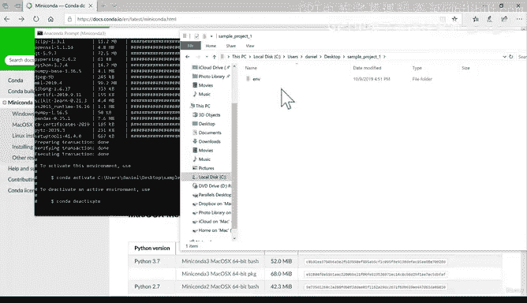

运行命令后，Conda会分析这些包的依赖关系，并列出所有需要下载和安装的组件。确认无误后，输入 `y` 并按回车开始安装。这个过程可能需要几分钟，取决于你的网速。

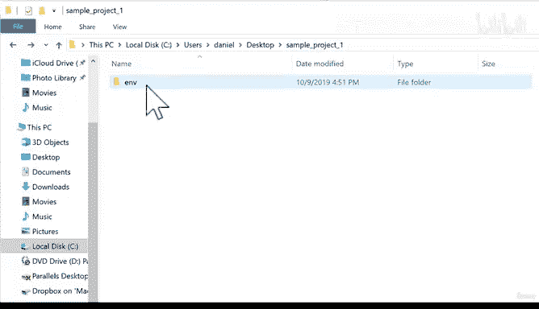

安装完成后，你会在 `sample_project_one` 文件夹内看到一个名为 `env` 的新文件夹，里面包含了所有已安装的工具。

---

## 激活环境与安装Jupyter

环境创建好后，我们需要“激活”它才能使用其中的工具。激活环境相当于进入这个特定的工作区。

要激活我们刚刚创建的环境，需要使用以下命令（请将路径中的“你的用户名”替换为你自己的用户名）：

```bash
conda activate C:\Users\你的用户名\desktop\sample_project_one\env
```

激活成功后，命令行提示符会从 `(base)` 变为显示你的环境路径，这表明你现在已处于自定义环境中。

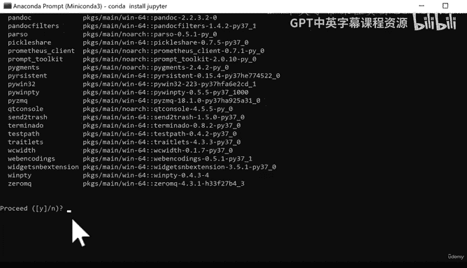

接下来，我们需要安装Jupyter Notebook，这是一个交互式笔记本，是数据科学家进行代码编写、文档记录和项目展示的主要工具。

在激活的环境中，使用以下命令安装Jupyter：

```bash
conda install jupyter
```

Conda会再次解析依赖并开始安装。输入 `y` 确认安装。安装完成后，我们就可以启动Jupyter Notebook了。

---

## 启动Jupyter并测试环境

现在，所有工具都已就绪。让我们启动Jupyter Notebook并测试环境是否配置正确。

在激活的环境下，输入以下命令：

```bash
jupyter notebook
```

这个命令会自动在你的默认浏览器中打开Jupyter的界面。界面中显示的文件和文件夹就是你当前项目目录（`sample_project_one`）下的内容。

为了测试我们的数据科学环境是否工作正常，我们需要创建一个新的Notebook并尝试导入核心库。

1.  在Jupyter界面中，点击右上角的“New”按钮，选择“Python 3”来创建一个新的笔记本。
2.  在第一个代码单元格中，输入以下代码来导入我们安装的库：

```python
import pandas as pd
import numpy as np
import matplotlib.pyplot as plt
import sklearn
print("所有库导入成功！环境已就绪。")
```

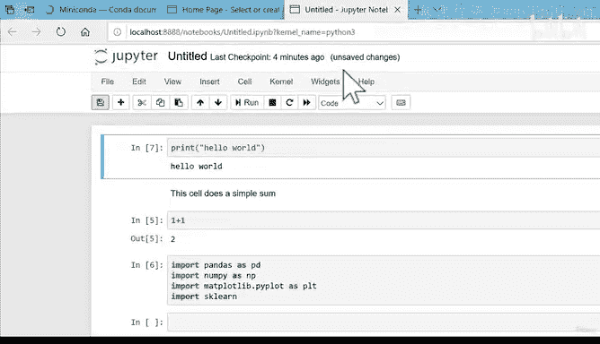

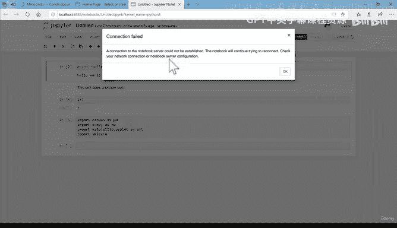

3.  按 `Shift + Enter` 运行这个单元格。

如果代码运行后没有出现任何错误提示，并且显示了“所有库导入成功！环境已就绪。”，那么恭喜你！你的机器学习和数据科学开发环境已经成功搭建完成。

---

## 日常使用流程与总结

本节课中，我们一起学习了从安装Miniconda到建立一个完整可用的数据科学工作环境的全过程。让我们总结一下关键的步骤和日常的工作流程：

**核心设置步骤回顾：**
1.  **下载安装Miniconda**：获取Python和Conda环境管理器。
2.  **创建项目文件夹**：为每个新项目建立独立的目录。
3.  **创建自定义环境**：在项目文件夹内，使用 `conda create --prefix ./env [包列表]` 命令构建一个包含所需工具的环境。
4.  **激活环境**：使用 `conda activate [环境完整路径]` 进入该环境。
5.  **安装额外工具**：在环境中，使用 `conda install [包名]` 安装像Jupyter这样的工具。
6.  **启动与测试**：运行 `jupyter notebook`，在浏览器中创建笔记本并测试库的导入。

**日常项目工作流程：**
*   **开始工作时**：打开Anaconda Prompt，导航到你的项目文件夹，然后激活对应的环境。
*   **进行开发**：启动Jupyter Notebook，在浏览器中进行编码和数据分析。
*   **结束工作时**：在Jupyter中保存笔记本，在浏览器中关闭标签页。回到Anaconda Prompt，按 `Ctrl+C` 两次来关闭Jupyter服务器。最后，可以使用 `conda deactivate` 退出当前环境。

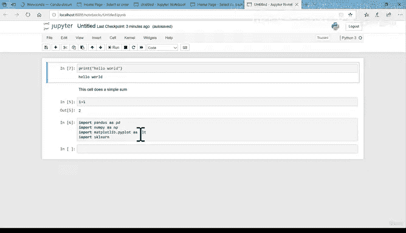

这个流程是未来所有项目的基础。它保证了项目的独立性、依赖管理的清晰性，也是在团队中复现工作环境的关键。虽然初次设置步骤较多，但一旦掌握，它将极大地提升你的开发效率和项目可维护性。如果在过程中遇到问题，回顾本教程或查阅相关资源都是很好的解决方法。