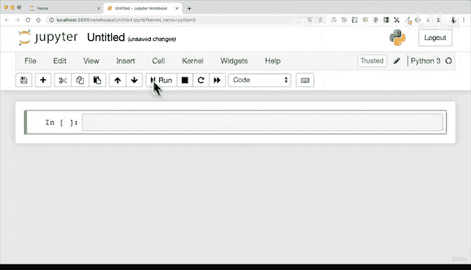
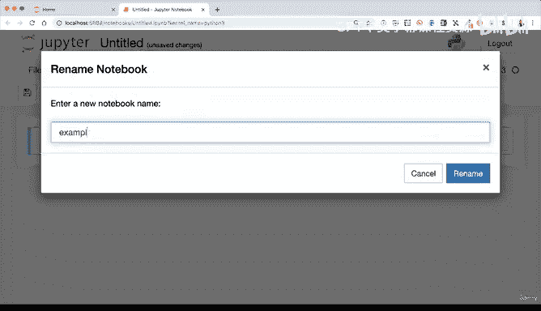
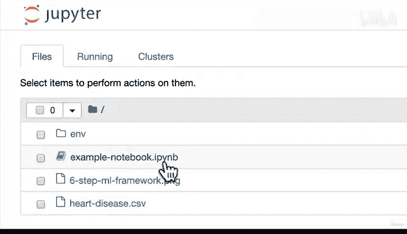
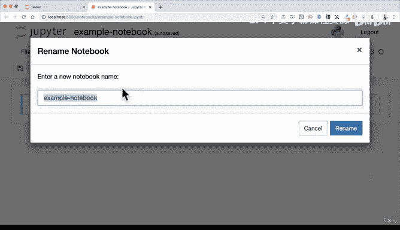
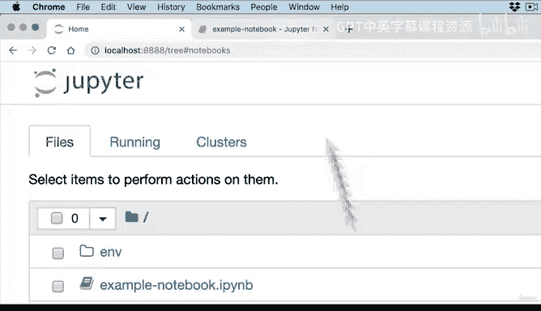

# 35：Jupyter Notebook 演练 🚀

在本节课中，我们将开始动手操作机器学习和数据科学中最受欢迎的工具之一：Jupyter Notebook。我们将学习如何启动、导航并使用Jupyter Notebook的基本功能。

---

## 概述

在之前的章节中，我们建立了工作流程：设置计算机、创建项目文件夹，并使用Conda创建了一个包含机器学习和数据科学工具的环境。现在，我们将开始深入探索这些工具，特别是本节重点关注的Jupyter Notebook。

Jupyter Notebook可以被视为你处理所有机器学习和数据科学项目的工作空间。我们将遵循以下工作流程：在已创建的项目文件夹中，激活环境以访问工具，然后在Jupyter Notebook中导入数据，并使用环境中的一系列工具从数据中获取洞察和信息。

现在，让我们开始动手操作Jupyter Notebook。

---

## 启动Jupyter Notebook

首先，打开终端（Windows用户可打开Anaconda Prompt）。我们需要激活环境以访问工具，并切换到项目文件夹。

以下是如何操作的步骤：

1.  切换到项目文件夹。例如，使用命令 `cd Desktop/ML_course/sample_project`。
2.  激活环境。使用命令 `conda activate [你的环境路径]`。激活后，终端提示符会从 `base` 变为你的环境名称。
3.  启动Jupyter Notebook。输入命令 `jupyter notebook` 并按回车。

执行此命令后，你的默认浏览器将自动打开，并显示Jupyter仪表盘。仪表盘是你项目文件夹的另一个视图。

---

## 认识Jupyter仪表盘

仪表盘界面主要包含以下几个部分：

*   **文件列表**：显示当前文件夹中的文件和目录。
*   **“上传”按钮**：用于将文件从本地计算机上传到当前Jupyter工作目录。
*   **“新建”按钮**：用于创建新项目，如笔记本、文本文件或文件夹。
*   **标签页**：
    *   **运行中**：显示当前正在运行的终端和笔记本。
    *   **集群**：目前无需关注。

“上传”功能本质上是将文件复制到你的项目文件夹中。例如，上传一个CSV文件后，你可以在项目文件夹中找到它。

---

## 创建你的第一个笔记本

点击“新建”按钮，然后选择“Python 3”。这将创建一个新的Jupyter Notebook，并打开一个新窗口。

Jupyter Notebook界面主要包含以下部分：

*   **标题**：位于顶部，可以点击进行重命名。笔记本文件以 `.ipynb` 为扩展名（代表“IPython Notebook”）。
*   **菜单栏**：包含文件、编辑等标准操作选项。
*   **工具栏**：提供对单元格进行操作的快捷命令。
*   **单元格**：这是笔记本的核心组成部分。每个单元格可以包含**代码**或**Markdown格式的文本**。

例如，在一个标记为“代码”的单元格中输入 `print("Hello World")`，然后按 `Shift + Enter` 执行，就会输出结果。在一个标记为“Markdown”的单元格中，你可以编写格式化的文本说明。

启动Jupyter Notebook后，终端窗口会显示类似 `http://localhost:8888/` 的信息，这表示笔记本正在你的本地计算机上运行，并通过浏览器进行访问，这是正常现象。

---

## 总结

本节课我们一起学习了Jupyter Notebook的基础操作。我们了解了如何从终端激活环境并启动Jupyter，熟悉了Jupyter仪表盘的界面，并成功创建了第一个笔记本，认识了标题、菜单栏、工具栏和核心的单元格概念。

在下一节视频中，我们将进一步探索如何在Jupyter Notebook中使用单元格，以及工具栏中各种工具的具体功能。