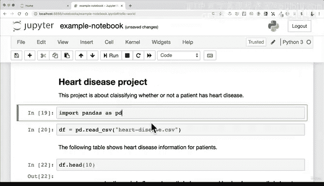

# 36：Jupyter Notebook 演练2 🚀


## 概述

在本节课中，我们将学习如何在 Jupyter Notebook 中实际操作，包括运行代码、使用 Markdown 格式化文本、查看数据、绘制图表以及执行终端命令。我们将专注于使用键盘快捷键来提高效率，并理解 Notebook 单元格的执行顺序。

---

## 启动与运行

上一节我们介绍了 Jupyter Notebook 的基本界面。本节中我们来看看在这个 Notebook 中具体能做些什么。

现在我们已经运行了一个 Jupyter Notebook。是时候看看我们在这个笔记本里能做什么了。记住在上节课中我们浏览过这个界面，这是标准的菜单栏，这是工具栏。但我们将避免使用工具栏，因为我们希望成为使用键盘的专家。这里所有可以做的事情，比如保存、添加、剪切、复制、粘贴等，都可以用键盘完成。

那么这能节省什么时间呢？例如，运行一个单元格。运行是执行代码的方式。如果我们来到这里，也许我们想打印一条友好的消息。

```python
print("Hello world. I'm learning about Jupyter notebooks.")
```

我们按下 `Shift + Enter`。我们本可以那样做。我习惯性地那样做了。这就是我们将要关注的重点。从一开始，我们将专注于使用键盘，而不仅仅是学习如何使用这个工具栏。

我可以一直点击这里的“运行”按钮，或者我可以一直按 `Shift + Enter`。现在你可能注意到，每次我按 `Shift + Enter`，左边的数字都会增加。记住，我刚刚高亮了这个单元格，按 `Shift + Enter`。这就是你在 Jupyter Notebook 中运行一段代码的方式，很漂亮，不是吗？😊

现在这个单元格编号在增加，这表示这是第 13 个单元格。记住，一个单元格可以是代码或 Markdown。我们马上会看到。这个单元格，或者说在 Jupyter 中总共运行了 13 个单元格。

这在以下情况很有帮助：如果你有类似 `a = 5` 的代码（单元格 14），然后你运行 `print(a)`（单元格 15）。哦，我们本意是 `a = 6`（单元格 16）。那么你认为 `a` 现在等于多少？因为这是 14，这是 16，如果我们运行这个并按 `Shift + Enter`，`a` 将等于 6。

所以这些数字有助于向我们展示 Notebook 的运行顺序。例如，如果我们有 100 个包含不同信息的单元格，在理想情况下，Notebook 是从上到下运行的。但在某些情况下，你可能正在处理一个项目，在上面运行一个单元格，然后在下面重新运行它，后来在你的 Notebook 中，往下几百个单元格，你遇到了某种错误，这时你可以用这个来弄清楚你的 Notebook 是以什么顺序运行的。

---

## 代码与 Markdown 模式

因为我们这里有代码，我们可以直接在 Jupyter Notebook 中运行 Python 的所有功能。`Shift + Enter` 运行 `1 + 2`。

你会注意到有些单元格有 `In`，有些单元格有 `Out`。如果一个单元格有某种代码输出，它通常会有一个 `Out` 编号，`Out` 编号与 `In` 编号匹配，这只是表示，嘿，这里有一些输入代码，我们这里有一些输出代码。

之前我们简要地看了一下这个：代码和 Markdown。这就是 Jupyter Notebook 绝对美妙之处，你可以在同一个 Notebook 中同时拥有代码和格式化的文本（这就是 Markdown）。让我给你看一个例子，假设我们想开始一个名为“心脏病”的项目。

**心脏病项目**

记住，Jupyter Notebook 是你数据科学项目的工作空间，所以你可以在其中运行机器学习代码并描述你正在做的事情。我们将在整个课程中看到实践，但我只想强调将一个单元格转换为 Markdown 的作用。

我们可以将其更改为 Markdown。但记住，我们不想习惯使用工具栏。那么我们该怎么做呢？Jupyter 另一个美妙之处是单元格有两种简单的模式。

一种叫做编辑模式，你会注意到这里有一个小铅笔图标，并且周围有一个绿色的框。另一种叫做命令模式。那么，我们如何在两者之间切换呢？正如你可能猜到的，我们也可以使用键盘，因为记住，我们不习惯使用这个工具栏。你甚至可以假装它不存在。

要从编辑模式切换到命令模式，我们要按 `Esc` 键。很好。现在我们注意到绿色的条变成了蓝色的条，铅笔图标消失了。现在，在我们运行这个单元格之前，如何回到编辑模式？按 `Enter` 键。

现在我们绿色的框回来了，小铅笔图标也回来了。很好。但我们实际上想在命令模式下，所以我们要回去，按 `Esc`。蓝色框回来了，铅笔图标消失了。在你有一些经验后，你会习惯运行 `Esc` 和 `Enter`。我知道怎么做这些事情，因为在我的经验中，我已经运行了成千上万个单元格。

我们要按 `M` 代表 Markdown，我需要想一下，因为要把它改回代码是按 `Y`。所以当我们处于命令模式（蓝色框）时，看着这里的小框，我们可以按 `M` 代表 Markdown，或者按 `Y` 代表代码。但在这种情况下，我们想要 Markdown。按 `M`。

要运行这个单元格，我们要按 `Shift + Enter`。现在你看到，这是一些格式漂亮的文本。所以你可以想象，在未来一个项目中，你可能从这里开始一个标题，然后在下面添加一些信息。

**这个项目是关于分类患者是否患有心脏病。**

这就是你如何从项目一开始就沟通你的工作。那么你还能在这里做什么呢？让我们看看一些数据，如果我们回到我们的要点。我们想建立这种设置。所以我们希望项目文件夹中有一些数据。我们希望通过我们的工作空间（即 Jupyter Notebook）运行这些数据，并尝试使用一些这些工具。让我们先体验一下。

---

## 导入数据与库

如果我们来到这里，`import pandas as pd`。这行代码的意思是，这是代码，它告诉 Python：嘿 Python，去获取 pandas，将其导入为快捷方式 `pd`，这对于 pandas 来说非常常见。我们将在未来的视频中更多地了解 pandas。我在这里做的是举例说明你可以在 Jupyter Notebook 中做的不同类型的事情。如果你正在跟着做，请确保你自己输入这些代码。

如果我们输入这行代码并按 `Shift + Enter`，这将把 pandas 导入到这个 Notebook 中。所以现在我们可以在我们的工作空间（Jupyter Notebook）中使用 pandas，这是我们安装在环境中的工具之一。

你还记得上节课我们如何在这里上传了一些文件吗？我们如何获取这些文件？这是一个 `heart-disease.csv` 文件，我们如何获取它？如果你从未听说过 CSV，它是一种称为“逗号分隔值”的格式。这是一种非常常见的存储数据的方式。但你认为我们如何将其导入到这里？没错，如果你不知道，因为你可能从未经历过这个，但我们要做的是使用 pandas 创建一个数据框。`df` 代表数据框。

```python
df = pd.read_csv('heart-disease.csv')
```

我要读取 CSV。我们将使用文件名。Jupyter Notebook 另一个美妙之处是，如果你在这里有一个文件，你可以使用 `Tab` 键进行自动补全。所以如果我们按 `T`，它会自动补全 `heart-disease.csv`，并且我们已经有了另一个引号，所以我们将选择这个。

那么这行代码在做什么？它执行 `df = pd.read_csv`，所以这是一个函数，我们将文件名 `heart-disease.csv` 传递给 `read_csv` 函数。我们稍后会有一个关于 pandas 的完整章节，但这只是为了举例说明你可以在 Jupyter Notebook 中做什么。

所以我们按 `Shift + Enter`。我们可以看到它已经运行了，因为那个数字增加了。但我们如何查看我们的数据呢？Jupyter Notebook 另一个美妙之处是，你可以立即查看你正在处理的内容。

```python
df.head()
```

`df.head()` 显示你数据框的前五行。😊 所以如果我们看这里，我们有不同的列，有不同的样本。也许我们想查看前 10 行以获得更好的视角。`df.head(10)`。我们将在未来的项目中研究这个，但这只是向你展示 Jupyter Notebook 可以显示什么样的数据。

我们甚至可以在这里放一个单元格，所以我们按 `Esc`，然后按 `B` 在下方创建一个新单元格。你也可以按 `A` 在上方创建一个新单元格，但我们要删除这个，所以按 `Esc`，然后按两次 `D` 删除，很好。

让我输入以下内容：“下表显示了患者的心脏病信息。” 按 `Esc`，然后按 `M` 转换为 Markdown。按 `Shift + Enter`。

现在我们这里有了一些沟通。好的，我们已经看到了一个表格，如果我们想放一个小图表或类似的东西，看看这些信息实际上是什么样子，因为这样看很混乱。我们有一个目标列，里面全是 1 和 0。我之所以知道，是因为我以前见过这个表格，但 1 表示某人患有心脏病，0（目前你看不到任何 0）表示某人没有心脏病。

那么，如果我们想快速绘制图表，看看有多少患者患有心脏病，有多少没有，该怎么办？顺便说一下，这里的每一行都是一个独立的患者，所以这些是他们的参数。

让我们看看，我们要执行 `df['target']`，这只是意味着访问 `df` 的 `target` 值。我们要执行 `.value_counts()`，这只是计算该列中不同值的出现次数。然后执行 `.plot(kind='bar')`，这意味着创建一个条形图。让我们看看，按 `Shift + Enter`。

顺便说一下，为什么没有显示出来？嗯，显然我们还没有访问权限。我们回到这里。我们的小环境设置在这里。我们一直在使用 pandas 查看这个数据框。但我们需要 Matplotlib 来查看图表，好的。我知道这个原因是因为我有经验，但我们将深入查看这些工具中的每一个。那么我们在这里可以做什么？也许我们尝试 `import matplotlib.pyplot as plt`。`plt` 是 matplotlib 的快捷方式。

我们按 `Shift + Enter`。什么都没发生。为什么？记住，Jupyter Notebook 是按操作顺序执行的。所以仅仅因为我们在这里运行了一个单元格，并不意味着它会影响上面的单元格。所以我们必须做的是回到上面并重新运行这个单元格。好了。

所以现在如果我们看数字，24 是 `In [24]`，25 是 `Out [25]`。你看到刚才发生了什么吗？因为我们之前运行了这个单元格（24），而这个是 23。运行这段代码直到我们重新运行它才产生影响。所以对于 Jupyter Notebook 来说，这是一个非常重要的事情，它们是按操作顺序执行的。

这里的另一个要点是，我们不仅可以用表格格式查看数据，还可以开始用图表格式查看它。所以你可能会开始看到，好吧，如果我可以运行代码单元格、文本单元格以及图像单元格，我可以在这个 Notebook 中完成我的整个项目，这完全正确。

---

## 插入图像与组织项目

再看一件事，如果我们想导入另一张图片。所以我们将这个单元格更改为 Markdown，按 `Esc`，然后按 `M`。

我们将使用感叹号。如果你以前从未写过 Markdown 代码，网上有一些很好的指南教你如何写 Markdown 代码，但基本上，任何你可以写的 Markdown 代码，你都可以写在 Jupyter 单元格中。所以我们想导入我们之前上传的图片。

```

```

你可以用任何图片这样做，所以这在这个文件文件夹里。我们只是在这里写，你可以用你自己的图片做这个。基本上，这是 Markdown 代码，意思是“将这个图片导入到 Notebook 中”。如果我们按 `Shift + Enter`。

好了。这是我们的框架。好的，我们以前见过这个。现在，我们可能为这些步骤中的每一个创建一个部分，所以你可以再次做 Markdown，按 `Esc`，然后按 `M`。

**1. 问题定义**

我们可以说：“预测心脏病。” 我在这里输入一些简短的内容。你可能想做更长的描述。

然后我们可以按 `Esc`，然后按几次 `B` 创建五六个单元格。在我数到数据之前。这是我们正在使用的数据。我们要按 `Esc`，然后按 `M`。然后按 `Shift + Enter`。

所以现在你可以开始想象，我们有了我们的框架。我们可以从一个问题定义开始。然后我们可以查看数据，就像我们在这里做的一样，我们可以把这个移到数据部分。然后我们可以创建一个评估指标。然后我们可以查看我们数据的特征。我们可以做一些建模，然后我们可以运行实验，所有这些都可以在 Jupyter Notebook 中完成。

---

## 运行终端命令

现在，在我们结束这节课之前，还有一件事你可以在 Jupyter Notebook 中做，因为这节课有点长了。到目前为止的两个主要要点是，你可以在同一个空间中运行代码、文本和图像。

最后一件事是，你也可以在 Jupyter Notebook 中运行终端命令。例如，假设我们想运行 `ls`，就像我们在终端上运行 `ls` 一样。所以如果我在这里输入 `ls`，它会列出我用户帐户中的所有文件。

如果我们在 Jupyter Notebook 中做同样的事情，如果我们只是在代码单元格中运行 `ls` 并按 `Shift + Enter`，那很有趣。这可能是一个我以前没见过的更新。通常，你需要输入 `!ls`。好吧，你每天都能学到新东西，也许你不需要感叹号，但一般来说，要运行像 `ls` 这样的命令，你需要在终端命令前加上感叹号，这将使 Jupyter 执行这个命令，就像我在终端上运行它一样，而不是像执行一些 Python 代码那样执行它。

所以 `ls` 命令只是向我们展示我们在这里拥有的不同文件。

---

## 总结

好了，这节课的内容足够了。记住，听起来像老生常谈，但重要的是要记住，Jupyter Notebook 单元格是按编号顺序运行的。所以如果我们在这里运行 `a = 5`，如果我们来到这个单元格并跳过这个，它将是 `a = 5`，但然后如果我们运行这个，`a` 将等于 6。你可以运行 Markdown 单元格、代码单元格，以及在 Notebook 中绘制不同的图像。



在课程的其余部分，我们将有大量的实践经验，所以请继续关注。