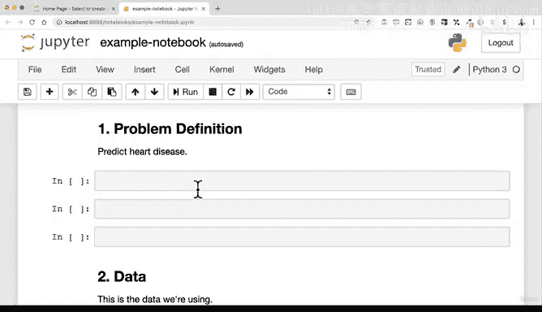

#  37：Jupyter Notebook 工作流程详解 🚀


在本节课中，我们将学习如何保存、关闭、重新启动以及分享 Jupyter Notebook。掌握这些工作流程对于高效地进行数据科学和机器学习项目至关重要。

---

## 保存你的工作 💾

上一节我们介绍了 Jupyter Notebook 的基本操作，本节中我们来看看如何保存你的工作。

Jupyter Notebook 会自动保存你的工作，这由界面右上角的自动保存指示器显示。但养成手动保存的习惯可以防止意外丢失进度。

以下是保存 Notebook 的几种方法：
*   在菜单栏点击 **File** -> **Save and Checkpoint**。
*   在命令模式（蓝色边框，无铅笔图标）下，按键盘上的 **S** 键。
*   在任何时候，都可以使用快捷键 **Cmd+S**（Mac）或 **Ctrl+S**（Windows）。

经常保存工作可以避免因意外情况而重做大量内容。

---

## 关闭 Notebook 与服务器 🔒

保存好工作后，你可能需要关闭 Notebook 并停止服务器。

要关闭 Notebook 并停止其背后的内核服务器，需要回到启动 Notebook 的终端。在终端中，按下 **Ctrl+C** 组合键。系统会询问你是否确认关闭，你需要在 5 秒内输入 **y**（是）或 **n**（否）。输入 **y** 后，服务器将关闭。

此时，Jupyter 仪表板中的 “Running” 标签页可能不会立即更新，你可以直接关闭浏览器标签页。你的 Notebook 文件已安全保存在项目文件夹中。

---

## 重新启动工作环境 🔄

当你第二天回来继续工作时，需要重新激活整个工作环境。

首先，打开终端并导航到你的项目文件夹。例如：
```bash
cd Desktop/ML_course/sample_project
```
接着，激活之前创建的 Conda 环境：
```bash
conda activate your_env_name
```
激活后，终端提示符会发生变化。最后，启动 Jupyter Notebook 服务器：
```bash
jupyter notebook
```
浏览器会自动打开 Jupyter 仪表板，你可以点击你的 `.ipynb` 文件重新打开 Notebook。

需要注意的是，重新打开 Notebook 时，所有代码单元的内存状态都会被重置。你需要按顺序重新运行上方的代码单元，以确保后续代码能获得正确的变量和数据。

---

## 分享你的工作成果 🤝

Jupyter Notebook 的一个强大之处在于易于分享。

你的整个项目工作区，包括环境配置文件、数据集、图像和包含代码与文本描述的 Notebook 文件，都可以打包发送给同事。只要对方在计算机上设置了相同的环境，他们就可以复现你的整个分析流程。

这使得 Jupyter Notebook 成为数据科学和机器学习项目中一体化的工作和协作空间。

---



## 总结 📝


本节课中我们一起学习了 Jupyter Notebook 的核心工作流程：如何保存进度、正确关闭服务器、重新启动完整的工作环境，以及如何与他人分享你的项目成果。掌握这些步骤能让你更流畅地管理数据科学项目。在接下来的课程中，我们将深入实践，在 Notebook 中应用各种数据科学与机器学习工具。