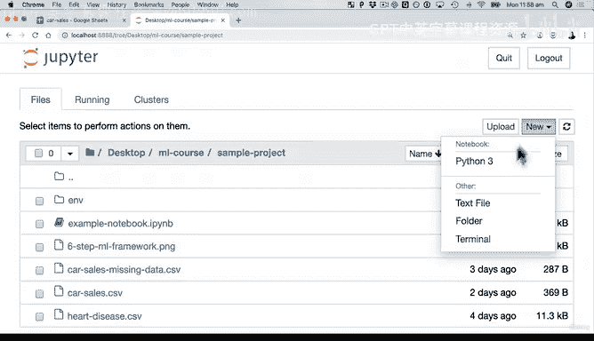
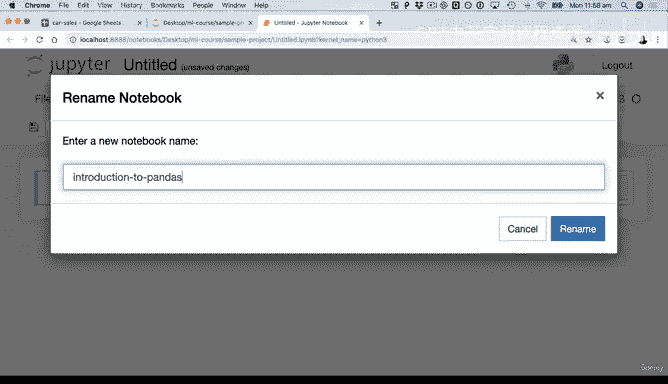
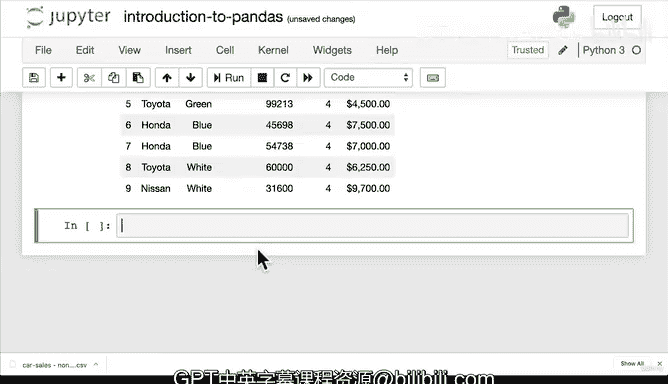

#  40：Pandas 入门 - Series、DataFrame 与 CSV 文件操作 📊


在本节课中，我们将学习 Pandas 库的两个核心数据结构：**Series** 和 **DataFrame**，并掌握如何从 CSV 文件导入数据以及如何将数据导出为 CSV 文件。我们将通过编写代码来实践这些概念。

---

## 概述

Pandas 是 Python 中用于数据操作和分析的强大库。本节课将引导你完成环境设置，创建 Series 和 DataFrame，并学习如何与 CSV 文件进行交互，这是数据科学工作流中的基础步骤。

---

## 设置工作环境

在开始编写代码之前，我们需要确保在正确的 Python 环境中工作。这个环境应包含 Pandas 和 Jupyter Notebook 等必要工具。

以下是激活特定 Conda 环境的步骤：

1.  打开终端或命令提示符。
2.  使用命令 `conda env list` 查看所有可用的环境。
3.  激活我们为课程创建的环境，例如：`conda activate ml_course_sample_project`。
4.  环境激活后，输入 `jupyter notebook` 启动 Jupyter Notebook。





在 Jupyter 仪表板中，导航到项目文件夹并创建一个新的 Python 3 笔记本，将其命名为 “introduction_to_pandas”。

---

## 导入 Pandas 库

使用 Pandas 的第一步是导入它。按照惯例，我们将其导入并简写为 `pd`。

```python
import pandas as pd
```

这行代码告诉 Python 我们想要使用 Pandas 库的功能。

---

## 理解 Pandas 的核心数据结构

Pandas 主要围绕两种数据结构构建：**Series** 和 **DataFrame**。

### 1. Series：一维数据列

Series 可以被看作是一个单列的数据表。它是**一维**的。

让我们创建一个 Series。`pd.Series()` 函数接受一个 Python 列表作为输入。

```python
series = pd.Series(['BMW', 'Toyota', 'Honda'])
series
```

运行上述代码会显示一个包含汽车品牌的 Series。同样，我们可以创建另一个包含颜色的 Series：

```python
colours = pd.Series(['Red', 'Blue', 'White'])
colours
```

这两个对象都是独立的一维数据列。

---

### 2. DataFrame：二维数据表

DataFrame 是 Pandas 中最常用、最重要的数据结构。它是**二维**的，包含行和列，类似于电子表格或 SQL 表。

我们可以通过组合 Series 来创建一个 DataFrame。`pd.DataFrame()` 函数接受一个 Python 字典，其中键是列名，值是对应的 Series。

```python
car_data = pd.DataFrame({'Car Make': series, 'Colour': colours})
car_data
```

运行代码后，你将看到你的第一个 DataFrame！它有两列：“Car Make” 和 “Colour”。

然而，手动创建 DataFrame 通常很繁琐。更常见的做法是从外部文件（如 CSV）导入数据。

---

## 从 CSV 文件导入数据

CSV（逗号分隔值）是一种常见的数据存储格式，Pandas 可以非常方便地处理它。

假设我们有一个名为 `car_sales.csv` 的文件。使用 `pd.read_csv()` 函数可以将其加载到 DataFrame 中。

```python
car_sales = pd.read_csv('car_sales.csv')
car_sales
```

**小技巧**：在 Jupyter Notebook 中，你可以使用 `Tab` 键进行自动补全，快速输入文件名。

现在，`car_sales` 变量中包含了来自 CSV 文件的所有数据，我们可以使用 Pandas 的各种功能来分析和操作它。

---

## DataFrame 的解剖结构

理解 DataFrame 的各个部分非常重要：

*   **索引（Index）**：最左侧的列，默认从 0 开始编号。
*   **行（Row）**：水平方向的一组数据，在 Pandas 函数中常被称为 **axis=0**。
*   **列（Column）**：垂直方向的一组数据，在 Pandas 函数中常被称为 **axis=1**。
*   **数据（Data）**：每个单元格中的具体值。
*   **列名（Column Names）**：每列顶部的标题。

记住 `axis=0` 代表行，`axis=1` 代表列，这对后续使用很多 Pandas 函数至关重要。

---

## 将 DataFrame 导出为 CSV 文件

在对数据进行处理和分析后，你可能希望将结果保存下来。使用 `.to_csv()` 方法可以将 DataFrame 导出为 CSV 文件。

```python
car_sales.to_csv('exported_car_sales.csv')
```

执行后，会在当前目录下生成一个名为 `exported_car_sales.csv` 的新文件。

**注意**：默认情况下，`.to_csv()` 会将 DataFrame 的索引也作为一列导出。如果你不希望保存索引，可以设置参数 `index=False`。

```python
car_sales.to_csv('exported_car_sales_no_index.csv', index=False)
```

你可以再次使用 `pd.read_csv()` 导入这个新文件来验证导出结果。

---

## 总结

本节课我们一起学习了 Pandas 的基础知识：

1.  **Series** 是一个一维的数据列。
2.  **DataFrame** 是一个二维的数据表，由行和列组成，是数据分析的主要工具。
3.  使用 `pd.read_csv()` 可以轻松地从 CSV 文件导入数据到 DataFrame。
4.  使用 `.to_csv()` 可以将 DataFrame 中的数据导出到 CSV 文件。
5.  理解了 DataFrame 的基本结构：索引、行（axis=0）、列（axis=1）和列名。



掌握这些核心概念是使用 Pandas 进行更复杂数据操作的第一步。在接下来的课程中，我们将探索如何对 DataFrame 进行筛选、排序和计算等操作。