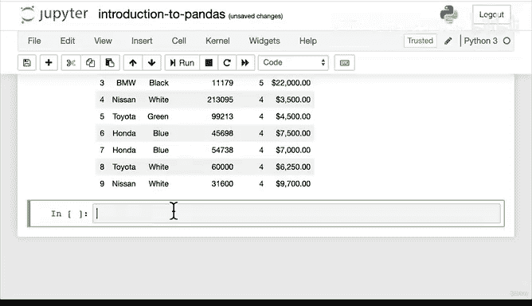

#  41：使用 Pandas 描述数据 📊


在本节课中，我们将学习如何使用 Pandas 库来描述和分析数据集。我们将探索不同的属性和函数，以获取关于数据的基本信息，例如数据类型、统计摘要和结构。

---

## 描述数据

上一节我们介绍了如何导入和导出数据。本节中，我们来看看如何使用 Pandas 描述数据。

### 数据类型

要查看数据框中各列的数据类型，可以使用 `dtypes` 属性。

```python
car_sales.dtypes
```

此操作将返回每列的数据类型。例如，`make` 和 `color` 列可能是对象类型，而 `odometer` 和 `doors` 列可能是整数类型。

### 列名

要获取数据框的列名，可以使用 `columns` 属性。

```python
car_sales.columns
```

此操作将列名以列表形式返回，便于后续操作。

### 索引

要查看数据框的索引信息，可以使用 `index` 属性。

```python
car_sales.index
```

此操作将显示索引的范围和步长。

---

## 统计摘要

以下是获取数据统计摘要的方法。

### 描述函数

`describe` 函数提供数值列的统计摘要，包括计数、均值、标准差和百分位数。

```python
car_sales.describe()
```

此函数仅适用于数值列。如果某列是对象类型，则不会显示在摘要中。

### 信息函数

`info` 函数提供数据框的详细信息，包括索引范围、列名、非空值数量和数据类型。

```python
car_sales.info()
```

此函数结合了索引和数据类型的信息，是探索数据的有用工具。

---

## 统计计算

以下是进行统计计算的方法。

### 均值

要计算数值列的平均值，可以使用 `mean` 函数。

```python
car_sales.mean()
```

此函数仅适用于数值列。对于对象类型的列，不会显示结果。

### 总和

要计算数值列的总和，可以使用 `sum` 函数。

```python
car_sales.sum()
```

此函数也可用于单个列。

```python
car_sales['doors'].sum()
```

### 其他统计函数

Pandas 支持多种统计函数，如中位数、最大值和最小值。建议查阅 Pandas 文档以了解更多。

---

## 数据框长度

要获取数据框的行数，可以使用 `len` 函数。

```python
len(car_sales)
```

此操作将返回数据框的行数，便于了解数据规模。

---

## 总结



本节课中，我们一起学习了如何使用 Pandas 描述数据。我们探索了数据类型、列名、索引、统计摘要和统计计算等方法。这些工具是数据探索的基础，能帮助我们快速了解数据集的结构和特征。