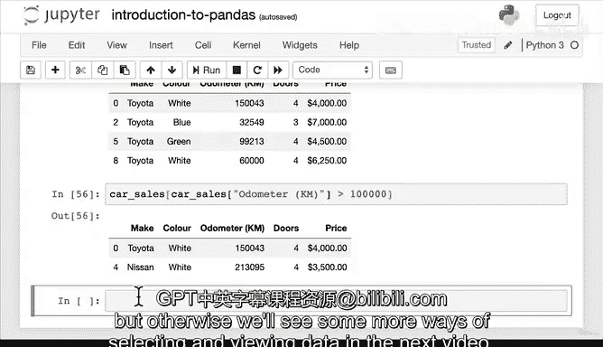

#  42：使用 Pandas 选择和查看数据 🐼


在本节课中，我们将学习如何使用 Pandas 库来查看和选择 DataFrame 中的数据。我们将介绍几种核心方法，包括查看数据头部和尾部、使用 `loc` 和 `iloc` 进行索引，以及如何选择特定的列和行。

---

## 查看和选择数据

上一节我们介绍了如何将数据导入 Pandas DataFrame。本节中，我们来看看如何查看和选择其中的数据。

首先，我们通常需要快速查看数据的前几行。以下是实现方法：

*   **`head()` 函数**：默认返回 DataFrame 的前 5 行。你可以通过传入一个数字来指定返回的行数，例如 `df.head(7)` 会返回前 7 行。
*   **`tail()` 函数**：默认返回 DataFrame 的最后 5 行。同样，你可以传入数字来指定返回的行数，例如 `df.tail(3)` 会返回最后 3 行。

这些方法在处理大型数据集时非常有用，可以让你在不加载全部数据的情况下快速预览。

---

## 理解 `loc` 和 `iloc`

接下来，我们将探讨两个用于选择数据的核心方法：`loc` 和 `iloc`。为了理解它们的区别，我们先创建一个自定义索引的 Series 对象。

```python
import pandas as pd

# 创建一个 Series 并自定义索引
animals = pd.Series(['dog', 'snake', 'bird', 'panda', 'cat'], index=[0, 3, 9, 3, 1])
print(animals)
```

运行代码后，我们可以看到索引是 `[0, 3, 9, 3, 1]`。现在，让我们看看 `loc` 和 `iloc` 的不同：

*   **`loc`**：基于**索引标签**进行选择。
    *   例如，`animals.loc[3]` 会返回索引标签为 `3` 的所有项（‘snake’ 和 ‘panda’）。
    *   再如，`animals.loc[9]` 会返回索引标签为 `9` 的项（‘bird’）。

*   **`iloc`**：基于**整数位置**进行选择（从 0 开始计数）。
    *   例如，`animals.iloc[3]` 会返回位置 3（即第 4 个）的项（‘panda’）。

**核心区别公式**：
> **`loc`** 选择的是 **索引（Index）**，而 **`iloc`** 选择的是 **位置（Position）**。

在索引顺序规整的 DataFrame 中（如 0, 1, 2, 3…），`loc[3]` 和 `iloc[3]` 的结果可能相同。但在索引混乱时，它们的结果会不同。

---

## 使用切片选择数据

`loc` 和 `iloc` 都支持切片操作，这与 Python 列表的切片类似。

以下是切片操作的示例：

*   `animals.iloc[:3]`：返回从开始到位置 3（不包括位置 3）的所有项。
*   `car_sales.loc[:3]`：返回从开始到索引标签 3（包括索引 3）的所有行。这类似于 `car_sales.head(4)`。

---

## 选择特定的列

我们经常需要查看或处理 DataFrame 中的某一列。有两种主要方法可以选择单列：

1.  **方括号表示法**：`df[‘column_name’]`
2.  **点号表示法**：`df.column_name`

例如：
```python
# 两种方法效果相同
make_column_1 = car_sales[‘Make’]
make_column_2 = car_sales.Make
```

**重要提示**：如果列名包含空格，则不能使用点号表示法。例如，对于列名 `‘Odometer (KM)’`，必须使用方括号表示法：`car_sales[‘Odometer (KM)’]`。

建议在项目中保持一致的列选择方式。

---

## 使用条件筛选数据（布尔索引）

最后，我们可以结合列选择和条件语句来筛选出满足特定条件的行。这被称为布尔索引。

以下是条件筛选的示例：

*   选择品牌为 ‘Toyota’ 的所有行：
    ```python
    toyota_cars = car_sales[car_sales[‘Make’] == ‘Toyota’]
    ```
*   选择里程数大于 100,000 公里的所有行：
    ```python
    high_mileage = car_sales[car_sales[‘Odometer (KM)’] > 100000]
    ```

通过组合多个条件，你可以构建非常复杂和精确的数据查询。

---

## 总结



本节课中我们一起学习了使用 Pandas 查看和选择数据的多种方法。我们掌握了如何使用 `head()` 和 `tail()` 快速预览数据，理解了 `loc`（基于索引）和 `iloc`（基于位置）的核心区别与用法，学会了通过列名选择特定列，并初步尝试了使用布尔索引进行条件筛选。这些是进行数据探索和分析的基础技能。在接下来的课程中，我们将继续学习更多高级的数据操作技巧。