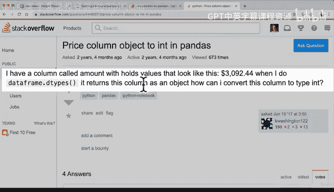
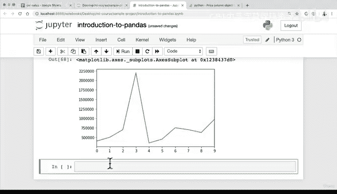

# 43：使用Pandas选择和查看数据（第二部分）📊


在本节课中，我们将继续学习使用Pandas选择和查看数据的多种方法。我们将探索交叉表、分组聚合以及数据可视化等高级功能，并学习如何解决数据处理中遇到的常见问题。

---

## 交叉表分析 🔀

上一节我们介绍了基础的数据选择方法，本节中我们来看看如何比较两个分类列。`pd.crosstab` 是一个很好的工具，它可以生成一个交叉表，直观地展示两个列之间的关系。

以下是使用 `pd.crosstab` 的步骤：

1.  导入Pandas库。
2.  加载你的DataFrame。
3.  调用 `pd.crosstab()` 函数，并传入你想要比较的两个列名。

例如，比较汽车品牌（`make`）和车门数量（`doors`）：
```python
import pandas as pd
# 假设 car_sales 是已加载的DataFrame
cross_tab_result = pd.crosstab(car_sales[‘make’], car_sales[‘doors’])
print(cross_tab_result)
```
运行上述代码会生成一个表格，显示每个品牌下不同车门数量汽车的数量。

---

## 分组聚合操作 📈

交叉表适用于比较两个列，但如果你想在更多列的背景下进行比较，就需要用到 `groupby` 操作。`groupby` 允许你根据一个或多个列对数据进行分组，然后对每个组应用聚合函数（如求平均值、求和等）。

以下是使用 `groupby` 的基本语法：
```python
grouped_data = car_sales.groupby(‘make’).mean()
print(grouped_data)
```
这段代码会根据 `make` 列对数据进行分组，并计算每个品牌下所有数值列的平均值。例如，它会输出每个品牌汽车的平均里程数和平均车门数。

---

## 数据可视化 📉

查看表格数据有时不够直观，数据可视化能帮助我们快速理解数据的分布和趋势。Pandas内置了基于Matplotlib的绘图功能，可以轻松创建图表。

### 绘制折线图

要绘制某一列的折线图，可以直接在Series上调用 `.plot()` 方法。
```python
car_sales[‘odometer’].plot()
```
如果图表没有显示，你可能需要在Jupyter Notebook中运行以下代码来启用内联显示：
```python
import matplotlib.pyplot as plt
%matplotlib inline
```

### 绘制直方图



直方图是查看数据分布的绝佳方式。它显示了数据在不同区间内的频率。
```python
car_sales[‘odometer’].plot(kind=‘hist’)
```
通过直方图，你可以快速看出大部分里程读数集中在哪个范围，并识别可能的异常值。

---

## 处理数据类型错误 🔧

在进行可视化或计算时，你可能会遇到数据类型错误。例如，尝试绘制一个非数值列（如对象类型）会导致错误。

1.  **检查数据类型**：使用 `.dtype` 属性查看列的数据类型。
    ```python
    print(car_sales[‘price’].dtype)
    ```
    如果输出是 `object`，说明该列是字符串类型。

2.  **转换数据类型**：需要将字符串转换为数值类型（如整数）。一个常见的问题是价格列可能包含美元符号（`$`）和逗号（`,`）。
    以下是一种转换方法：
    ```python
    car_sales[‘price’] = car_sales[‘price’].str.replace(‘[\$,\.]’, ‘’, regex=True).astype(int)
    ```
    这段代码使用字符串的 `.replace()` 方法移除 `$` 和 `,`，然后使用 `.astype(int)` 将结果转换为整数。

**注意**：转换后务必检查数据，例如，价格 `$9,700` 可能被转换为整数 `9700`，但有时也可能产生非预期的结果（如 `970000`），需要根据实际情况调整代码逻辑。

---

## 总结 ✨



本节课我们一起学习了Pandas中更高级的数据查看和选择技术。我们掌握了如何使用交叉表分析分类数据之间的关系，如何利用 `groupby` 进行分组聚合计算，以及如何通过绘制折线图和直方图来可视化数据分布。最后，我们还探讨了如何处理数据类型转换中的常见问题，为后续的数据分析和处理打下了坚实的基础。