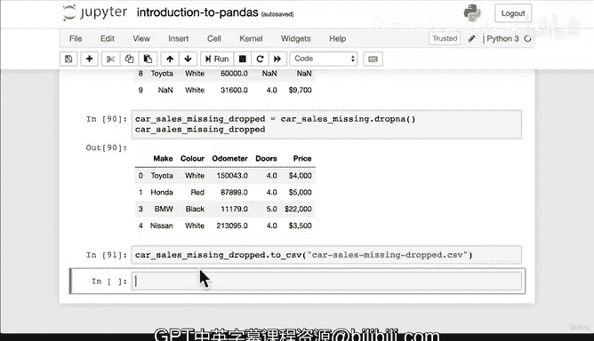

#  44：Pandas 数据操作 🛠️


在本节课中，我们将学习如何使用 Pandas 库来操作数据。主要内容包括处理字符串列、填充缺失值以及删除包含缺失数据的行。掌握这些技能对于清理和准备真实世界的数据集至关重要。

---

## 数据操作简介

上一节我们介绍了 Pandas 的基础知识，本节中我们来看看如何对数据进行实际操作。Pandas 的强大之处在于，只要你能想到的操作，几乎都能实现。

### 字符串方法

Python 本身有许多字符串方法，例如 `.lower()`。在 Pandas 中，你可以对字符串类型的列执行相同的操作。

例如，`car_sales[‘Make’].str.lower()` 会将 “Make” 列中的所有字符串转换为小写。这里的关键是使用 `.str` 来访问列的字符串方法。

**重要概念**：在 Pandas 中，如果你想永久改变一个列，通常需要重新赋值。

```python
car_sales[‘Make’] = car_sales[‘Make’].str.lower()
```

执行上述代码后，“Make” 列中的所有字母都将变为小写。许多 Pandas 函数都有一个 `inplace` 参数，可以避免显式重新赋值，我们稍后会看到。

---

## 处理缺失数据

真实世界的数据集很少是完美的，经常包含缺失值。Pandas 用 `NaN`（Not a Number）来表示缺失数据。

假设我们有一个包含缺失值的数据集 `car_sales_missing.csv`。我们可以使用 `pd.read_csv()` 将其导入。

### 填充缺失值

`fillna()` 函数用于填充缺失值。例如，我们可以用 “Odometer” 列现有值的平均值来填充该列的缺失值。

```python
car_sales_missing[‘Odometer’].fillna(car_sales_missing[‘Odometer’].mean())
```

但请注意，默认情况下 `fillna()` 不会修改原始 DataFrame。为了永久改变，你有两种选择：

1.  **重新赋值**：
    ```python
    car_sales_missing[‘Odometer’] = car_sales_missing[‘Odometer’].fillna(car_sales_missing[‘Odometer’].mean())
    ```
2.  **使用 `inplace` 参数**：
    ```python
    car_sales_missing[‘Odometer’].fillna(car_sales_missing[‘Odometer’].mean(), inplace=True)
    ```

`inplace=True` 会直接在原数据上修改，而无需重新赋值。选择哪种方式取决于你的工作流程。

---

### 删除缺失值

如果某些行的缺失值无关紧要，或者会干扰分析，你可以选择删除包含缺失值的行。

`dropna()` 函数用于删除任何包含 `NaN` 的行。

与 `fillna()` 类似，`dropna()` 也有 `inplace` 参数。以下是两种用法：

*   **使用 `inplace`**（直接修改原 DataFrame）：
    ```python
    car_sales_missing.dropna(inplace=True)
    ```
*   **创建新 DataFrame**（保留原始数据）：
    ```python
    car_sales_missing_dropped = car_sales_missing.dropna()
    ```

创建新 DataFrame 的优点是，你仍然可以访问原始的、包含缺失值的数据。

---

## 总结

本节课中我们一起学习了 Pandas 数据操作的核心技巧：

1.  **字符串操作**：通过 `.str` 访问器，可以对 DataFrame 中的字符串列应用 Python 字符串方法。
2.  **处理缺失数据**：
    *   使用 `fillna(value)` 填充缺失值。
    *   使用 `dropna()` 删除包含缺失值的行。
3.  **`inplace` 参数**：理解 `inplace=True`（直接修改）和 `inplace=False`（返回副本并需要赋值）的区别至关重要。



记住，作为数据科学家或机器学习工程师，重要的不是记住所有函数，而是知道如何提出问题（“我该如何处理这些数据？”）并能够查找解决方案。多练习，多尝试，是掌握这些技能的最佳途径。