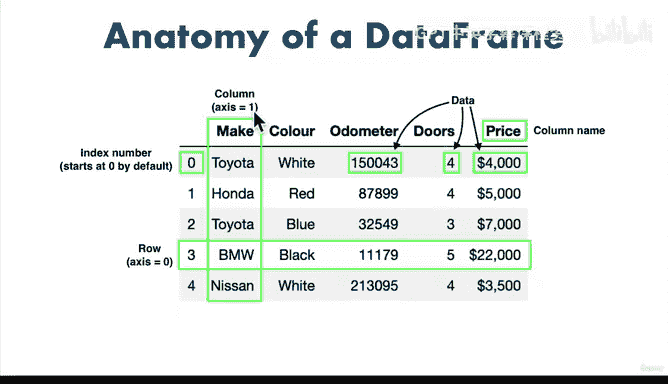

# 45：数据操作2 🚗


在本节课中，我们将学习如何使用Pandas库创建和删除数据列。我们将通过几种不同的方法，从现有数据中生成新列，并了解如何移除不需要的列。

## 概述

上一节我们介绍了如何处理缺失数据。本节中，我们来看看如何从现有数据创建新列，以及如何删除不需要的列。

## 从Series创建新列

首先，我们可以从一个Pandas Series创建新列。以下是具体步骤：

```python
# 创建一个名为seats_column的Series
seats_column = pd.Series([5, 5, 5, 5, 5])

# 将Series作为新列添加到数据框中
car_sales['Seats'] = seats_column
```

运行上述代码后，新列`Seats`会出现在数据框的最右侧。如果Series的长度与数据框的行数不匹配，新列中会出现缺失值。

## 从Python列表创建新列

另一种方法是从Python列表创建新列。但需要注意，列表的长度必须与数据框的行数一致。

```python
# 创建一个燃料经济性列表
fuel_economy = [7.5, 9.2, 5.0, 9.6, 8.7, 3.0, 4.5, 6.0, 7.0, 5.5]

# 将列表作为新列添加到数据框中
car_sales['Fuel_per_100km'] = fuel_economy
```

如果列表长度与数据框行数不匹配，Pandas会抛出错误。

## 从现有列创建新列

我们还可以通过对现有列进行运算来创建新列。例如，计算车辆在其整个生命周期中使用的总燃料量：

```python
# 计算总燃料使用量
car_sales['Total_fuel_used'] = (car_sales['Odometer'] / 100) * car_sales['Fuel_per_100km']
```

这种方法利用了Pandas对数值列的直接运算能力，非常方便。

## 从单个值创建新列

有时，我们可能需要创建一个所有行都具有相同值的新列。例如，为所有车辆添加一个表示车轮数量的列：

```python
# 创建一个所有值都为4的新列
car_sales['Number_of_wheels'] = 4
```

## 删除列

如果我们不再需要某个列，可以使用`drop`函数将其删除。删除列时，需要指定`axis=1`参数。



```python
# 删除名为'Total_fuel_used'的列
car_sales = car_sales.drop('Total_fuel_used', axis=1)
```

记住，删除操作需要重新赋值或使用`inplace=True`参数才能生效。

## 总结

本节课中我们一起学习了如何使用Pandas创建和删除数据列。我们探讨了从Series、Python列表、现有列运算以及单个值创建新列的方法，并了解了如何删除不需要的列。这些操作是数据科学和机器学习项目中常见的数据预处理步骤。