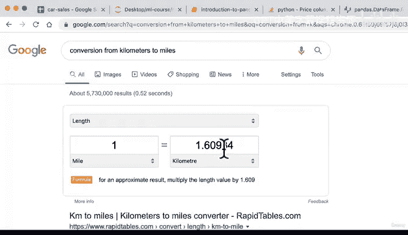

# 46：数据操作3 🧮


## 概述
在本节课中，我们将继续学习Pandas库中几个重要的数据操作函数。我们将重点介绍如何打乱数据顺序、重置索引以及对列应用自定义函数。这些技能对于准备机器学习数据集至关重要。

---

## 数据打乱（Shuffling Data） 🔀

上一节我们介绍了如何选择和筛选数据，本节中我们来看看如何打乱数据集的顺序。这在机器学习中非常重要，可以防止数据顺序对模型学习模式产生潜在影响。

`sample` 函数可以从数据框中随机抽取样本，通过设置参数 `frac=1`，我们可以实现对全部数据的随机重排（即打乱）。

**代码示例：**
```python
# 打乱整个数据框的行顺序
car_sales_shuffled = car_sales.sample(frac=1)
```

以下是使用 `sample` 函数时需要注意的几个要点：
*   `frac` 参数指定抽取数据的比例，例如 `frac=0.2` 表示抽取20%的数据。
*   打乱顺序后，每一行数据内部的关联保持不变，只是行的索引顺序发生了变化。
*   对于大型数据集（如数百万行），可以先抽取一小部分（如1%）进行快速实验和调试，以提高效率。

---

## 重置索引（Resetting Index） 🔢

在打乱数据后，索引会变得混乱。为了恢复一个整洁的、从0开始的连续索引，我们可以使用 `reset_index` 函数。

**代码示例：**
```python
# 重置索引，并丢弃旧的索引列
car_sales_shuffled.reset_index(drop=True, inplace=True)
```

以下是 `reset_index` 函数的关键参数：
*   `drop=True`：默认情况下，`reset_index` 会将旧的索引作为新列添加到数据框左侧。设置 `drop=True` 可以避免创建这个额外的列。
*   `inplace=True`：直接在原数据框上进行修改，而无需创建新的副本。

---

## 应用函数到列（Applying Functions to Columns） ⚙️

有时我们需要对某一列的所有值进行统一的转换或计算，这时可以使用 `apply` 函数。它允许我们应用一个自定义函数或Lambda函数到指定的列。

例如，要将里程表读数从公里转换为英里，我们可以这样做：

**代码示例：**
```python
# 使用Lambda函数将‘Odometer (KM)’列的值从公里转换为英里
car_sales[‘Odometer (KM)’] = car_sales[‘Odometer (KM)’].apply(lambda x: x / 1.6)
```

让我们分解一下这段代码：
*   `car_sales[‘Odometer (KM)’]`：选择名为 ‘Odometer (KM)’ 的列。
*   `.apply(...)`：对该列应用一个函数。
*   `lambda x: x / 1.6`：这是一个Lambda函数（匿名函数）。`x` 代表列中的每一个值。这个函数将每个 `x` 除以 1.6（近似的公里到英里转换系数）。



---

## 总结 🎯

本节课中我们一起学习了Pandas中三个强大的数据操作技巧：
1.  使用 `sample(frac=1)` 打乱数据顺序，这对准备机器学习训练集和验证集至关重要。
2.  使用 `reset_index(drop=True)` 在数据操作后重置混乱的索引，保持数据框的整洁。
3.  使用 `apply()` 函数配合Lambda表达式，轻松实现对数据列进行批量转换和计算。

记住，学习编程的关键在于实践。如果遇到问题，请尝试运行代码、查阅文档（如搜索“pandas reset_index”）或在社区提问。现在，你已经掌握了更多处理和分析数据的实用工具！