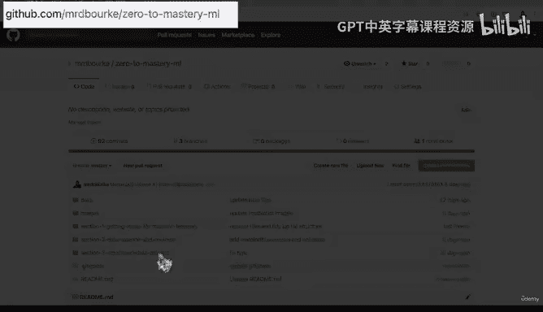
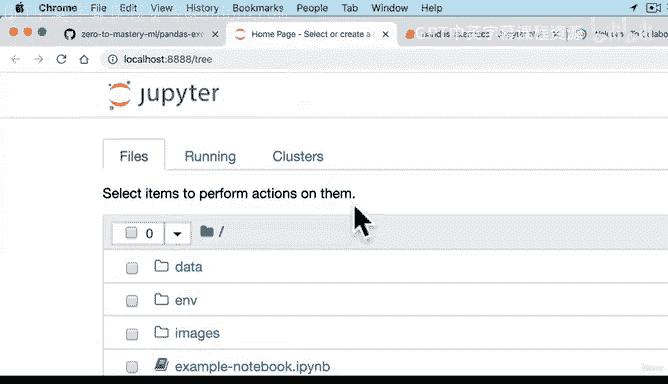
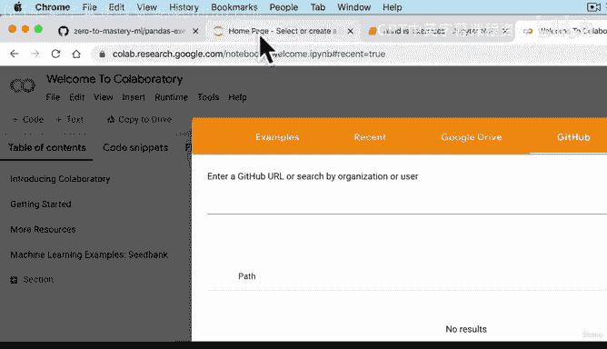
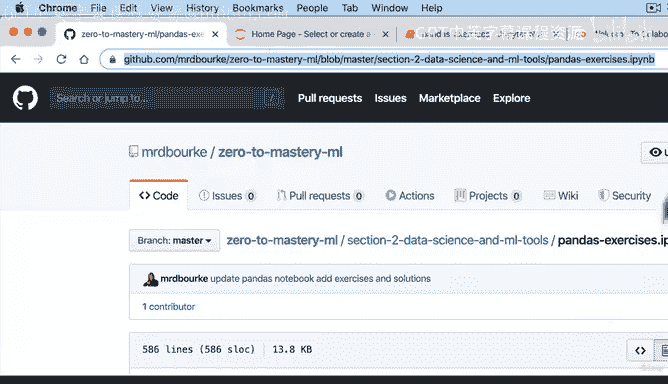
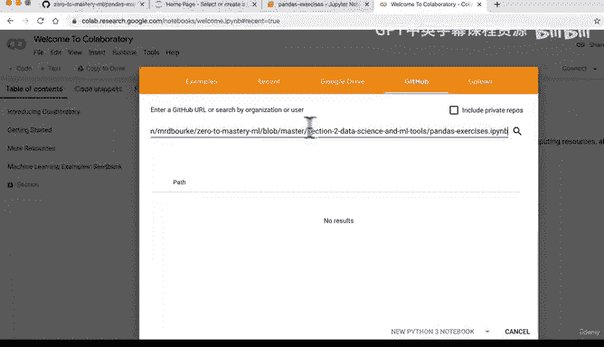
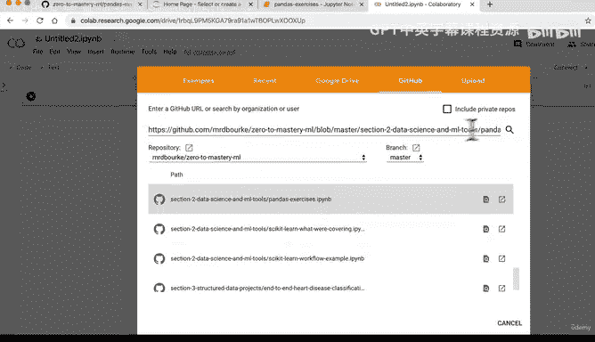
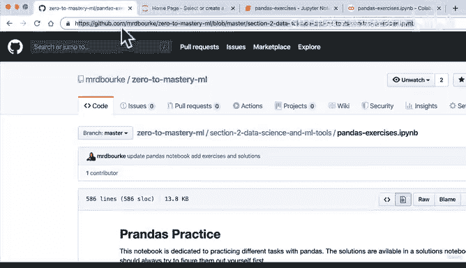
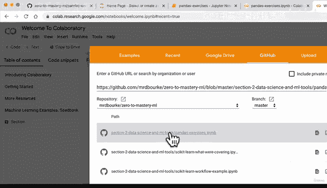
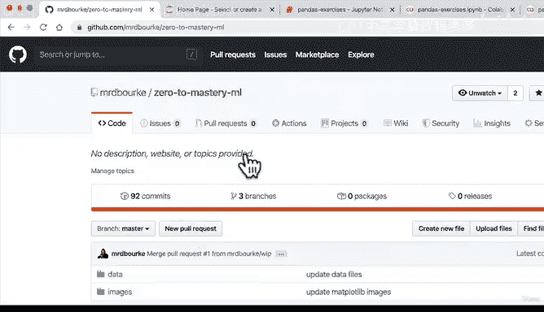

# 47：如何下载课程作业 📥


在本节课中，我们将学习如何从 GitHub 仓库下载课程所需的 Jupyter Notebook 文件。课程中会大量使用 Jupyter Notebook，它是数据科学家和机器学习工程师的主要工作环境。我们将介绍两种方法：一种是直接从 GitHub 下载文件到本地并运行，另一种是使用 Google Colab 在线打开并运行。



---

上一节我们介绍了课程作业的来源。本节中，我们来看看如何从 GitHub 仓库下载单个 Jupyter Notebook 文件。

首先，访问课程 GitHub 仓库的 URL：`github.com/mrburg/0tomasteryml`。请注意，仓库内容可能会更新，但下载流程是通用的。

假设我们想下载名为 `pandas_exercises.ipynb` 的练习文件。

以下是具体操作步骤：

1.  在仓库中找到目标文件并点击进入。
2.  点击页面上的 **`Raw`** 按钮。
3.  浏览器会显示文件的原始文本。此时，在浏览器菜单中选择 **`文件`** -> **`另存为`**。
4.  选择一个本地文件夹（例如 `ML_course`），保存文件。文件可能会被保存为 `.ipynb.txt` 格式。

文件下载完成后，我们需要在本地环境中打开它。

---

上一节我们完成了文件的下载。本节中，我们来看看如何在本地激活环境并运行下载的 Notebook。

首先，需要激活你的 Anaconda 环境。Conda 环境是一个用于数据科学和机器学习项目的工具集合。

在终端中，使用以下命令激活环境：
```bash
conda activate /path/to/your/environment
```
激活后，终端提示符会发生变化。接着，启动 Jupyter Notebook 服务器：
```bash
jupyter notebook
```
这将在浏览器中打开 Jupyter 界面。找到你下载的文件（可能带有 `.txt` 扩展名），将其重命名为 `.ipynb` 格式（通常只需删除 `.txt` 后缀），然后即可打开并运行该 Notebook。

例如，你可以在单元格中运行 `import pandas as pd` 来测试环境是否配置正确。

---





上一节我们介绍了本地运行的方法。本节中，我们来看看一个更快捷的在线替代方案：使用 Google Colab。






如果你希望更快地开始，可以使用 Google 提供的 Colab 工具。它本质上是运行在 Google Drive 中的 Jupyter Notebook。



以下是使用 Colab 的步骤：

1.  访问 `colab.research.google.com`。
2.  登录你的 Google 账户。
3.  点击页面上的 **`GitHub`** 选项卡。
4.  将目标 Notebook 在 GitHub 上的 URL 粘贴到输入框中，然后按回车键。
5.  Colab 会自动加载该 Notebook。你可以在其中直接运行代码，所有计算将在 Google 的云端服务器上进行。

请注意，首次打开来自 GitHub 的 Notebook 时，可能会看到安全提示，建议你审阅代码后再执行。





---



本节课中我们一起学习了两种获取和运行课程 Jupyter Notebook 作业的方法：一种是下载到本地，通过激活 Conda 环境在 Jupyter 中运行；另一种是使用 Google Colab 在线直接打开 GitHub 链接运行。无论仓库如何更新，这些核心工作流程都将适用。