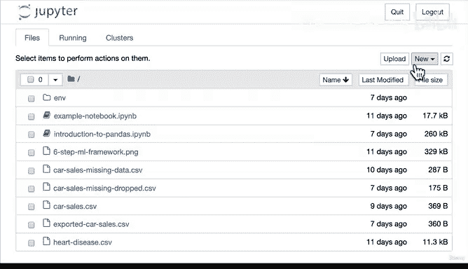
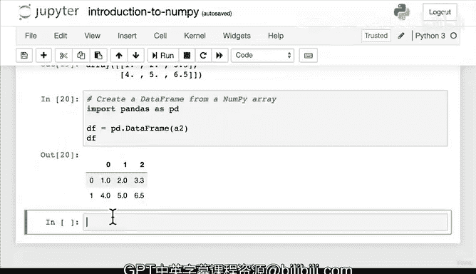

# 50：NumPy 数据类型与属性 📊


在本节课中，我们将学习 NumPy 的核心数据结构和基本属性。我们将通过动手编写代码来理解 NumPy 数组的创建、形状、维度和数据类型。

---

## 概述

NumPy 是 Python 中用于科学计算的基础库，其核心是 **n维数组（ndarray）**。本节课我们将学习如何创建 NumPy 数组，并探索其关键属性，如形状、维度和数据类型。理解这些概念是后续进行数据操作和机器学习的基础。

---



## 准备工作


首先，我们需要在正确的环境中启动 Jupyter Notebook 并导入 NumPy。

1.  在终端中，导航至包含项目环境的目录。
2.  激活 Conda 环境。
3.  启动 Jupyter Notebook 并创建一个新的笔记本。
4.  将笔记本重命名为 `introduction_to_numpy`。
5.  在第一个代码单元格中导入 NumPy 库，通常使用缩写 `np`。

```python
import numpy as np
```

---

## 数据类型与属性

NumPy 的主要数据类型是 **ndarray**，即 n 维数组。数组本质上是一个数字列表，其形状可以是任意维度。

### 创建数组

我们可以使用 `np.array()` 函数并传入一个数字列表来创建数组。

```python
# 创建一个一维数组
a1 = np.array([1, 2, 3])
print(a1)
```

```python
# 创建一个二维数组
a2 = np.array([[1, 2, 3],
               [4, 5, 6]])
print(a2)
```

```python
# 创建一个三维数组
a3 = np.array([[[1, 2, 3],
                [4, 5, 6],
                [7, 8, 9]],
               [[10, 11, 12],
                [13, 14, 15],
                [16, 17, 18]]])
print(a3)
```

### 数组的解剖结构

理解数组的形状对于数据科学至关重要，因为机器学习算法要求输入数据的形状必须匹配。

*   **a1**：这是一个**向量**，形状为 `(3,)`。它有一行和三列。NumPy 在显示一维数组的形状时会省略行数。
*   **a2**：这是一个**矩阵**，形状为 `(2, 3)`。它有两行和三列。
*   **a3**：这是一个三维数组，形状为 `(2, 3, 3)`。它有两“层”，每层有三行和三列。

在 NumPy 中：
*   **轴 0 (axis 0)** 通常指行。
*   **轴 1 (axis 1)** 通常指列。
*   **轴 n (axis n)** 指超出行和列的更高维度。

---

## 探索数组属性

上一节我们介绍了数组的创建和基本结构，本节中我们来看看 NumPy 数组内置的一些有用属性。

以下是 NumPy 数组的关键属性：

*   **`.shape`**：返回一个元组，表示数组在每个维度上的大小。
    ```python
    print(a1.shape)  # 输出: (3,)
    print(a2.shape)  # 输出: (2, 3)
    print(a3.shape)  # 输出: (2, 3, 3)
    ```

*   **`.ndim`**：返回数组的维数（轴的数量）。
    ```python
    print(a1.ndim)  # 输出: 1
    print(a2.ndim)  # 输出: 2
    print(a3.ndim)  # 输出: 3
    ```

*   **`.dtype`**：返回数组中元素的数据类型。NumPy 数组中的所有元素必须是同一类型。
    ```python
    print(a1.dtype)  # 输出: int64 (整数)
    print(a2.dtype)  # 输出: int64 (即使混入浮点数，也会统一为浮点型 float64)
    ```

*   **`.size`**：返回数组中元素的总数。
    ```python
    print(a1.size)  # 输出: 3
    print(a2.size)  # 输出: 6
    print(a3.size)  # 输出: 18
    ```

*   **`type()`**：返回对象本身的类型。对于任何 NumPy 数组，其类型都是 `numpy.ndarray`。
    ```python
    print(type(a1))  # 输出: <class 'numpy.ndarray'>
    print(type(a2))  # 输出: <class 'numpy.ndarray'>
    ```

**重要概念**：无论数组的形状或大小如何，所有 NumPy 数组都是 `ndarray` 类型。这意味着本课程中学到的所有函数和操作都可以应用于任何 NumPy 数组。

---

## NumPy 与其他库的关系

为了进一步理解 NumPy 的基础地位，我们来看看它如何与 Pandas 协同工作。

我们可以轻松地从 NumPy 数组创建 Pandas DataFrame。

```python
import pandas as pd
df = pd.DataFrame(a2)
print(df)
```

这演示了 Pandas 等高级数据科学库是构建在 NumPy 之上的。DataFrame 本质上是以特定格式组织的 NumPy 数组的集合。因此，对 Pandas 中的数据执行操作，底层就是对 NumPy 数组进行操作。

---

## 总结

本节课中我们一起学习了 NumPy 的核心——**ndarray（n维数组）**。我们掌握了如何创建不同维度的数组，并探索了其关键属性：`.shape`、`.ndim`、`.dtype`、`.size` 和 `type()`。最重要的是，我们理解了无论数组如何变化，其根本类型始终是 `ndarray`，并且像 Pandas 这样的库以及机器学习算法都是基于寻找 NumPy 数组中的模式而构建的。



理解这些基础知识是后续进行高效数值计算和数据分析的基石。