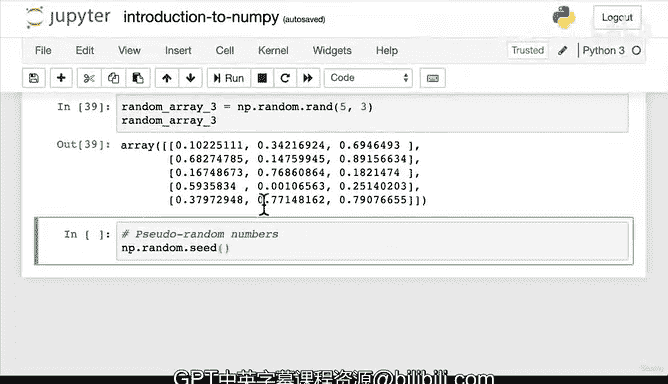

# 51：创建NumPy数组 🧮


在本节课中，我们将学习如何创建NumPy数组。我们将探索多种创建数组的方法，从手动输入到自动生成，并了解每种方法的应用场景。

---

在上一节中，我们通过手动输入数字列表的方式创建了一些数组，例如A1、A2、A3，并学习了这些数组的不同属性。然而，手动输入数字非常繁琐。

因此，本节我们将介绍一些更简便的创建数组的方法。

首先，我们回顾一下最初的方法：

```python
sample_array = np.array([1, 2, 3])
```

以下是创建数组的几种便捷方法：

**1. 创建全1数组**
使用 `np.ones` 函数可以创建一个指定形状且所有元素都为1的数组。其函数签名为 `np.ones(shape)`。

```python
ones = np.ones((2, 3))
```

**2. 创建全0数组**
使用 `np.zeros` 函数可以创建一个指定形状且所有元素都为0的数组。其函数签名为 `np.zeros(shape)`。

```python
zeros = np.zeros((2, 3))
```

**3. 创建等差数列数组**
使用 `np.arange` 函数可以创建一个在给定区间内、具有固定步长的等差数列数组。其函数签名为 `np.arange(start, stop, step)`。

```python
range_array = np.arange(0, 10, 2)
```

**4. 创建随机整数数组**
使用 `np.random.randint` 函数可以创建一个指定形状、元素在给定范围内的随机整数数组。其函数签名为 `np.random.randint(low, high, size)`。

```python
random_array = np.random.randint(0, 10, size=(3, 5))
```

**5. 创建随机浮点数数组**
使用 `np.random.random` 函数可以创建一个指定形状、元素在[0, 1)区间内的随机浮点数数组。其函数签名为 `np.random.random(size)`。

```python
random_array2 = np.random.random((5, 3))
```

**6. 另一种创建随机数组的方法**
`np.random.rand` 是另一种创建随机数组的函数，它直接接受维度参数。其函数签名为 `np.random.rand(d0, d1, ...)`。

```python
random_array3 = np.random.rand(5, 3)
```

---

需要了解的是，NumPy生成的随机数并非真正的随机数，它们是“伪随机数”，其生成基于一个称为“随机种子”的初始值。我们将在下一节视频中详细探讨 `np.random.seed` 的概念。

---



本节课中，我们一起学习了创建NumPy数组的多种方法，包括创建全1数组、全0数组、等差数列数组以及不同类型的随机数组。掌握这些方法能让你更高效地准备和处理数据。在下一节中，我们将深入了解随机种子如何控制伪随机数的生成。