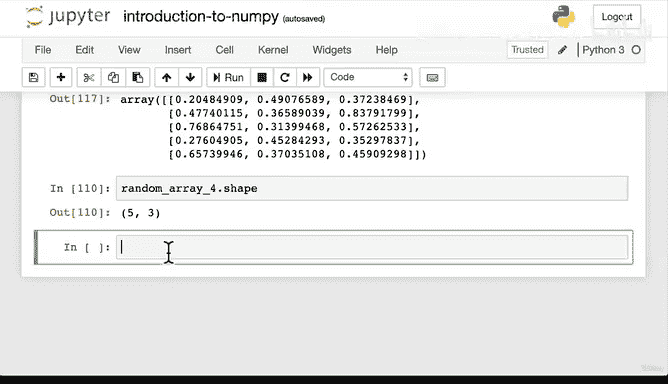

#  52：NumPy 随机种子 🎲


在本节课中，我们将要学习 NumPy 中的 `random.seed` 函数。我们将探讨为什么计算机生成的“随机”数实际上是伪随机数，以及如何通过设置随机种子来确保实验的可重复性。

---

上一节我们介绍了使用 NumPy 创建数组的几种方法，包括生成随机数组。本节中我们来看看如何控制这些随机数的生成过程，使其可重复。

计算机生成的随机数并非真正的随机数，而是伪随机数。这意味着它们是由一个确定的算法生成的，只是看起来随机。每次运行代码时，如果不加控制，算法会从一个新的“起点”开始，从而产生不同的数字序列。

为了确保每次运行都能得到相同的“随机”数字序列，我们可以使用 `np.random.seed()` 函数来设置一个固定的起点，即随机种子。

以下是设置随机种子的基本语法：

```python
np.random.seed(seed_value)
```

其中，`seed_value` 可以是任意整数。设置后，后续所有基于 NumPy 随机数生成器的调用都将从该种子开始，产生相同的数字序列。

让我们通过一个例子来理解。首先，我们生成一个不设置种子的随机整数数组：

```python
import numpy as np
random_array_1 = np.random.randint(10, size=(5, 3))
print(random_array_1)
```

每次运行上面的代码，输出都会不同。现在，我们在生成随机数之前设置一个种子：

```python
np.random.seed(0)  # 设置随机种子为 0
random_array_2 = np.random.randint(10, size=(5, 3))
print(random_array_2)
```

无论你运行这段代码多少次，`random_array_2` 的输出都将保持不变。这是因为种子固定了随机数生成器的初始状态。

随机种子的值可以是任何整数。不同的种子值会产生不同的、但可重复的数字序列。例如：

```python
np.random.seed(42)
random_array_3 = np.random.random((5, 3))
print(random_array_3)
```

只要种子是 `42`，`random_array_3` 的结果就始终一致。

在机器学习和数据科学中，设置随机种子至关重要，原因如下：
*   **可重复性**：确保你或他人能够完全复现你的实验过程和结果。
*   **调试**：当代码行为依赖于随机数时，固定种子有助于隔离和修复错误。
*   **公平比较**：在比较不同模型或算法时，使用相同的随机数据可以确保比较的公平性。

因此，当你看到代码开头有 `np.random.seed(42)`（或其他数字）时，就知道这是为了保证实验的可重复性。

---

本节课中我们一起学习了 NumPy 的随机种子。我们了解到计算机生成的随机数是伪随机的，通过 `np.random.seed()` 函数设置一个固定的种子，可以确保每次运行代码时生成相同的随机数序列，这对于实验的可重复性和调试至关重要。



现在，你可以尝试生成一些随机数组，并练习使用不同的种子值。下一节，我们将学习如何查看和操作数组与矩阵。