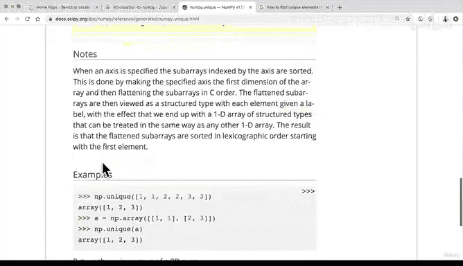
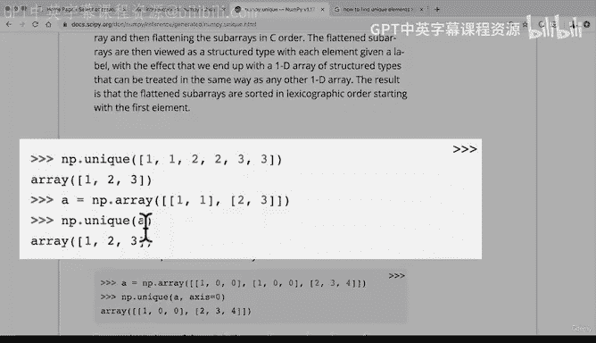

# 07：查看数组和矩阵 🔍


在本节课中，我们将学习如何查看和索引 NumPy 数组（或矩阵）。我们将从回顾如何查找数组中的唯一元素开始，然后深入探讨如何通过索引和切片来访问多维数组中的特定数据。理解这些操作是后续进行数据操作和比较的基础。

---

上一节我们介绍了 NumPy 的随机数生成器。本节中，我们来看看如何查看数组和矩阵。





首先，我们练习一个实用技巧：如何查找数组中的唯一元素。

以下是查找 NumPy 数组中唯一元素的步骤：
1.  使用 `np.unique()` 函数。
2.  将目标数组作为参数传递给该函数。
3.  函数将返回一个包含所有唯一值的新数组。

例如，对于一个随机整数数组 `random_array4`，我们可以这样操作：
```python
unique_values = np.unique(random_array4)
```
执行后，`unique_values` 将包含 `random_array4` 中所有不重复的数字。

---

掌握了查找唯一值的方法后，现在让我们进入核心内容：查看和索引数组。

我们之前已经创建了数组 `a1`、`a2` 和 `a3`。查看和索引数组需要一些练习，如果一开始感到困惑，请不要担心，关键是动手尝试。

### 基础索引
我们可以使用从0开始的索引来访问数组元素。

对于一维数组 `a1`，访问第一个元素：
```python
a1[0]
```

对于二维数组 `a2`，访问第一“行”：
```python
a2[0]
```
这是因为 `a2.shape` 返回 `(2, 3)`，索引 `[0]` 对应第一个维度（行）。

对于三维数组 `a3` (`shape` 为 `(2, 3, 3)`)，访问第一个二维“矩阵”：
```python
a3[0]
```

### 切片操作
与 Python 列表类似，NumPy 数组也支持切片。

例如，获取 `a3` 中每个维度的前两个元素：
```python
a3[:2, :2, :2]
```
这个操作会返回一个形状更小的新数组，它提取了原始数据的一个子块。

### 理解高维数组的显示
NumPy 从最外层括号向内显示数组。`shape` 中最右边的数字对应最内层显示的元素数量。

例如，一个四维数组 `a4`，其 `shape` 为 `(2, 3, 4, 5)`：
*   最内层有 5 个数字（`shape` 的最后一个值 5）。
*   向外一层有 4 组这样的内层数组。
*   再向外一层有 3 组。
*   最外层有 2 组。

要获取这个四维数组最内层每个数组的前4个数字，可以这样切片：
```python
a4[:, :, :, :4]
```
这个操作保留了前三个维度的所有数据，但只取第四个维度（最内层）的前4个元素。

---

本节课中，我们一起学习了如何查看和索引 NumPy 数组。我们介绍了查找唯一值的 `np.unique()` 函数，并练习了通过基础索引和切片来访问多维数组中的特定部分。理解数组的 `shape` 对于正确进行索引至关重要。虽然高维数组的视觉化起初可能具有挑战性，但通过创建不同形状的数组并积极练习索引，你会逐渐掌握它。


接下来，我们将学习如何操作和比较不同的数组，这是机器学习从数字中发现模式的核心。请稍作休息，尝试创建自己的数组并进行一些切片练习，我们下个视频再见。