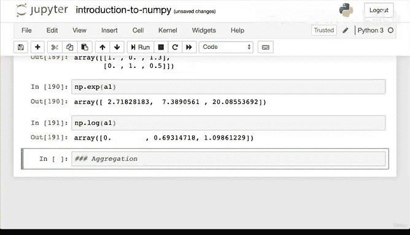

#  54：NumPy 数组操作与比较 🧮


在本节课中，我们将学习如何操作和比较 NumPy 数组。这是机器学习的核心部分，涉及对数字数组进行计算和模式识别。

## 概述

上一节我们介绍了如何创建和查看 NumPy 数组。本节中，我们将探索如何操作和比较这些数组。

## 操作与比较数组

与 Pandas 类似，在 NumPy 中，几乎所有你能想到的数字操作方式都可以实现。

### 算术运算

算术运算是基本数学运算的统称。让我们从查看之前创建的 `a1` 数组开始。

```python
a1
```

我们将创建另一个名为 `ones` 的数组。

```python
np.ones(3)
```

首先，我们来看简单的加法运算。执行 `a1 + ones` 会发生什么？

```python
a1 + ones
```

结果是 `[2, 3, 4]`。这个操作将两个数组中相同位置的元素相加：第 0 位 1+1=2，第 1 位 2+1=3，第 2 位 3+1=4。

接下来，我们看看减法。

```python
a1 - ones
```

结果是 `[0, 1, 2]`。这个操作从 `a1` 中减去了 `ones`。

现在尝试乘法。

```python
a1 * ones
```

结果合理，因为 `ones` 数组全是 1，相当于 `a1` 乘以 1。

我们再引入另一个数组 `a2`。

```python
a2
```

现在，将 `a1` 乘以 `a2` 会很有趣。

```python
a1 * a2
```

这个操作将 `a1` 中的三个数字分别乘以 `a2` 的第一行，然后对第二行重复相同操作。

让我们看看另一个数组 `a3`。

```python
a3
```

尝试将 `a2` 和 `a3` 相乘。

```python
a2 * a3
```

出现了错误：“操作数无法与形状 (2,3) (2,3,3) 一起广播”。这引出了 NumPy 的一个重要概念——广播。

### 广播机制

在概念视频中我们提到，NumPy 通过一种称为广播的技术来向量化代码，从而实现高速运算。广播描述了 NumPy 在算术运算中如何处理不同形状的数组。

广播规则是：在满足一定约束条件下，较小的数组会在较大的数组上“广播”，以使它们具有兼容的形状。这解释了 `a1 * a2` 的操作：较小的数组 `a1` 被广播到 `a2` 的每一行。

当你遇到这种形状不匹配的错误时，作为数据科学家或机器学习工程师，你需要查阅文档来解决问题。

以下是广播的一般规则：当对两个数组进行操作时，NumPy 会逐元素比较它们的形状。它从尾部维度开始向前工作。两个维度在相等或其中一个为 1 时是兼容的。

为了节省时间，我建议你自行探索如何通过重塑 `a2` 来使其与 `a3` 兼容。你可以查阅广播文档并搜索“如何重塑 NumPy 数组”。

现在，我们继续完成算术运算部分。

### 更多算术运算

我们已经做了乘法，现在尝试除法。

```python
a1 / ones
```

这个操作运行良好，因为数组形状相似。

尝试地板除。

```python
a2 // a1
```

地板除使用两个斜杠 `//`，它会移除小数部分，向下取整。

接下来，我们看看平方运算。

```python
a2 ** 2
```

这是幂运算，每个元素都会进行平方。

NumPy 也有等效的函数，例如 `np.square`。使用数学符号操作还是 NumPy 函数取决于你的工作流程。

你还可以使用 `np.add` 进行加法。

```python
np.add(a1, ones)
```

这与 `a1 + ones` 相同。

再看取模运算。

```python
a1 % 2
```

取模运算返回除法的余数。

如果你想进行指数运算，可以使用 `np.exp`。如果想取对数，可以使用 `np.log`。这些函数可能在未来的项目中用到。

## 总结

本节课我们一起学习了 NumPy 中的数组操作与比较。我们介绍了基本的算术运算，如加、减、乘、除，并深入探讨了广播机制，这是处理不同形状数组的关键。我们还简要介绍了地板除、幂运算、取模等高级操作。

记住，如果你能想象出一种数字操作，NumPy 很可能就能实现。这只是冰山一角。在下节课之前，建议你创建一些自己的数组，并尝试使用这些算术函数。如果有疑问，就运行代码；如果不确定某个函数的作用，就查阅 NumPy 文档。



下节课我们将介绍一个称为“聚合”的主题。我们下节课再见。