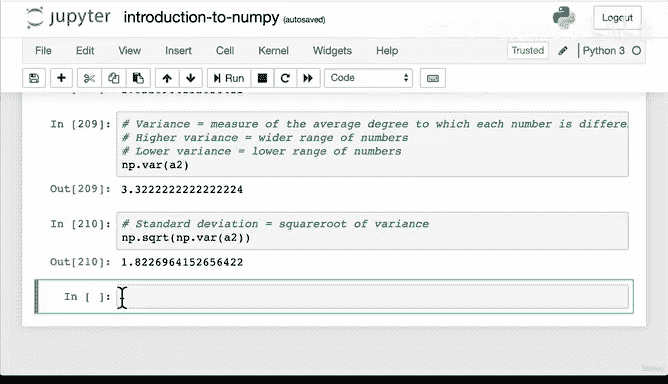

# 55：NumPy 数组操作（二）📊


在本节课中，我们将学习如何使用 NumPy 对数组进行聚合操作。聚合操作是指对一组数据执行相同的计算，例如求和、求平均值等。我们将通过具体的例子来理解这些概念，并比较 NumPy 方法与 Python 内置方法的性能差异。

## 聚合操作简介

上一节我们学习了 NumPy 数组的基本算术运算。本节中，我们来看看如何对数组进行聚合操作。聚合是指对一组数据执行相同的计算，例如求和、求平均值等。

## 求和操作对比

以下是两种对数组求和的方法：

*   **Python 内置 `sum()` 函数**：适用于 Python 原生数据类型（如列表）。
*   **NumPy 的 `np.sum()` 函数**：专门为 NumPy 数组优化。

**核心原则**：对 Python 数据类型使用 Python 方法，对 NumPy 数组使用 NumPy 方法。

```python
# 对列表使用 Python 的 sum()
listy_list = [1, 2, 3]
total_python = sum(listy_list)

# 对 NumPy 数组使用 NumPy 的 sum()
import numpy as np
a1 = np.array([1, 2, 3])
total_numpy = np.sum(a1)
```

## 性能对比演示

为了展示 NumPy 在数值计算上的性能优势，我们创建一个包含 10 万个随机数的大型数组，并比较两种求和方法的耗时。

```python
# 创建一个大型数组
massive_array = np.random.rand(100000)

# 使用 Jupyter Notebook 的魔法命令 %timeit 计时
# Python sum() 方法
%timeit sum(massive_array)

# NumPy np.sum() 方法
%timeit np.sum(massive_array)
```

运行上述代码会发现，`np.sum()` 的执行速度远快于 Python 原生的 `sum()` 函数。这是因为 NumPy 底层使用 C 语言实现，并针对数值计算进行了深度优化。因此，在处理数值数据时，应优先使用 NumPy 的聚合函数。

## 常用聚合函数

NumPy 提供了丰富的聚合函数。让我们以一个二维数组为例进行演示：

```python
a2 = np.array([[1, 2, 3],
               [4, 5, 6]])
```

以下是几个常用的聚合函数：

*   **求平均值**：`np.mean(a2)`
*   **求最大值**：`np.max(a2)`
*   **求最小值**：`np.min(a2)`
*   **求标准差**：`np.std(a2)`
*   **求方差**：`np.var(a2)`

## 理解方差与标准差

方差和标准差是衡量数据离散程度的重要指标。

*   **方差**：衡量每个数据点与平均值之间的平均差异程度。
    *   **公式**：`方差 = np.var(array)`
    *   方差越大，表示数据分布范围越广；方差越小，表示数据越集中。
*   **标准差**：衡量数据分布的离散程度，是方差的平方根。
    *   **公式**：`标准差 = np.std(array) = np.sqrt(np.var(array))`
    *   标准差越大，数据点越分散；标准差越小，数据点越靠近平均值。

方差和标准差在数据科学、机器学习和统计分析中至关重要，有助于我们理解数据的波动性和稳定性。

## 总结



本节课中我们一起学习了 NumPy 的聚合操作。我们了解了求和、平均值、最大值、最小值等基本聚合函数，并通过性能对比认识到对 NumPy 数组使用 NumPy 方法的重要性。最后，我们介绍了方差和标准差这两个描述数据分布的关键概念。记住，在处理数值计算时，充分利用 NumPy 优化过的函数可以显著提升代码效率。