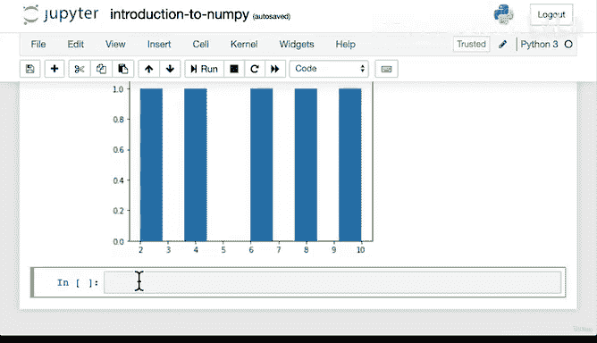
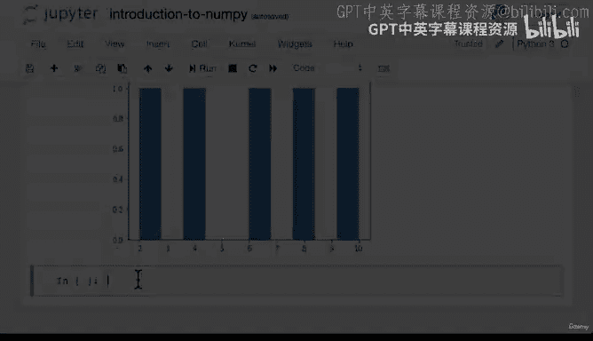

# 56：056_07_010 标准差与方差 📊


在本节课中，我们将要学习标准差与方差这两个重要的数据度量指标。它们是衡量数据集中数值分散程度的关键工具。

上一节我们介绍了使用NumPy进行聚合运算，例如计算数组所有元素的总和。我们看到了在处理数值型数据时，NumPy代码比纯Python代码快得多。因此，在处理NumPy数组时，应始终使用NumPy的聚合函数。

本节中，我们将通过实际代码演示来深入了解标准差和方差。

## 核心概念：数据的分散程度

标准差和方差的核心概念是衡量数据的分散程度。让我们通过代码示例来直观理解。

首先，我们创建两个NumPy数组。

```python
import numpy as np

high_var_array = np.array([1, 100, 200, 300, 4000, 5000])
low_var_array = np.array([2, 4, 6, 8, 10])
```

观察这两个数组中的数字。`high_var_array` 从1开始，到100、200、300，然后跃升至4000，最后是5000。`low_var_array` 则简单地以2、4、6、8、10递增。

仅从数字上看，`high_var_array` 的数值分布更广，最大值与最小值相差很大。而 `low_var_array` 的数值则紧密聚集，最大差值仅为8。

## 计算方差

以下是计算两个数组方差的方法。

```python
print(np.var(high_var_array))
print(np.var(low_var_array))
```

运行代码后，`high_var_array` 的方差是一个非常大的数字，而 `low_var_array` 的方差则小得多。

虽然我们不深入探讨背后的数学公式，但理解其概念更为重要。**方差**衡量的是每个数值与平均值差异的平均程度。方差越高，表示数值范围越广；方差越低，表示数值范围越集中。这与我们的两个数组情况相符：`high_var_array` 具有很高的方差，而 `low_var_array` 由于数值接近，方差较低。

## 计算标准差

接下来，我们计算两个数组的标准差。

```python
print(np.std(high_var_array))
print(np.std(low_var_array))
```

在运行之前，可以思考一下标准差的结果会如何。运行后，我们看到 `high_var_array` 的标准差高于 `low_var_array` 的标准差。

**标准差**衡量的是数值组相对于平均值的分散程度。两者的定义都涉及平均值。让我们计算一下平均值。

```python
print(np.mean(high_var_array))
print(np.mean(low_var_array))
```

标准差表示数值与平均值之间的平均距离。例如，如果 `high_var_array` 的平均值是1600，那么标准差2072意味着该数组中的数值平均距离下一个数值2072个单位。同理，`low_var_array` 的标准差2.8意味着其数值平均距离平均值2.8个单位。

## 可视化数据分布

为了更直观地查看数据的分散情况，我们可以绘制直方图。

```python
import matplotlib.pyplot as plt

plt.hist(high_var_array)
plt.show()

plt.hist(low_var_array)
plt.show()
```

通过可视化图表，我们可以清晰地看到 `high_var_array` 的数值分布范围更广，大部分数值集中在低端，只有少数样本出现在高端。而 `low_var_array` 的分布则相对均匀，因为每个数据点之间的间隔为2，最大距离仅为8。

## 总结

本节课中我们一起学习了标准差与方差。记住，标准差和方差的核心是衡量数据的分散程度。`high_var_array` 的高方差和高标准差反映了其数值的广泛分布，而 `low_var_array` 的低方差和低标准差则表明其数值紧密聚集。





理解这些概念对于后续的数据分析和机器学习工作至关重要。接下来，我们将进入下一节，学习更多操作数组的方法。