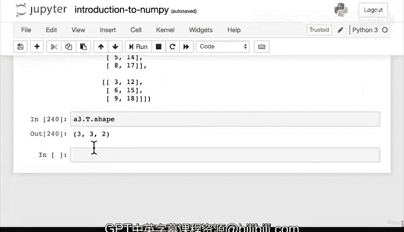

# 57：重塑与转置 📐


在本节课中，我们将要学习如何改变NumPy数组的形状，具体包括**重塑**和**转置**两种操作。理解如何操作数组的形状对于准备机器学习算法的输入数据至关重要。

上一节我们介绍了数组的算术和聚合运算。本节中我们来看看如何改变数组的形态，使其符合特定运算（如广播）的要求。

## 为何需要改变数组形状？ 🤔

许多机器学习任务要求将输入数据整理成特定形态，以确保算法能正确接收并输出结果。确保你的数据数组具有正确的形状，是“对齐”输入的一种关键方式。

## 重塑数组

**重塑**操作允许你改变数组的维度，但不改变其包含的数据。这是通过`.reshape()`方法实现的。

以下是`.reshape()`方法的基本用法：

```python
# 假设我们有一个2x3的数组a2
a2_reshaped = a2.reshape(new_shape)
```

让我们通过一个具体例子来理解。假设我们有两个数组`a2`（形状为`(2, 3)`）和`a3`（形状为`(2, 3, 3)`）。直接相乘会导致广播错误，因为它们的形状不兼容。

NumPy的广播规则指出：两个数组的维度从尾部开始逐元素比较时，只有当它们相等，或其中一个为1时，维度才是兼容的。

为了使`a2`与`a3`兼容，我们可以为`a2`添加一个大小为1的新维度：

```python
# 将a2从形状(2,3)重塑为(2,3,1)
a2_reshaped = a2.reshape(2, 3, 1)
print(a2_reshaped.shape)  # 输出：(2, 3, 1)
print(a3.shape)           # 输出：(2, 3, 3)
```

现在，`a2_reshaped`的形状是`(2, 3, 1)`，`a3`的形状是`(2, 3, 3)`。根据广播规则，最后一个维度（1和3）是兼容的（因为其中一个为1），因此它们现在可以相乘：

```python
result = a2_reshaped * a3
```

重塑操作的核心在于：它不改变数组包含的数据，只是重新排列这些数据以匹配新的形状。当你的数据形状不匹配导致算法报错时，重塑是解决问题的关键工具。

## 转置数组

**转置**是另一种改变数组形态的操作，它通过交换数组的轴（通常是行和列）来实现。

转置操作可以通过`.T`属性或`.transpose()`方法轻松完成。

以下是转置操作的基本示例：

```python
# 使用.T属性进行转置
a2_transposed = a2.T
print(a2.shape)           # 原始形状：(2, 3)
print(a2_transposed.shape) # 转置后形状：(3, 2)
```

转置操作直观地交换了行和列。对于更高维度的数组，转置会交换指定的轴。例如，对于一个形状为`(2, 3, 3)`的数组`a3`：

```python
print(a3.shape)        # 输出：(2, 3, 3)
print(a3.T.shape)      # 输出：(3, 3, 2)
```

可以看到，转置操作默认翻转了所有轴的顺序。

## 重塑与转置的关键区别

以下是重塑与转置的核心区别：

*   **重塑**：允许你自定义任何**合法**的新形状（总元素数必须保持不变）。你完全控制维度的组织和大小。
*   **转置**：主要是交换数组现有的轴。它是一种更特定、更规则的重排方式。

简单来说，重塑让你“重新塑造”数组，而转置让你“翻转”数组的轴。

## 总结

本节课中我们一起学习了NumPy中两个关键的数组形态操作：

1.  **重塑**：使用`.reshape()`方法改变数组的维度结构，以适应广播规则或其他运算需求，而不改变其数据。
2.  **转置**：使用`.T`属性或`.transpose()`方法快速交换数组的轴，通常是行和列。



掌握如何灵活地改变数组形状，是确保数据与机器学习算法兼容的重要步骤。请多加练习这些操作，我们下节课再见！