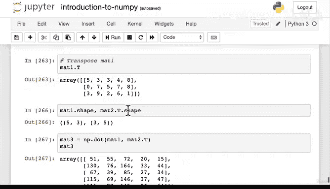
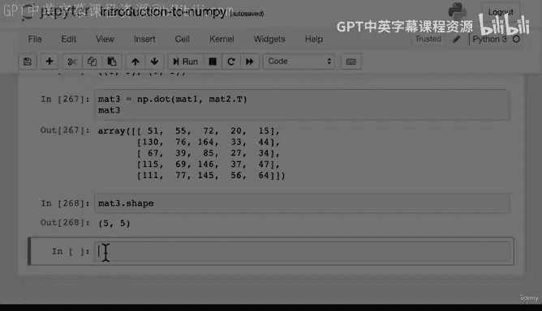

# 58：点积与逐元素运算 📊


在本节课中，我们将学习两种重要的矩阵运算：**点积**和**逐元素乘法**。我们将通过代码示例理解它们的工作原理、区别以及在实际中的应用场景。

---

## 概述

上一节我们介绍了矩阵的**重塑**和**转置**操作。你可能会想，转置只是翻转矩阵的轴，它究竟在什么时候有用呢？本节我们将探讨转置的一个主要应用场景：**点积运算**。同时，我们也会回顾另一种基础的矩阵乘法形式——**逐元素乘法**。

---

## 逐元素乘法（哈达玛积）

首先，我们来回顾一种简单的矩阵运算：逐元素乘法，也称为**哈达玛积**。这种运算要求两个矩阵形状完全相同，运算规则是对应位置的元素相乘。

以下是其数学表示和代码实现：

**公式表示：**
若矩阵 **A** 和 **B** 形状相同，则逐元素乘积 **C** 中每个元素满足：
`C[i, j] = A[i, j] * B[i, j]`

**代码实现：**
```python
import numpy as np

# 创建两个相同形状的随机矩阵
mat1 = np.random.randint(10, size=(5, 3))
mat2 = np.random.randint(10, size=(5, 3))

# 逐元素乘法（两种等效方式）
elementwise_product_1 = mat1 * mat2
elementwise_product_2 = np.multiply(mat1, mat2)
```
在NumPy中，使用 `*` 运算符或 `np.multiply()` 函数都可以实现逐元素乘法。运算结果是另一个相同形状的矩阵，其中每个元素都是两个输入矩阵对应位置元素的乘积。

---

## 点积运算

现在，我们来看看更复杂的**点积**运算。点积是线性代数中的核心操作，在机器学习和数据科学中应用广泛，例如神经网络的前向传播。

### 点积的规则

点积运算遵循特定的维度规则。假设我们有两个矩阵：
*   矩阵 **A** 的形状为 `(m, n)`
*   矩阵 **B** 的形状为 `(n, p)`

**规则1：** 进行点积运算时，**A** 的列数（`n`）必须等于 **B** 的行数（`n`）。我们称这两个维度为“内部维度”，它们必须匹配。

**规则2：** 点积结果矩阵 **C** 的形状由“外部维度”决定，即 `(m, p)`。

**公式表示：**
结果矩阵 **C** 中第 `i` 行、第 `j` 列的元素计算公式为：
`C[i, j] = sum(A[i, :] * B[:, j])`
这意味着 **C** 的每个元素是 **A** 的一行与 **B** 的一列对应元素乘积之和。

### 点积的直观演示

为了更好地理解，我们来看一个具体的计算过程。假设：
```
A = [[5, 0, 3],
     [2, 1, 4]]

B = [[4, 1],
     [6, 2],
     [8, 3]]
```
计算点积 `C = np.dot(A, B)`：
1.  计算 `C[0, 0]`（结果矩阵左上角元素）：
    *   取 **A** 的第0行 `[5, 0, 3]` 和 **B** 的第0列 `[4, 6, 8]`。
    *   对应元素相乘：`5*4 + 0*6 + 3*8 = 20 + 0 + 24 = 44`。
2.  计算 `C[0, 1]`（结果矩阵右上角元素）：
    *   取 **A** 的第0行 `[5, 0, 3]` 和 **B** 的第1列 `[1, 2, 3]`。
    *   对应元素相乘：`5*1 + 0*2 + 3*3 = 5 + 0 + 9 = 14`。
3.  依此类推，计算所有元素。

最终结果矩阵 **C** 的形状为 `(2, 2)`。

### 代码实现与转置的应用

在代码中，我们使用 `np.dot()` 函数或 `@` 运算符进行点积运算。

```python
import numpy as np

# 创建两个形状不直接匹配的矩阵
mat1 = np.random.randint(10, size=(5, 3))  # 形状 (5, 3)
mat2 = np.random.randint(10, size=(5, 3))  # 形状 (5, 3)

# 直接尝试点积会报错，因为内部维度 3 != 5
# result = np.dot(mat1, mat2)  # ValueError: shapes (5,3) and (5,3) not aligned

# 使用转置使维度匹配
# 将 mat2 转置，形状变为 (3, 5)。现在 mat1 的列数(3)等于 mat2.T 的行数(3)
mat3 = np.dot(mat1, mat2.T)  # 或 mat1 @ mat2.T

print(f"mat1 形状: {mat1.shape}")
print(f"mat2.T 形状: {mat2.T.shape}")
print(f"点积结果 mat3 形状: {mat3.shape}")  # 输出: (5, 5)，由外部维度 (5, 5) 决定
```
这里就体现了**转置**的实用性。当两个矩阵的形状不满足点积条件时，我们可以通过转置其中一个矩阵来调整其维度，使其匹配。

---

## 两种运算的对比总结

以下是点积与逐元素乘法的主要区别：

*   **运算规则**：
    *   逐元素乘法：对应位置相乘。
    *   点积：行与列的点乘求和。
*   **符号/函数**：
    *   逐元素乘法：`*` 或 `np.multiply`。
    *   点积：`np.dot` 或 `@`。
*   **输入要求**：
    *   逐元素乘法：输入矩阵**形状必须完全相同**。
    *   点积：第一个矩阵的**列数**必须等于第二个矩阵的**行数**。
*   **输出形状**：
    *   逐元素乘法：输出形状与输入相同。
    *   点积：输出形状为 `(第一个矩阵的行数, 第二个矩阵的列数)`。

---

## 练习建议

为了巩固理解，建议你进行以下练习：
1.  手动创建两个小矩阵（如2x3和3x2），在纸上计算它们的点积，验证规则。
2.  在代码中创建不同形状的矩阵，尝试使用转置操作使它们能够进行点积运算。
3.  比较对相同矩阵使用 `*` 和 `np.dot` 的结果，直观感受两者的不同。

---

## 总结

本节课我们一起学习了两种关键的矩阵运算。我们明确了**逐元素乘法**（哈达玛积）是形状相同的矩阵对应元素相乘。而**点积**则是一种更复杂的乘法，它遵循“内部维度匹配，外部维度决定结果形状”的规则，并且是许多机器学习算法的基础。我们还看到了**转置操作**在调整矩阵维度以进行点积运算时的实际应用。理解这些运算是掌握后续更复杂线性代数概念和模型构建的重要一步。





在下一节中，我们将探讨点积在实践中的具体应用场景。