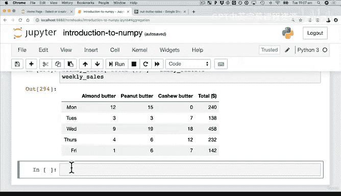

# 59：点积的实际应用：坚果酱商店销售分析 🥜


在本节课中，我们将学习如何将点积这一数学概念应用于一个实际的商业场景：分析一家坚果酱商店的每日销售额。我们将使用NumPy和Pandas来复现一个类似电子表格的计算过程。

点积是一种将两个数组对应元素相乘后求和的运算。在数据科学中，它常用于计算加权和，例如根据单价和销量计算总收入。其公式可以表示为：
**`total = sum(price[i] * quantity[i])`**

---

## 从电子表格到代码

上一节我们介绍了点积的基本概念，本节中我们来看看如何在一个具体的销售数据例子中应用它。

假设我们经营一家商店，销售三种坚果酱：杏仁酱、花生酱和腰果酱。我们有一个电子表格，记录了周一至周五每种酱的销量和单价，并计算了每日的总收入。

我们的目标是使用Python的NumPy和Pandas库，完全复现这个电子表格的计算逻辑，而不依赖任何电子表格软件。

## 构建销售数据

首先，我们需要创建模拟的销售数据。以下是创建销量数组和数据框的步骤：

```python
import numpy as np
import pandas as pd

# 设置随机种子以保证结果可复现
np.random.seed(42)

# 创建销量数组，模拟5天里3种产品的销量（假设最多20罐）
sales_amounts = np.random.randint(0, 20, size=(5, 3))
# 销量数组形状为 (5, 3)，代表5天，3种产品

# 创建Pandas数据框，使其更直观
weekly_sales = pd.DataFrame(sales_amounts,
                            index=["Mon", "Tue", "Wed", "Thu", "Fri"], # 行索引为星期
                            columns=["Almond Butter", "Peanut Butter", "Cashew Butter"]) # 列名为产品
```

## 创建价格数据

接下来，我们定义每种产品的单价，并将其也放入一个数据框中：

```python
# 创建价格数组：杏仁酱$10，花生酱$8，腰果酱$12
prices = np.array([10, 8, 12])

# 将价格数组转换为Pandas数据框
# 注意：需要将形状从(3,)重塑为(1,3)，以匹配数据框的格式（1行，3列）
butter_prices = pd.DataFrame(prices.reshape(1, 3),
                             index=["Price"], # 行索引为“价格”
                             columns=["Almond Butter", "Peanut Butter", "Cashew Butter"])
```

## 计算每日总销售额

现在，我们有了销量数据框 `weekly_sales` 和价格数组 `prices`。要计算每日总收入，本质上就是对每一天，执行销量与对应单价的点积运算。

然而，直接进行点积运算会遇到形状不匹配的问题。`weekly_sales` 的形状是 (5, 3)，而 `prices` 的形状是 (3,)。我们需要调整形状使其对齐。

以下是计算过程：

```python
# 方法：将销量数据框转置，使其形状变为(3,5)，这样就能与形状为(3,)的价格数组进行点积运算
# 点积运算会在“产品”维度上对齐相乘并求和，最终得到一个形状为(5,)的数组，代表5天的总收入
daily_sales = prices.dot(weekly_sales.T) # 或者使用 np.dot(prices, weekly_sales.T)

# 将计算结果（每日总收入）作为一个新列添加到原销量数据框中
# 注意：daily_sales 目前是一个数组，需要先将其转换为数据框并转置，以匹配列的形式
weekly_sales["Total ($)"] = pd.DataFrame(daily_sales).T
```

通过以上步骤，我们就在 `weekly_sales` 数据框的最右侧成功添加了“Total ($)”列，它精确地计算出了每一天的总销售额，完全复现了手动在电子表格中输入公式 `= (销量1 * 单价1) + (销量2 * 单价2) + (销量3 * 单价3)` 的效果。

## 核心要点总结

本节课中我们一起学习了如何将点积应用于一个实际的销售分析案例：

1.  **数据构建**：我们使用NumPy和Pandas创建了结构化的销量和价格数据。
2.  **形状对齐**：我们认识到进行数组运算时，形状匹配是关键。通过转置（`.T`）操作，我们解决了点积运算中的形状不匹配问题。
3.  **点积计算**：我们使用 `dot()` 函数执行了点积运算，高效地计算出了每日的总销售额，避免了繁琐的循环操作。
4.  **结果整合**：最后，我们将计算结果作为新列添加回原始数据框，完成了整个分析流程。



这个练习清晰地展示了点积在数据科学中的实用价值：它能将复杂的多步计算浓缩为一行简洁的代码，是进行加权求和、线性组合等计算的强大工具。请务必亲自动手尝试代码，并可以修改产品、价格或天数来创建你自己的销售分析案例。