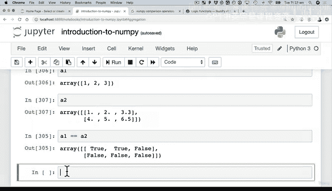

# 60：比较运算符 🔍


在本节课中，我们将要学习如何在 NumPy 数组中使用比较运算符。这些运算符允许我们比较数组中的元素，并生成布尔值数组作为结果。

我们已经了解了多种操作数组的方法。在本节中，我们将重点介绍如何比较数组。

## 比较运算符简介

NumPy 中的比较运算符与 Python 中的用法相似。它们可以用于比较两个数组，或者比较一个数组与一个标量值。

以下是主要的比较运算符示例：

*   `>`：大于
*   `>=`：大于或等于
*   `<`：小于
*   `<=`：小于或等于
*   `==`：等于

## 数组与数组的比较

让我们使用两个示例数组 `a1` 和 `a2` 来进行比较。

```python
import numpy as np

a1 = np.array([1, 2, 3, 4, 5])
a2 = np.array([1, 2, 3.3, 4, 5])
```

现在，我们可以使用比较运算符。例如，检查 `a1` 中的每个元素是否大于 `a2` 中的对应元素：

```python
result = a1 > a2
print(result)  # 输出：[False False False False False]
```

因为 `a1` 的前两个元素等于 `a2` 的对应元素，而后三个元素小于或等于 `a2` 的对应元素，所以结果全是 `False`。

接下来，我们尝试“大于或等于”比较：

```python
result = a1 >= a2
print(result)  # 输出：[ True  True False False  True]
```

这次，前两个元素相等，最后一个元素相等，因此结果为 `True`，而中间两个元素小于对应值，结果为 `False`。

## 数组与标量的比较

我们也可以将整个数组与一个单一数值（标量）进行比较。例如，检查 `a1` 中的哪些元素大于 5：

```python
result = a1 > 5
print(result)  # 输出：[False False False False False]
```

检查 `a1` 中的哪些元素小于 5：

```python
result = a1 < 5
print(result)  # 输出：[ True  True  True  True False]
```

## 检查相等性

要检查两个数组的对应元素是否相等，我们使用 `==` 运算符：

```python
result = a1 == a2
print(result)  # 输出：[ True  True False False  True]
```

## 结果的数据类型

比较操作返回的结果是一个新的 NumPy 数组，其元素的数据类型是布尔型（`bool`）。

```python
bool_array = a1 == a2
print(type(bool_array))        # 输出：<class 'numpy.ndarray'>
print(bool_array.dtype)        # 输出：bool
```

## 更多比较运算符

除了上面演示的运算符，NumPy 还提供了其他逻辑函数，例如 `np.all`、`np.any` 等，用于对布尔数组进行进一步操作。您可以在需要时查阅 NumPy 官方文档的“逻辑函数”部分以了解更多。

---



本节课中我们一起学习了 NumPy 的比较运算符。我们了解了如何使用 `>`、`>=`、`<`、`<=` 和 `==` 来比较数组之间或数组与标量之间的元素，并知道这些操作会返回一个布尔类型的数组。掌握这些比较操作是进行数据筛选、条件判断等更高级数据分析的基础。