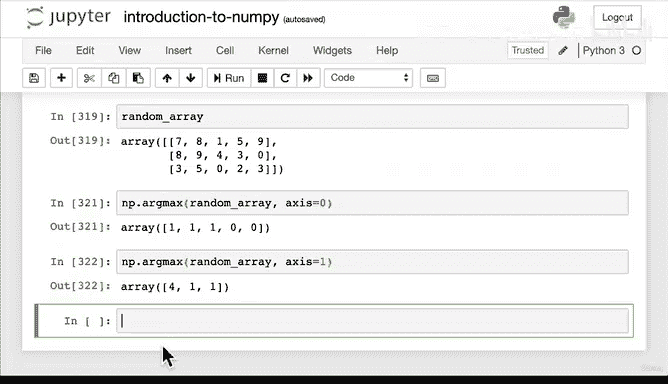

# 61：数组排序 📊


在本节课中，我们将要学习如何使用 NumPy 对数组进行排序。排序是数据处理中的一项基本操作，它能帮助我们快速找到最大值、最小值，或者按照特定顺序组织数据。

---

## 回顾与引入

上一节我们介绍了数组的创建、查看、操作和比较。本节中，我们来看看如何对数组进行排序。

首先，我们创建一个用于演示的随机整数数组。

```python
import numpy as np

# 创建一个 3行5列的随机整数数组
random_array = np.random.randint(10, size=(3, 5))
print("原始数组：")
print(random_array)
print("数组形状：", random_array.shape)
```

---

## 使用 `np.sort` 排序数组

NumPy 提供了一个名为 `np.sort` 的函数，它可以返回数组的排序副本。

以下是 `np.sort` 函数的基本用法：

```python
# 对数组进行排序
sorted_array = np.sort(random_array)
print("排序后的数组：")
print(sorted_array)
```

执行上述代码后，你会发现每一行中的数字都按照从小到大的顺序排列了。

---

## 使用 `np.argsort` 获取排序索引

有时，我们不仅想知道排序后的值，还想知道每个值在原始数组中的位置。这时可以使用 `np.argsort` 函数。

`np.argsort` 返回的是将数组排序所需的索引值。

```python
# 获取排序索引
sorted_indices = np.argsort(random_array)
print("排序索引：")
print(sorted_indices)
```

通过索引，我们可以知道原始数组中每个位置的元素在排序后应该处于哪个位置。

---

## 寻找极值索引：`argmin` 与 `argmax`

除了整体排序，我们经常需要快速找到数组中最小值或最大值的位置。NumPy 提供了 `argmin` 和 `argmax` 方法。

以下是具体用法：

```python
# 创建一个简单的一维数组用于演示
a1 = np.array([3, 1, 4])
print("示例数组 a1：", a1)

# 找到最小值的索引
min_index = np.argmin(a1)
print("最小值索引：", min_index)  # 输出 1

# 找到最大值的索引
max_index = np.argmax(a1)
print("最大值索引：", max_index)  # 输出 2
```

对于多维数组，我们可以指定 `axis` 参数来沿特定轴寻找极值索引。

```python
# 在多维数组中沿轴寻找最大值索引
# axis=0 表示沿列方向（垂直）比较
max_indices_axis0 = np.argmax(random_array, axis=0)
print("沿 axis=0（列）的最大值索引：", max_indices_axis0)

# axis=1 表示沿行方向（水平）比较
max_indices_axis1 = np.argmax(random_array, axis=1)
print("沿 axis=1（行）的最大值索引：", max_indices_axis1)
```

理解 `axis` 参数可能需要一些练习。最好的学习方法就是创建不同的数组，尝试这些命令，并观察结果。

---

## 核心概念总结

以下是本节课的核心操作总结：

*   **`np.sort(array)`**：返回数组排序后的副本。
*   **`np.argsort(array)`**：返回将数组排序所需的索引。
*   **`np.argmin(array)`**：返回数组中最小值的索引。
*   **`np.argmax(array)`**：返回数组中最大值的索引。
*   **`axis` 参数**：在多维数组中指定操作的方向（0为列，1为行）。

---

## 实践建议与课程总结

本节课中我们一起学习了 NumPy 的数组排序功能。NumPy 的强大之处在于，这些函数可以应用于任何维度的数组。

如果觉得内容繁多，请不要担心。掌握这些技能的最佳方式就是动手实践：

1.  创建你自己的数组。
2.  尝试使用 `sort`、`argsort`、`argmin` 和 `argmax` 函数。
3.  尝试进行点积等其他操作。



通过用数字构建实际例子并解决问题，你能获得最有效的学习体验。在结束 NumPy 章节之前，我们将在下一课看一个综合性的实际应用示例。