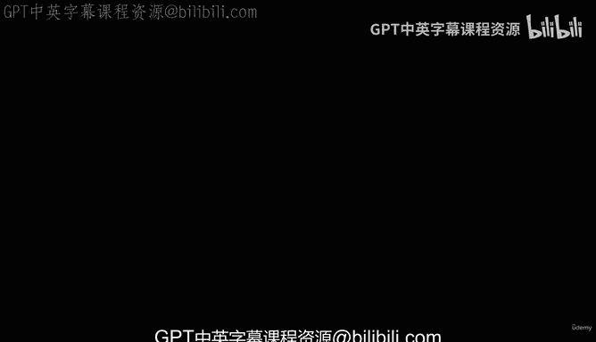
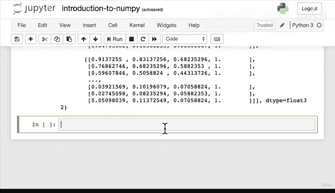

#  62：将图像转换为NumPy数组 🖼️➡️🔢



在本节课中，我们将学习如何将图像数据转换为NumPy数组。这是机器学习中一个至关重要的步骤，因为机器学习算法需要数字形式的数据来寻找模式。

---

## 概述

我们已经学习了NumPy的基础知识。现在，让我们通过一个实际的例子来巩固所学。我们将使用NumPy来处理图像数据。

## 从图像到数字

在机器学习的核心思想中，无论你的数据是什么形式，都需要将其转换为数字，然后使用算法在这些数字中寻找模式。如果你的数据恰好是图像，那么这个过程同样适用。

我们将使用Matplotlib库中的一个功能来实现这一点。首先，我们需要导入必要的模块。

```python
from matplotlib import image as img
```

这里，我们导入了`matplotlib.image`模块，并将其简称为`img`。这个模块包含一个名为`imread`的函数，它的作用是从文件中读取图像并将其转换为数组。

## 读取图像并转换为数组

假设我们有一个名为“panda.jpg”的图像文件，它位于一个名为“images”的文件夹中。我们可以使用`imread`函数来读取它。

```python
panda = img.imread('images/panda.jpg')
```

现在，让我们检查一下`panda`变量的类型。

```python
type(panda)
```

输出应该是`numpy.ndarray`。这意味着图像已经被成功转换成了一个NumPy多维数组。因此，我们可以对这个数组使用所有我们学过的NumPy功能。

## 探索图像数组

让我们查看一下这个数组的一些属性。

```python
panda.shape
```

这个命令会输出数组的形状，例如`(高度, 宽度, 颜色通道)`。对于彩色图像，通常是三维的，代表红、绿、蓝三个颜色通道。

数组中的每个数字代表一个像素的颜色值。如果我们查看数组的前几个元素：

```python
panda[:5]
```

我们可以看到这些数字。本质上，`imread`函数将图片分解为像素，并记录了每个像素的红、绿、蓝颜色值。

## 尝试更多图像

为了加深理解，我们可以用其他图像重复这个过程。

以下是读取汽车照片的示例：

```python
car = img.imread('images/car_photo.png')
type(car)
```

同样，我们也可以读取一张狗狗的照片：

```python
dog = img.imread('images/dog_photo.jpg')
```

现在，我们已经成功地将这些图像转换成了NumPy数组。这是机器学习流程中最大的一步：将数据转化为数字，具体来说是NumPy数组。

## 机器学习如何利用这些数组

机器学习算法无法像人类一样“看”图片并识别出“这是一棵树”或“这是一只狗”。它需要数字。算法会分析这些数字数组，比较不同图像中相似区域的像素值。例如，如果两张图片中某片区域的像素值非常接近，算法可能会推断这两片区域代表同一种物体（比如草地或树木）。

## 总结

本节课中，我们一起学习了如何将图像转换为NumPy数组。我们使用了Matplotlib的`imread`函数来完成这项任务，并探索了结果数组的属性。记住，将数据转化为数字是应用机器学习的关键第一步。NumPy因其高效处理数组和数学运算的能力，在此过程中扮演着核心角色。



如果你现在没有完全掌握所有内容，请不要担心。这是一个需要消化的过程。建议你休息一下，用自己的图片进行尝试，将它们转换为NumPy数组，并回顾我们所学的内容。我们下节课再见！