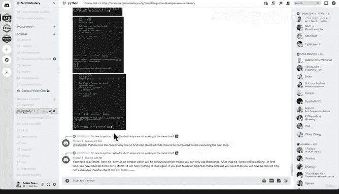

# 63：063_07_017 练习：应对冒名顶替综合症 🧠

在本节课中，我们将暂时离开技术学习，探讨一个在学习过程中普遍存在的心理现象——冒名顶替综合症。我们将了解它的本质，并学习一个通过实践来克服它的有效练习。

---

## 概述：什么是冒名顶替综合症？

冒名顶替综合症是一种自我怀疑的心理状态。你会感觉自己能力不足，认为所学知识过于复杂，永远无法达到自己的目标。当你看到行业内的专家时，可能会认为自己永远无法企及他们的高度。

然而，这种感觉其实是学习过程中的一个常见症状。它仅仅意味着你目前尚未达到那个水平，而掌握任何有价值的技能都需要时间和努力。正是因为它困难，所以它才显得有价值。

---

## 从不适到熟练：一个自然的过程

回想你第一天上学或第一天上班时的感受，那是一种相似的、充满未知与不安的体验。但随着时间的推移，通过不断的重复和练习，你会逐渐变得得心应手，积累经验，那种冒名顶替的感觉也会慢慢消退。

因此，冒名顶替综合症的出现并非坏事。它恰恰表明你正在从事一项有价值、有挑战性的事业。请不要将其视为负面情绪，而应将其作为一种鼓励，证明你正在学习新知识，并不断突破自己的极限。

---

## 实践练习：通过教学来巩固学习

基于以上理解，我们提议进行一个简短的练习。请暂停视频讲座，稍作休息，然后前往我们的 Discord 社区。

以下是你需要完成的步骤：

1.  **访问 Discord 服务器**：如果你已经加入，很好。如果尚未加入，请立即前往。
2.  **选择帮助领域**：进入与编程或课程相关的板块，例如 `#python` 频道。
3.  **寻找帮助机会**：浏览其他学员提出的问题。
4.  **尝试解答**：看看你是否能运用目前所学知识帮助他人解决问题。

这个练习的核心概念是：**“教即是学”**。即使你对自己的知识没有100%的把握，尝试向他人解释你刚刚学到的内容，这个过程本身对你的学习大有裨益。如果你从不尝试去教授、解释或展示所学，你将永远停留在初学者的阶段。

> **核心公式**：`学习效果 = 输入 + 输出`，其中 `输出` 包括**实践**与**教学**。

---

## 社区文化与鼓励

请记住我们社区的口号：**保持友善，不作评判**。在这里，我们都是初学者，都在学习的道路上。不要因为害怕答错而不敢参与。除了尤达大师，没有人是完美的。

勇敢地分享你的理解，在帮助他人的同时，你也在帮助自己更牢固地掌握知识。

---

## 总结

本节课我们一起探讨了冒名顶替综合症的本质，认识到它是学习旅程中的自然组成部分。我们更学习了一个强大的应对工具：**通过帮助他人（教学）来深化自己的理解**。记住，每一次你克服犹豫去解释一个概念，都是在为自己积累信心与真知。

现在，休息一下，然后去 Discord 社区尝试帮助一位伙伴吧。我们下节课再见！