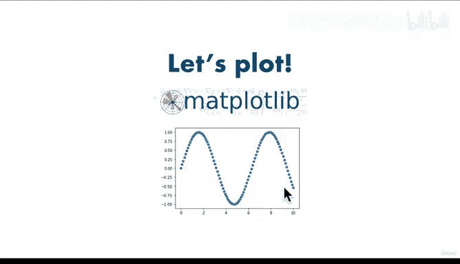

# 65：Matplotlib 简介 📊

在本节课中，我们将要学习 Matplotlib 的基础知识。Matplotlib 是一个强大的 Python 绘图库，它能够将数据转换为直观的图表，帮助我们更好地理解和展示数据。

---

## 什么是 Matplotlib？🤔

在之前的几节课程中，我们学习了如何以列表、数组和数据框的形式查看数据。本节中，我们来看看 Matplotlib。

Matplotlib 是一个绘图库，更具体地说，是一个 Python 绘图库。它能与我们之前使用的工具很好地配合。Matplotlib 的功能是允许我们将数据转换为美观的可视化图表，这些图表也被称为绘图或图形。

---

## Matplotlib 在机器学习框架中的位置 🗺️

回顾我们的机器学习建模框架，我们会经历问题定义、数据、评估、特征、建模和实验等步骤。

如果回到我们工具所处的位置，Matplotlib 属于数据分析部分。但正如你将看到的，它也可以成为实验阶段的一部分。我们将在未来的视频中详细讨论这一点。

Matplotlib 将与 Pandas 和 NumPy 共同构成数据分析的“三驾马车”。当你开始看到这三者协同工作时，你会真正理解它们在数据分析和探索不同数据集时提供的协同效应。

---

## 为什么选择 Matplotlib？✨

首先，Matplotlib 建立在 NumPy 数组和 Python 之上。正如我们之前讨论的，大量数据和数值信息都基于 NumPy 数组，包括 Pandas 的数据框，Matplotlib 也是如此。

由于这一切都是用 Python 编写的，我们无需学习另一种编程语言。因此，我们现在可以使用相同的编程语言来处理数据并创建可视化图表。

其次，它通过 Matplotlib Pandas API 直接与 Pandas 集成。你可以创建基本或高级的图表。同样，像其他库一样，如果你能想象出一种可视化效果或图表，你很可能可以使用 Matplotlib 来创建它。不过，我们将专注于最有用的图表类型。

最后，它拥有简单易用的接口。当然，一旦掌握了基础，你会发现它非常强大。

---

## Matplotlib 的工作流程 🔄

以下是 Matplotlib 内部的一个基本工作流程：

1.  **从数据开始**：这是所有绘图的基础。
2.  **创建图形**：图形就像一个空白的画布。
3.  **在图形上绘制数据**：这是 Matplotlib 的两个主要数据类——坐标轴和图形的核心操作。完成这一步后，你将得到一个包含 X 轴和 Y 轴以及一些信息的图表。
4.  **自定义图表**：例如，添加标题、调整颜色等。在这个例子中，我们有一个标题显示“0 to Mastery Machine Learning”，并且随着时间推移，你的机器学习知识在增加。
5.  **保存或分享图表**：人类是视觉动物，直接看充满数字的大表格可能会让人困惑。图表能帮助我们直观地传达工作成果，而不仅仅是展示一堆数字。

---

## 本课具体内容 📝

在了解了 Matplotlib 的工作流程后，我们将在以下各个要点中应用这个流程：

*   **导入 Matplotlib**：学习如何导入这个库。
*   **两种绘图方式**：我们将探讨 Matplotlib 的两种不同绘图方式，并选择最有用、最灵活的一种。
*   **从 NumPy 数组绘图**：这将建立在之前 NumPy 课程的基础上。
*   **与 Pandas 数据框集成**：学习如何通过 Matplotlib Pandas API 直接从 Pandas 数据框创建图表。
*   **自定义图表**：学习如何更改颜色、添加标题、命名坐标轴等。
*   **保存和分享图表**：完成工作流程的最后一步，以便与他人交流你的工作。

---

## 如何获取帮助？🆘

在学习过程中，如果遇到问题，可以遵循以下步骤：

首先，尽可能跟着代码一起操作。记住我们的座右铭：如有疑问，运行代码。我们将再次使用 Jupyter Notebook，课程结束后或在额外信息部分你可以找到它。

总是自己动手尝试。如有疑问，运行代码。尝试其他方法。继续前进。

如果仍然卡住，可以搜索答案，你很可能会找到 Stack Overflow 上的相关讨论，或者查阅 Matplotlib 的官方文档，它非常全面。

如果你有具体问题，可以先尝试搜索，如果对 Stack Overflow 上的内容不太理解，再仔细阅读文档。

最后，如果还是不行，可以提问。记住，如有疑问，运行代码。我自己也经常需要提醒自己这一点。

---

## 总结 🎯

本节课中，我们一起学习了 Matplotlib 的基础知识。我们了解了 Matplotlib 是什么，它在数据分析中的重要性，以及其基本的工作流程。我们还预览了接下来要学习的具体内容，包括导入、绘图、集成与自定义。准备好开始绘图了吗？让我们在下一节视频中继续探索！