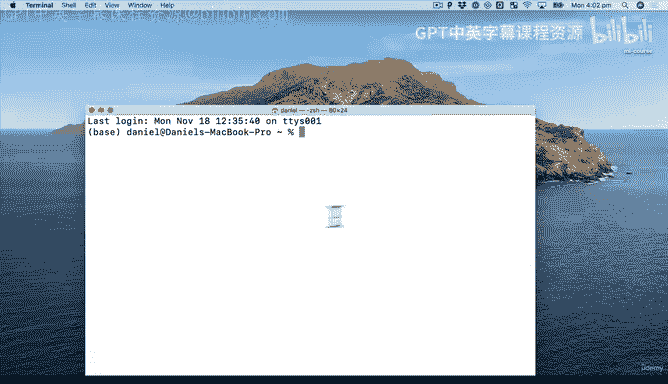
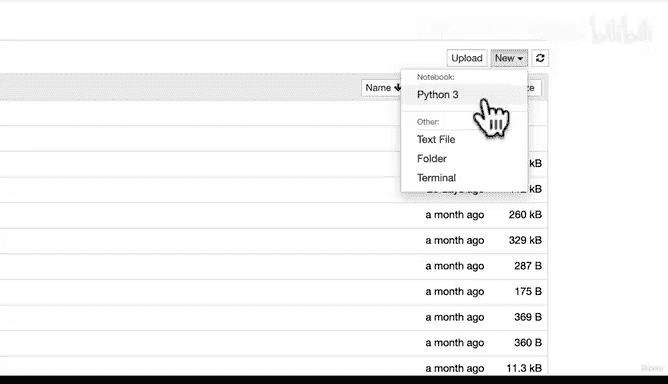
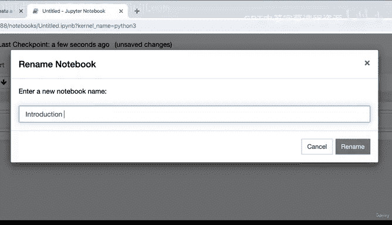
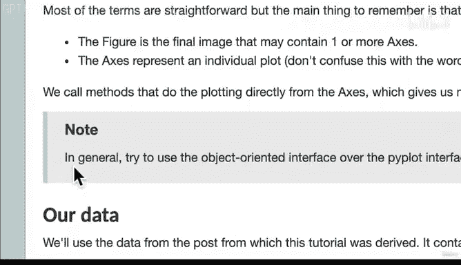
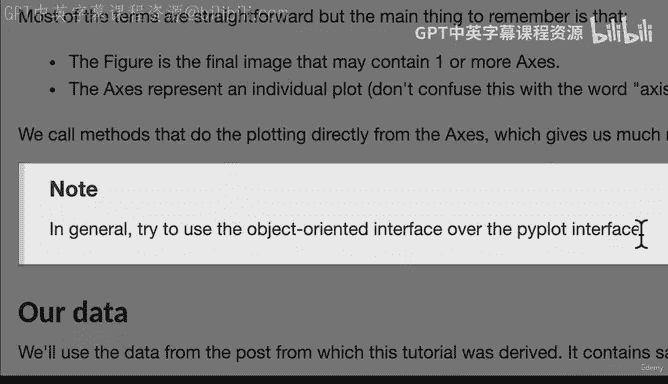
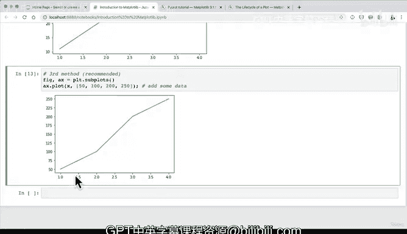

#  66：导入和使用 Matplotlib 📊


在本节课中，我们将学习如何导入和使用 Python 中最流行的数据可视化库之一：Matplotlib。我们将从基础开始，了解如何创建简单的图表，并比较 Matplotlib 中两种主要的绘图方式。



---

## 概述

我们将从设置工作环境开始，然后导入必要的库。接着，我们会探索 Matplotlib 的两种主要绘图接口：Pyplot（类 MATLAB 风格）和面向对象接口。最后，我们会确定在后续课程中将主要使用哪种方法。

---

## 启动环境与 Jupyter Notebook



首先，我们需要在终端中激活我们的工作环境并启动 Jupyter Notebook。



以下是启动步骤：
1.  打开终端。
2.  使用 `cd` 命令导航到项目文件夹（例如 `sample_project`）。
3.  使用 `conda activate` 激活虚拟环境。
4.  输入 `jupyter notebook` 启动 Jupyter。

良好的习惯是手动输入这些命令，这有助于熟悉代码编写过程。

---

## 导入必要的库

在 Jupyter Notebook 中，我们首先在代码单元格顶部导入所有需要的工具。这是一个标准的工作流程。

我们将导入以下库：
*   **Matplotlib**：用于绘图。
*   **NumPy**：用于数值计算。
*   **Pandas**：用于数据处理。

为了确保图表能直接显示在 Notebook 中，我们需要使用一个“魔法命令” `%matplotlib inline`。

```python
%matplotlib inline
import matplotlib.pyplot as plt
import pandas as pd
import numpy as np
```

运行这个单元格后，这些工具就可以使用了。`%matplotlib inline` 的作用是让所有图表都内嵌显示在 Notebook 中。

---

## 创建第一个简单图表

在 Matplotlib 中，最简单的绘图方式是使用 `plt.plot()` 函数。

如果我们直接运行 `plt.plot()`，会得到一个空白的图表框，并可能附带一些我们不想要的文本输出。为了隐藏这些输出，可以在语句末尾添加一个分号 `;`。

```python
plt.plot();
```

另一种达到相同效果的方法是显式调用 `plt.show()` 来显示图形。

```python
plt.plot()
plt.show()
```

现在，让我们为图表添加一些数据。`plt.plot()` 函数的基本用法是传入 X 轴和 Y 轴的数据。

```python
# 传入一个列表作为Y值，X值会自动生成
plt.plot([1, 2, 3, 4]);
```

```python
# 分别定义X和Y的数据
x = [1, 2, 3, 4]
y = [11, 22, 33, 44]
plt.plot(x, y);
```

此时，我们已经创建了一个简单的折线图。这种使用 `plt.plot()` 等函数直接绘图的方式，被称为 **Pyplot 接口** 或 **状态机接口**。它的风格类似于 MATLAB，使用起来快速直接。

---

## 理解 Matplotlib 的绘图接口

上一节我们使用了 Pyplot 接口。然而，查阅 Matplotlib 官方文档会发现，它通常推荐使用另一种更灵活的方法。

Matplotlib 主要提供两种编程接口：
1.  **Pyplot 接口**：通过 `plt.plot()` 等函数直接绘图，简单快捷，但灵活性较低。
2.  **面向对象接口**：通过显式创建图形（Figure）和坐标轴（Axes）对象来绘图，提供了更精细的控制，是更推荐的方式。

官方文档的教程中明确指出：
> 通常，尽量使用面向对象接口而不是 Pyplot 接口。





为了让你在查阅其他资料时能识别不同风格，下面展示三种创建图表的常见方法。

---

### 方法一：显式创建图形和坐标轴

这是面向对象接口的基础形式，步骤清晰。

```python
fig = plt.figure()          # 创建一个图形（Figure）对象
ax = fig.add_subplot()      # 在图形中添加一个坐标轴（Axes）对象
plt.plot([1, 2, 3, 4], [1, 4, 2, 3])  # 在坐标轴上绘图
plt.show()                  # 显示图形
```

### 方法二：混合使用面向对象和 Pyplot

这种方法先创建图形，然后使用 Pyplot 风格的函数在特定坐标轴上绘图。

```python
fig = plt.figure()          # 创建图形
ax = fig.add_axes([0, 0, 1, 1]) # 添加坐标轴，参数定义位置和大小
ax.plot([1, 2, 3, 4], [10, 20, 25, 30]) # 使用坐标轴对象的plot方法
plt.show()
```

### 方法三：推荐方法（使用 plt.subplots）

这是最常用且简洁的面向对象接口写法。`plt.subplots()` 函数一次性创建图形和坐标轴对象。

```python
fig, ax = plt.subplots()    # 创建图形和一个子图坐标轴
ax.plot([1, 2, 3, 4], [50, 100, 200, 250]) # 在坐标轴ax上绘图
plt.show()
```

`plt.subplots()` 特别适合创建包含多个子图的复杂布局。每次调用类似 `fig, ax = plt.subplots()` 的代码，都会创建一个全新的图形，之前绘制的数据不会被保留。

---

## 总结

本节课我们一起学习了 Matplotlib 的基础知识。我们首先设置了工作环境并导入了库，然后使用 `plt.plot()` 创建了第一个图表。接着，我们了解了 Matplotlib 的两种主要绘图接口：**Pyplot 接口** 和更受推荐的 **面向对象接口**。最后，我们介绍了三种创建图表的方法，并确定在后续课程中将主要使用 **`plt.subplots()`** 这种面向对象的方式，因为它能为我们将来实现更复杂的可视化提供最大的灵活性。

记住，核心的绘图代码模式是：
```python
fig, ax = plt.subplots()
ax.plot(x_data, y_data)
```



在下一节课中，我们将利用这种方法来创建更多样化的图表。