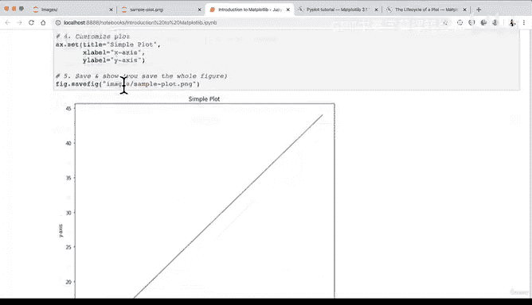

# 67：Matplotlib图形结构详解 📊


在本节课中，我们将学习Matplotlib图形的基本结构。我们将了解如何创建和自定义图形，掌握对象导向API的使用方法，并完成一个完整的绘图工作流程。

---

## 图形结构解析

上一节我们介绍了Matplotlib的几种绘图方法。本节中，我们来看看Matplotlib图形的详细结构。

Matplotlib图形包含多个组成部分，这些部分共同构成完整的可视化图表。以下是主要组件：

*   **图形（Figure）**：整个绘图区域，相当于画布
*   **坐标轴（Axes）**：图形中的实际绘图区域，可包含多个子图
*   **标题（Title）**：图表的名称
*   **坐标轴标签（Axis Labels）**：X轴和Y轴的描述文字
*   **图例（Legend）**：数据系列的说明
*   **网格线（Grid）**：辅助阅读数据的参考线

这些组件通过代码控制，例如设置标题的代码为：
```python
ax.set_title("图表标题")
```

---

## 对象导向API基础

理解了图形的基本结构后，现在我们来了解Matplotlib的对象导向API。

Matplotlib提供两种主要接口：基于状态的pyplot接口和对象导向接口。对象导向接口更灵活，适合复杂图表。核心对象包括：

*   **Figure对象**：对应整个图形区域
*   **Axes对象**：对应图形中的坐标轴区域

创建这些对象的典型代码是：
```python
fig, ax = plt.subplots()
```

这里`fig`代表整个图形，`ax`代表图形中的坐标轴区域。一个图形可以包含多个坐标轴区域，形成子图布局。

---

## 完整工作流程示例

现在我们已经掌握了图形结构和对象导向API，让我们通过一个完整示例来实践Matplotlib的工作流程。

以下是创建和保存图形的标准步骤：

1.  **导入Matplotlib并配置Jupyter显示**
    ```python
    import matplotlib.pyplot as plt
    %matplotlib inline
    ```

2.  **准备数据**
    ```python
    x = [1, 2, 3, 4, 5]
    y = [2, 4, 6, 8, 10]
    ```

3.  **设置图形和坐标轴**
    ```python
    fig, ax = plt.subplots(figsize=(10, 10))
    ```

4.  **绘制数据**
    ```python
    ax.plot(x, y)
    ```

5.  **自定义图形**
    ```python
    ax.set_title("简单图表")
    ax.set_xlabel("X轴")
    ax.set_ylabel("Y轴")
    ```

6.  **保存图形**
    ```python
    fig.savefig("images/sample_plot.png")
    ```

这个工作流程展示了从数据准备到图形保存的完整过程。`figsize`参数控制图形尺寸，`savefig`方法将图形保存为图像文件。

---

## 总结

本节课中我们一起学习了Matplotlib图形的核心概念。我们了解了图形的各个组成部分，掌握了对象导向API的基本用法，并实践了完整的绘图工作流程。这些知识为创建更复杂的可视化图表奠定了基础。



建议尝试创建自己的图表，使用不同数据练习这些步骤。下节课我们将深入学习更多图表类型和自定义选项。