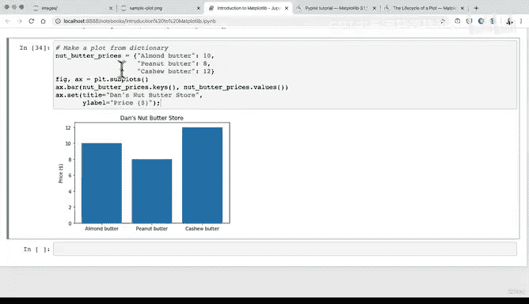

# 68：散点图与条形图 📊


在本节课中，我们将要学习如何使用Matplotlib库创建两种常见的数据可视化图形：散点图和条形图。我们将从NumPy数组和Python字典这两种数据结构出发，演示如何生成图表，并介绍一些基本的自定义选项。

---

## 概述

在NumPy部分，我们讨论了许多Python数据科学包都构建在NumPy数组之上。Matplotlib也不例外，它的一个美妙之处在于其灵活性堪比NumPy数组。只要你能构想出一种数据可视化方式，很可能就能用Matplotlib实现。

然而，有些类型的可视化比其他类型更常见，或者你更可能遇到。这些图形包括折线图、散点图、条形图、直方图和子图（在一个图形上绘制多个可视化图表）。本节我们将重点看看其中几种更常见的图形。

记住，“图形”和“图表”这两个词通常可以互换使用。我们将从使用纯NumPy数组开始。

---

## 创建数据与折线图

首先，我们需要导入必要的库并创建一些数据。以下是具体步骤：

```python
import numpy as np
import matplotlib.pyplot as plt
```

接下来，我们使用NumPy的`linspace`函数生成数据。该函数返回指定区间内均匀间隔的数字。

```python
X = np.linspace(0, 10, 100)
```

这段代码将在0到10的区间内生成100个均匀分布的样本点。我们可以查看前几个值来确认。

现在，让我们创建第一个图形。我们将使用`plt.subplots()`方法，它会返回一个图形（fig）和坐标轴（ax）对象。这是Matplotlib中常用的模式。

```python
fig, ax = plt.subplots()
ax.plot(X, X**2)
```

这里，`ax.plot()`默认创建的是**折线图**。我们传入X值作为横坐标，X的平方作为纵坐标，从而生成一条曲线。

---

## 创建散点图

上一节我们介绍了折线图，本节中我们来看看如何创建散点图。散点图用点来表示数据，适合展示两个变量之间的关系。

我们将使用相同的数据来创建一个散点图。以下是具体步骤：

```python
fig, ax = plt.subplots()
ax.scatter(X, np.exp(X))
```

`ax.scatter()`方法用于创建散点图。我们再次传入X值，但这次纵坐标是X的指数函数`np.exp(X)`。由于点非常密集，它们看起来几乎连成了一条线，但实际上每个点都是独立的。

为了更清晰地看到散点的效果，让我们用正弦波数据创建另一个散点图：

```python
fig, ax = plt.subplots()
ax.scatter(X, np.sin(X))
```

这样就生成了一个清晰的正弦波散点图。

---

## 从字典创建条形图

到目前为止，我们一直在使用NumPy数组。Matplotlib的灵活性在于它也能直接处理其他数据结构，比如Python字典。本节我们将学习如何从字典数据创建条形图。

假设我们有一个字典，记录了不同坚果酱的价格：

```python
nut_butter_prices = {"Almond butter": 10,
                     "Peanut butter": 8,
                     "Cashew butter": 12}
```

现在，我们从这个字典创建条形图。条形图使用`ax.bar()`方法。需要注意的是，`bar`方法的参数与`plot`和`scatter`略有不同。

以下是创建条形图的代码：

```python
fig, ax = plt.subplots()
ax.bar(nut_butter_prices.keys(), nut_butter_prices.values())
```

这里，我们将字典的键（坚果酱名称）作为X轴标签，字典的值（价格）作为条形的高度（Y轴）。

---

## 自定义图表

基本的条形图可能不够直观。我们可以通过添加标题和轴标签来增强图表的可读性。以下是自定义图表的步骤：

```python
fig, ax = plt.subplots()
ax.bar(nut_butter_prices.keys(), nut_butter_prices.values())
ax.set(title="Dan's Nut Butter Price Store",
       ylabel="Price ($)")
```

我们使用`ax.set()`方法来设置图表的标题和Y轴标签。此外，如果在Jupyter Notebook等环境中运行，图表下方可能会输出一行文本。要隐藏这行输出，可以在最后一行代码的末尾添加一个分号`;`。

```python
fig, ax = plt.subplots()
ax.bar(nut_butter_prices.keys(), nut_butter_prices.values())
ax.set(title="Dan's Nut Butter Price Store",
       ylabel="Price ($)");
```

---

## 总结

本节课中我们一起学习了如何使用Matplotlib创建两种基础但重要的数据可视化图形：**散点图**和**条形图**。

我们首先回顾了如何从NumPy数组生成数据，并创建了默认的折线图。接着，我们探索了如何使用`scatter`方法将相同的数据以散点的形式呈现。最后，我们演示了如何直接从Python字典数据结构创建并自定义一个条形图，为其添加了标题和轴标签。



记住，学习过程中遇到错误（比如参数使用不当）是正常的，关键是通过查阅文档（使用`Shift+Tab`查看文档字符串）和不断尝试来解决问题。请尝试用你自己的字典或NumPy数组数据创建图表，以巩固所学知识。