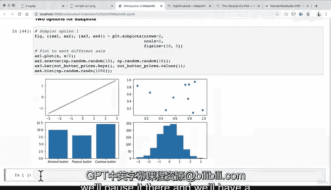

# 69：直方图与子图 📊


在本节课中，我们将学习如何创建直方图以及在同一张图中绘制多个子图。我们将使用Matplotlib库来实现这些功能，并通过实例代码展示具体操作步骤。

---

## 直方图简介

上一节我们介绍了条形图，本节中我们来看看直方图。直方图用于展示数据的分布情况，特别适用于查看数据是否遵循某种分布，例如正态分布。

首先，我们生成一些符合正态分布的随机数据，并绘制直方图。

```python
import numpy as np
import matplotlib.pyplot as plt

# 生成1000个符合标准正态分布的随机样本
x = np.random.randn(1000)

# 创建图形和坐标轴
fig, ax = plt.subplots()
# 绘制直方图
ax.hist(x)
plt.show()
```

执行上述代码后，你将看到一个近似于钟形曲线的直方图，这展示了数据的正态分布特性。

---

## 创建子图

有时我们需要在同一张图中展示多个图表，这时可以使用子图功能。Matplotlib提供了灵活的方式来创建和排列子图。

以下是创建子图的两种主要方法。

### 方法一：使用 `plt.subplots` 指定网格

这种方法允许我们一次性创建一个包含多个坐标轴的图形网格。

```python
# 创建一个2行2列的子图网格
fig, ((ax1, ax2), (ax3, ax4)) = plt.subplots(nrows=2, ncols=2, figsize=(10, 5))

# 在第一个子图（左上）中绘制折线图
ax1.plot(x)

# 在第二个子图（右上）中绘制散点图
scatter_x = np.random.rand(10)
scatter_y = np.random.rand(10)
ax2.scatter(scatter_x, scatter_y)

# 在第三个子图（左下）中绘制条形图
nut_butter_prices = {'Almond butter': 10, 'Peanut butter': 8, 'Cashew butter': 12}
ax3.bar(nut_butter_prices.keys(), nut_butter_prices.values())

# 在第四个子图（右下）中绘制直方图
hist_data = np.random.randn(1000)
ax4.hist(hist_data)

plt.show()
```

通过上述代码，我们在一张图中集成了折线图、散点图、条形图和直方图。

### 方法二：使用 `plt.subplot` 逐个添加

另一种方法是使用 `plt.subplot` 函数逐个指定子图的位置。这种方法在动态添加子图时非常有用。

```python
# 创建一个新的图形
plt.figure(figsize=(10, 5))

# 添加第一个子图（2行2列网格中的第1个位置）
plt.subplot(2, 2, 1)
plt.plot(x)
plt.title('Line Plot')

# 添加第二个子图（2行2列网格中的第2个位置）
plt.subplot(2, 2, 2)
plt.scatter(scatter_x, scatter_y)
plt.title('Scatter Plot')

# 添加第三个子图（2行2列网格中的第3个位置）
plt.subplot(2, 2, 3)
plt.bar(nut_butter_prices.keys(), nut_butter_prices.values())
plt.title('Bar Plot')

# 添加第四个子图（2行2列网格中的第4个位置）
plt.subplot(2, 2, 4)
plt.hist(hist_data)
plt.title('Histogram')

plt.tight_layout()  # 自动调整子图间距
plt.show()
```

这种方法通过指定网格位置来逐个创建子图，适合需要灵活控制子图顺序和布局的场景。

---

## 总结



本节课中我们一起学习了直方图的创建方法，以及两种在同一图形中绘制多个子图的技术。直方图有助于理解数据分布，而子图功能则能让我们高效地在单一视图中比较不同的数据集或图表类型。掌握这些技能将大大提升你使用Matplotlib进行数据可视化的能力。