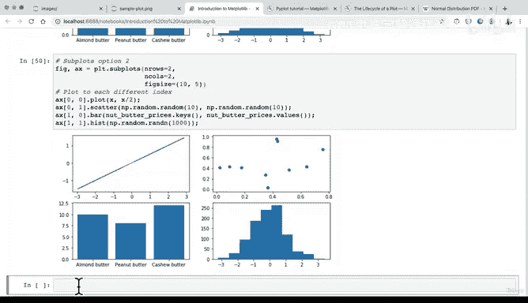
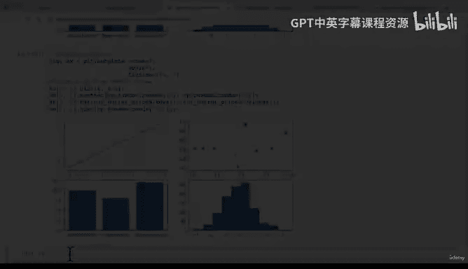

#  70：Matplotlib 子图创建方法二 📊


在本节课中，我们将学习创建 Matplotlib 子图的第二种方法。我们将使用与绘制单个图表相同的 `plt.subplots` 命令，但会通过列表索引的方式来访问和操作不同的子图坐标轴。

---

上一节我们介绍了创建子图的第一种方法，即通过解包 `ax` 对象数组来分别操作每个子图。本节中我们来看看第二种方法，它通过列表索引来定位子图。

这种方法的核心语法与我们之前使用的相同，都是 `fig, ax = plt.subplots()`。关键区别在于，我们将 `ax` 视为一个二维列表（或数组）来访问特定的子图位置。

以下是创建子图的基本代码结构：
```python
fig, ax = plt.subplots(nrows=2, ncols=2, figsize=(10, 5))
```
这段代码创建了一个包含 2 行 2 列，总共 4 个子图的画布。

为了在特定位置绘制图表，我们使用 `ax[row_index, column_index]` 的索引方式。例如，`ax[0, 0]` 表示第一行第一列的子图。

让我们通过一个例子来具体说明。以下代码演示了如何在不同的子图位置上绘制不同类型的图表：

```python
import matplotlib.pyplot as plt
import numpy as np

fig, ax = plt.subplots(nrows=2, ncols=2, figsize=(10, 5))

# 在 (0,0) 位置绘制折线图
ax[0, 0].plot(np.random.rand(10))

# 在 (0,1) 位置绘制散点图
ax[0, 1].scatter(np.random.rand(10), np.random.rand(10))

# 在 (1,0) 位置绘制柱状图
ax[1, 0].bar(['花生酱', '杏仁酱'], np.random.rand(2))

# 在 (1,1) 位置绘制另一个散点图
ax[1, 1].scatter(np.random.rand(10), np.random.rand(10))
```

运行上述代码，每次都会生成略有不同的随机图表，但子图的布局和类型是固定的。

---

两种方法对比与选择

我们介绍了两种创建子图的方法：
1.  **方法一（解包法）**：`ax0, ax1, ax2, ax3 = ax.ravel()`，然后直接使用 `ax0`、`ax1` 等变量。
2.  **方法二（索引法）**：始终通过 `ax[row, col]` 的索引来访问子图。

方法一在子图数量较少且固定时，代码可读性更高。方法二则在需要循环遍历子图或动态访问子图时更为灵活。在本系列课程的后续部分，我们将主要使用方法一，但了解方法二有助于你阅读和理解他人可能使用的不同代码风格。

---

本节课中我们一起学习了创建 Matplotlib 子图的第二种方法，即通过列表索引来定位和绘制子图。我们比较了两种方法的异同，并理解了根据场景选择合适方法的重要性。





接下来，我们将探索如何直接从 Pandas DataFrame 进行绘图，这是数据科学工作中更常见的场景。