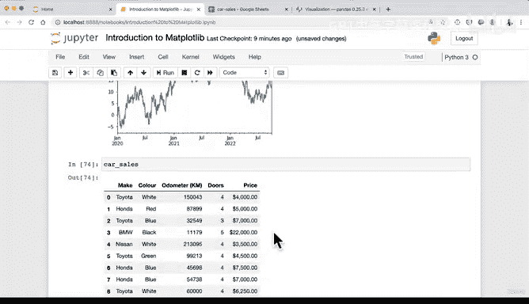

# 72：从Pandas DataFrame绘图 📊


## 概述
在本节课中，我们将学习如何直接从Pandas DataFrame创建图表。我们将利用之前学到的Matplotlib知识，并将其应用于更常见的数据结构——DataFrame。

---

## 导入Pandas与加载数据
首先，我们需要导入Pandas库并加载数据。我们将使用熟悉的`car-sales.csv`数据集。

```python
import pandas as pd
car_sales = pd.read_csv('car-sales.csv')
```

加载后，我们可以查看一下DataFrame以确认数据已正确导入。

---

## 回顾Pandas绘图基础
上一节我们介绍了使用NumPy数组进行绘图。本节中我们来看看如何从Pandas的Series对象开始绘图。

Pandas的绘图功能建立在Matplotlib之上。这意味着我们可以使用类似的API。例如，从一个包含日期和随机数的Series绘图：

```python
import numpy as np
ts = pd.Series(np.random.randn(1000), index=pd.date_range('1/1/2020', periods=1000))
ts = ts.cumsum()
ts.plot()
```

这段代码创建了一个时间序列，并绘制了其累积和的折线图。关键点在于，对一个Series调用`.plot()`方法会返回一个Matplotlib的`AxesSubplot`对象。

---

## 从DataFrame绘图
现在，让我们将焦点转移到从完整的DataFrame进行绘图。我们的`car_sales` DataFrame包含了各种汽车销售数据。

为了进行绘图，我们首先需要确保数据格式正确。一个常见的任务是绘制某个数值列随时间（或另一个序列）的变化。

以下是准备数据并绘图的基本步骤：

1.  **确保索引或某一列是绘图所需的序列**（例如日期）。
2.  **选择要绘制的数值列**。
3.  **调用`.plot()`方法**并指定图表类型。

在接下来的视频中，我们将实际操作，为`car_sales` DataFrame添加一个日期列，然后绘制销售价格随时间变化的图表。这将同时练习数据操作和绘图技巧。

---



## 总结
本节课中我们一起学习了Pandas绘图的核心概念。我们了解到Pandas的绘图功能是对Matplotlib的封装，使得从Series和DataFrame创建图表变得非常直接。关键方法是直接对数据对象调用`.plot()`。在下一节，我们将进行实践，在真实的汽车销售数据上创建图表。