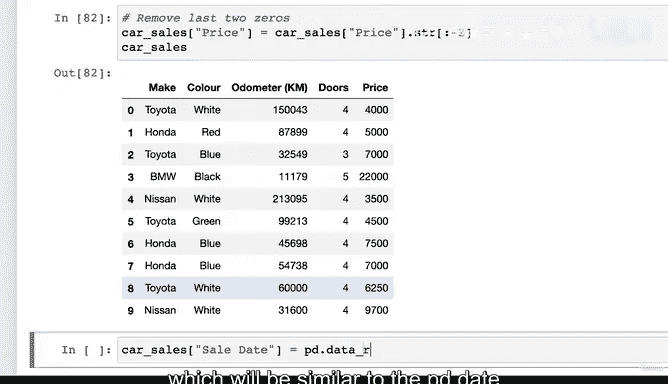
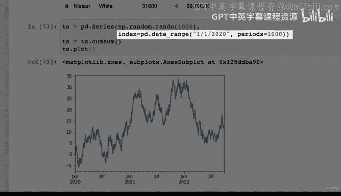
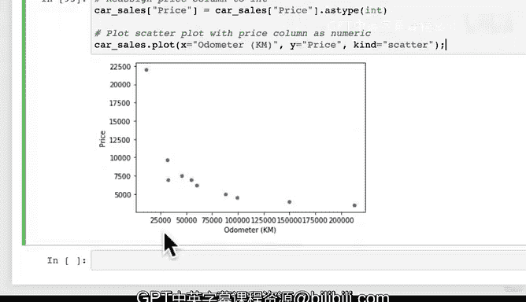

# 73：从Pandas DataFrame绘图（第二部分） 📊


在本节课中，我们将学习如何结合数据操作与绘图技巧，使用我们自己的数据来创建图表。我们将从清理数据开始，然后添加新列，最终生成线图和散点图来可视化数据。

---

## 数据准备与清理

上一节我们介绍了如何从现有示例中获取灵感。本节中，我们来看看如何将这些技巧应用到我们自己的数据集上。

首先，我们需要格式化价格列，将其转换为整数类型，以便进行数值运算。当前的价格列包含美元符号、逗号和小数点。

以下是格式化价格列的步骤：

1.  移除不需要的字符。
2.  处理多余的尾随零。

```python
# 移除美元符号、逗号和小数点
car_sales["Price"] = car_sales["Price"].str.replace("$", "", regex=False)
car_sales["Price"] = car_sales["Price"].str.replace(",", "")
car_sales["Price"] = car_sales["Price"].str.replace(".", "")

# 移除最后两位数字（例如，将“400000”变为“4000”）
car_sales["Price"] = car_sales["Price"].str[:-2]
```

完成这些操作后，价格列已变为我们需要的格式，但数据类型仍是字符串。

---



## 添加新列



接下来，我们将为数据框添加两个新列：销售日期和累计总销售额。

首先，添加一个顺序的销售日期列。

```python
import pandas as pd

# 创建与数据框行数相同的日期序列
car_sales["Sale Date"] = pd.date_range("1/1/2020", periods=len(car_sales))
```

现在，数据框中有了一个顺序的销售日期列。虽然实际销售可能并非连续日期，但这有助于演示如何操作数据。

然后，我们创建一个显示累计销售额的“总销售额”列。这需要使用 `cumsum()` 函数。

```python
# 将价格列转换为整数，然后计算累计和
car_sales["Total Sales"] = car_sales["Price"].astype(int).cumsum()
```

此代码将价格列临时转换为整数，并计算从第一行到当前行的累计总和，结果存储在新列“总销售额”中。

---

## 创建线图

有了处理好的数据，我们现在可以开始绘图。我们将创建一个线图来可视化总销售额随时间的变化趋势。

Pandas 提供了直接基于数据框的绘图方法，它是 Matplotlib API 的封装。

```python
# 使用数据框的plot方法绘制线图
car_sales.plot(x="Sale Date", y="Total Sales")
```

生成的图表显示总销售额随时间“向右上方”增长，这是一个积极的趋势。

通过这个练习，我们实践了从查找示例、理解原理到应用到自己数据上的完整工作流程。

---

## 创建散点图

我们已经创建了线图，现在尝试创建一个散点图，来探索里程表读数与价格之间的关系。

要创建散点图，我们需要在 `plot` 函数中指定 `kind='scatter'`。

```python
# 尝试绘制散点图
car_sales.plot(x="Odometer (KM)", y="Price", kind='scatter')
```

然而，运行此代码可能会产生错误，提示Y列（价格）需要是数值型。这是因为我们之前的数据清理操作并没有永久改变“Price”列的数据类型。

为了解决这个问题，我们需要将价格列永久转换为整数类型。

```python
# 将价格列的数据类型永久更改为整数
car_sales["Price"] = car_sales["Price"].astype(int)

# 现在可以成功绘制散点图
car_sales.plot(x="Odometer (KM)", y="Price", kind='scatter')
```

现在，我们得到了里程表与价格的散点图。为了抑制多余的文本输出，可以在绘图代码末尾添加一个分号。

---

## 总结

本节课中我们一起学习了如何综合运用 Pandas 数据操作和绘图功能。

我们首先清理和格式化了数据，然后添加了新的计算列（销售日期和累计销售额）。接着，我们使用 Pandas 内置的 `.plot()` 方法创建了展示趋势的线图和探索变量关系的散点图。



关键点在于，许多数据分析任务可以通过借鉴现有示例、调整代码以适应自己的数据集来完成。请尝试使用不同的列和图表类型进行练习，以巩固这些技能。