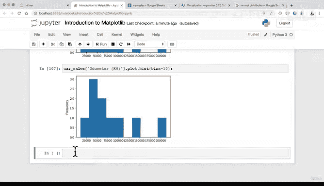

# 74：从Pandas DataFrame绘图（三）📊


## 概述

在本节课中，我们将继续学习如何直接从Pandas DataFrame创建各种图表。我们将重点介绍如何绘制条形图和直方图，并探索调整图表参数的方法。

---

## 回顾与引入

上一节我们介绍了如何从汽车销售DataFrame直接绘制散点图和折线图，并进行了数据操作，例如添加日期列和使用`sum`函数创建总销售额列。

本节中，我们来看看几种其他类型的图表，例如条形图。

## 创建示例数据

为了练习不同类型的绘图方法，我们将创建一个简单的DataFrame。

以下是创建示例数据的代码：

```python
import pandas as pd
import numpy as np

# 创建随机数据
np.random.seed(42)
x = np.random.rand(10, 4)

# 转换为DataFrame
df = pd.DataFrame(x, columns=['A', 'B', 'C', 'D'])

# 查看DataFrame
print(df.head())
```

## 绘制条形图

以下是绘制条形图的两种主要方法。

### 方法一：使用 `.plot.bar()`

第一种方法是直接使用DataFrame的`.plot.bar()`方法。

```python
df.plot.bar()
```

此方法会生成一个条形图，图例包含A、B、C、D四列。每个条形代表对应行中不同列的值。

### 方法二：使用 `.plot(kind='bar')`

第二种方法是使用`.plot()`函数并指定`kind`参数为`'bar'`。

```python
df.plot(kind='bar')
```

这两种方法产生的结果完全相同。选择哪一种取决于个人偏好，了解这两种写法有助于你阅读他人的代码。

## 在真实数据上实践

现在，让我们在真实的汽车销售数据上实践绘制条形图。

首先，查看我们的数据总是一个好习惯。在创建可视化时，你会经常在查看DataFrame和制作图表之间来回切换。

```python
# 假设 car_sales 是我们的DataFrame
print(car_sales.head())

# 绘制条形图：X轴为汽车品牌（Make），Y轴为里程表读数（Odometer）
car_sales.plot(x='Make', y='Odometer (KM)', kind='bar')
```

生成的图表底部X轴显示了不同的汽车品牌，Y轴则对应其里程表读数。一个可能的扩展练习是，按品牌分组并计算每个品牌里程表的平均值，这可以通过创建新列或使用分组聚合功能来实现。

## 绘制直方图

接下来，我们看看直方图。直方图非常适合可视化数据的分布情况。

### 方法一：使用 `.plot.hist()`

第一种方法是使用`.plot.hist()`。

```python
car_sales['Odometer (KM)'].plot.hist()
```

此图表显示了里程表读数的分布，呈现出近似正态分布的曲线。图中有一个值（约200,000公里）远高于其他数据点（大多在100,000公里以下），这可能是一个异常值。

### 方法二：使用 `.plot(kind='hist')`

第二种方法是使用`kind`参数。

```python
car_sales['Odometer (KM)'].plot(kind='hist')
```

### 调整直方图参数：`bins`

使用`.hist()`方法的一个优势是可以调整`bins`（箱数）参数。`bins`决定了数据被分到多少个区间内。默认值是10。

```python
car_sales['Odometer (KM)'].plot.hist(bins=20)
```

改变`bins`的数量会改变图表的外观。寻找最合适的`bins`数量是数据探索的一部分。理想情况下，你希望直方图能清晰地展示出数据的分布形态（例如钟形曲线）。对于当前的小数据集，10个`bins`可能效果就不错。

## 本节总结

本节课中我们一起学习了如何从Pandas DataFrame创建条形图和直方图。

我们掌握了两种绘制条形图的方法：`.plot.bar()`和`.plot(kind='bar')`。同时，我们也学习了绘制直方图的两种方法：`.plot.hist()`和`.plot(kind='hist')`，并了解了如何通过调整`bins`参数来探索数据的最佳分布展示方式。

## 练习建议

为了巩固所学，建议你进行以下练习：
1.  在汽车销售DataFrame上尝试创建条形图。
2.  在汽车销售DataFrame上尝试创建直方图，并调整不同的`bins`值观察效果。

下一节，我们将使用另一个数据集进行类似的绘图练习，以巩固这些方法。



---