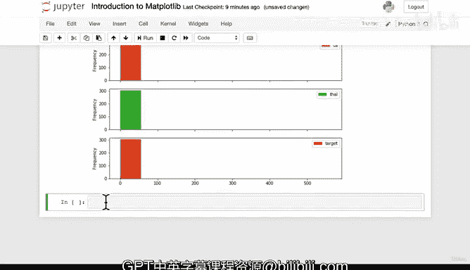

# 75：从Pandas DataFrame绘图（第四部分） 📊


## 概述

在本节课中，我们将继续学习如何使用Pandas DataFrame进行数据可视化。我们将把上一节学到的绘图技巧应用到另一个数据集上，并探索如何为DataFrame中的所有列创建子图。最后，我们将为学习更灵活的Matplotlib面向对象API做好准备。

---

## 复习与过渡

到目前为止，我们已经完成了大量的绘图练习。如果你此刻感到有些困惑，这是完全正常的。理解不同种类的图表及其适用场景需要一些练习。这个过程的一部分就是动手尝试，看看图表的效果，并思考它是否合理。

因此，在本视频中，我们将在另一个数据集上，绘制与之前在汽车销售数据集上看到的类似的图表。

## 在新数据集上实践

让我们尝试另一个数据集。我们有一个名为 `heartdisease.csv` 的文件，这是我们之前见过的数据集，它包含了患者的不同参数以及他们是否患有心脏病。

我们将其导入并命名为 `heart_disease`。

```python
heart_disease = pd.read_csv('heartdisease.csv')
```

现在，我们查看一下数据的前几行，以确保我们了解数据的情况。

```python
heart_disease.head()
```

数据集中有我们之前见过的参数，最后一列是目标列 `target`。

我们可以创建一个直方图来查看 `age` 列的分布情况。

```python
heart_disease['age'].plot.hist()
```

默认的箱数（bins）是10。我们可以看到数据开始呈现曲线形状，这是一种非常常见的**正态分布**。大多数患者的年龄集中在50多岁到60岁出头。

如果我们改变箱数会怎样？让我们尝试 `bins=20`、`bins=30`，甚至 `bins=50`。虽然形状细节有所变化，但最初用10个箱观察到的整体分布形态基本保持一致。

我们可能会注意到一些远离中心的数据点，这些点被称为**异常值**。在统计学中，异常值通常指距离均值超过三个标准差的数据点。这种可视化可以帮助我们直观地识别它们。

让我们将箱数改回10，这个看起来很不错。

## 创建所有列的子图

我们还没有直接从DataFrame绘制的最后一种图表类型是子图。让我们来完成它。

我们想在一个图表中绘制每一列的直方图。以下是实现方法：

```python
heart_disease.plot.hist(subplots=True)
```

这段代码会运行，但效果并不理想。图表出现了重叠，图例到处都是，而且由于所有子图使用了相同的刻度，导致一些列的图表（如 `slope`、`oldpeak`、`exang`）全部挤在一起，无法提供有意义的洞察。

我们可以尝试调整图形大小来改善布局：

```python
heart_disease.plot.hist(subplots=True, figsize=(10, 30))
```

这看起来好一些，但根本问题——不同列使用不同度量标准，却共享同一刻度——依然存在。对于这个具体的数据集和需求，这种将所有列的直方图堆叠在一起的方法可能信息过载，不够理想。

## 过渡到面向对象方法

然而，这是一个很好的过渡。目前，我们已经介绍了直接在Pandas DataFrame上绘制几种简单图表的方法。接下来，让我们看看如何使用更灵活的**面向对象方法**来创建可视化。

还记得在之前的视频中，我们讨论过的面向对象方法吗？它涉及创建图形（Figure）和坐标轴（Axes）对象。别担心，我们稍后会详细讲解。

到目前为止，我们一直使用的是Pandas的“无状态”方法进行绘图。在进入下一个视频学习更强大的Matplotlib API之前，请继续练习，尝试自己创建另一个图表。

---

## 总结

本节课中，我们一起学习了：
1.  将直方图绘制技巧应用于新的心脏病数据集，观察了年龄的分布并识别了潜在的异常值。
2.  尝试使用 `subplots=True` 参数为DataFrame中的所有列一次性创建直方图子图。
3.  认识到当各列数据尺度差异很大时，这种简单的子图方法可能效果不佳，从而引出了对更精细控制的需求。
4.  为下一节学习更强大、更灵活的Matplotlib面向对象绘图API做好了准备。



记住，数据可视化是一个迭代和探索的过程。不断尝试不同的图表和参数，是掌握这项技能的关键。我们下节课再见！