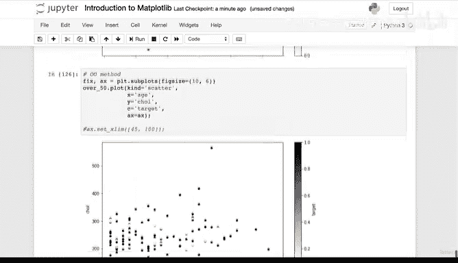

# 76：076_08_014 从Pandas DataFrame绘图5 📊

在本节课中，我们将要学习如何从Pandas DataFrame进行绘图，并比较两种不同的绘图方法。我们将通过一个具体的例子，探索如何为特定数据子集（例如年龄超过50岁的患者）创建更高级、更美观的可视化图表。


---

## 概述 📋

上一节我们介绍了使用Pandas内置的`plot`方法进行快速绘图。本节中我们来看看如何以及何时应该使用更强大的面向对象（OO）绘图方法，以创建更复杂和可定制的图表。

## 何时使用哪种绘图方法？ 🤔

以下是两种主要绘图方法的适用场景：

*   **快速绘图时，使用Pandas的`plot`方法**：当你需要快速查看数据分布或进行初步探索时，例如绘制单个列的分布图，使用`df.plot()`方法是完全合适的。
*   **绘制高级图表时，使用面向对象（OO）方法**：当你需要创建更复杂、需要精细控制（如多子图、自定义坐标轴、图例等）的可视化时，应该使用Matplotlib的面向对象接口。

## 创建数据子集并绘制散点图 📈

让我们创建一个数据子集，专注于分析年龄超过50岁的患者数据。

```python
over_50 = heart_disease[heart_disease[‘age’] > 50]
```

现在，我们尝试为这个子集绘制一个散点图，展示年龄与胆固醇水平的关系，并根据`target`列（是否患有心脏病）为数据点着色。

以下是使用Pandas `plot`方法的代码：

```python
over_50.plot(kind=‘scatter’, x=‘age’, y=‘chol’, c=‘target’)
```

这个图表实现了基本功能，但存在一些问题：X轴标签不清晰，颜色条对区分0和1的帮助不大，整体视觉效果不理想。

## 使用面向对象方法改进图表 ✨

为了获得更好的控制力和更美观的图表，我们使用Matplotlib的面向对象方法重新绘制。

首先，创建图形和坐标轴对象：

```python
fig, ax = plt.subplots(figsize=(10, 6))
```

接着，在绘图时，通过`ax`参数指定要将数据绘制到我们刚刚创建的坐标轴上：

```python
over_50.plot(kind=‘scatter’, x=‘age’, y=‘chol’, c=‘target’, ax=ax)
```

使用OO方法后，图表立即有了改善：图形尺寸更大，并且X轴标签（年龄）被正确显示出来。

## 调整坐标轴范围 🔧

面向对象方法的一个优势是我们可以轻松地调整图表的各个组件。例如，我们可以手动设置X轴的范围：

```python
ax.set_xlim([45, 100])
```

这会将X轴的显示范围设置为45到100，为数据周围提供了更多空白区域。Matplotlib通常会自动选择合理的坐标轴范围，但手动调整可以满足特定展示需求。

## 总结 🎯

本节课中我们一起学习了：
1.  **两种绘图方法的选用原则**：快速探索用Pandas `plot`，高级定制用Matplotlib OO方法。
2.  **使用布尔索引创建数据子集**进行针对性分析。
3.  **使用面向对象方法绘制散点图**，并通过`ax`参数将Pandas绘图功能与Matplotlib的坐标轴绑定。
4.  **初步调整图表属性**，例如图形尺寸和坐标轴范围。



当前图表在颜色区分和美观度上仍有提升空间。在下一节，我们将在此基础上，进一步美化这个散点图，使其信息传达更加清晰有效。