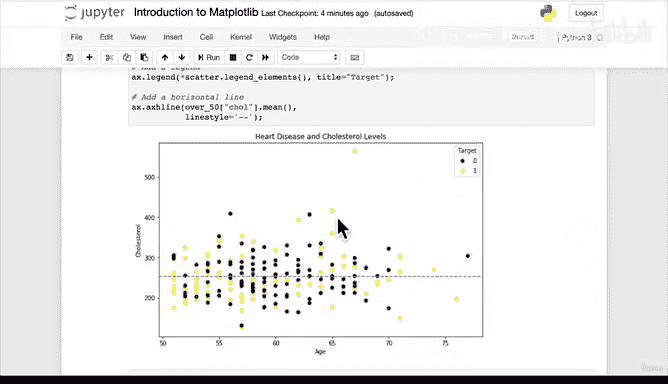

#  77：从零开始使用面向对象方法绘图 📊


在本节课中，我们将学习如何使用 Matplotlib 的面向对象（OO）方法，从头开始创建一个自定义的散点图。我们将使用一个包含年龄和胆固醇水平的数据集，并添加标题、坐标轴标签、图例以及一条表示平均胆固醇水平的水平线。

---

## 概述

上一节我们介绍了两种从 Pandas DataFrame 绘图的方法：一种是直接使用 `pie` 绘图方法，另一种是混合了面向对象思想的方法。本节中，我们将完全使用面向对象方法从头开始重建一个散点图，并进行深度自定义，使其更具可读性和美观性。

## 创建图形和坐标轴

首先，我们需要创建一个新的图形（Figure）和坐标轴（Axes）对象。这是面向对象绘图方法的基础。

```python
fig, ax = plt.subplots(figsize=(10, 6))
```

## 绘制散点图

接下来，我们将在坐标轴上绘制散点图。我们将使用 `over_50` 这个 DataFrame，其中 `age` 列作为 X 轴，`chol`（胆固醇）列作为 Y 轴。点的颜色将根据 `target` 列的值（0 或 1）进行区分。

```python
scatter = ax.scatter(x=over_50["age"],
                     y=over_50["chol"],
                     c=over_50["target"])
```

运行上述代码后，我们会得到一个初步的散点图，但此时它缺少必要的标签和信息。

## 添加标题和坐标轴标签

为了使图表更清晰，我们需要添加标题以及 X 轴和 Y 轴的标签。

以下是添加这些元素的方法：
```python
ax.set_title("Heart Disease and Cholesterol Levels")
ax.set_xlabel("Age")
ax.set_ylabel("Cholesterol")
```

添加后，图表的信息就更加完整了。

## 添加图例

目前，图表上的点有不同颜色，但我们不知道每种颜色代表什么。因此，我们需要添加一个图例。

我们可以通过以下代码添加图例：
```python
ax.legend(*scatter.legend_elements(), title="Target")
```
这段代码会从 `scatter` 对象中提取图例元素（基于我们之前设置的 `c` 参数），并自动根据 `target` 列中的唯一值（0 和 1）创建图例。

## 添加水平参考线

为了更直观地展示平均胆固醇水平，我们可以在图表中添加一条水平的虚线。

添加水平线的方法如下：
```python
ax.axhline(y=over_50["chol"].mean(),
           linestyle="--")
```
这条线代表了整个数据集中胆固醇水平的平均值，虚线样式使其在背景中清晰可辨。

## 总结

本节课中，我们一起学习了如何使用 Matplotlib 的面向对象 API 从头开始创建一个高度自定义的散点图。我们逐步添加了标题、坐标轴标签、图例以及一条参考线。这种方法提供了极大的灵活性，允许你精细控制图表的每一个细节。



在下一节，我们将探索如何将多个这样的图表组合成一个子图（Subplot），以便同时比较数据集中不同的变量关系。