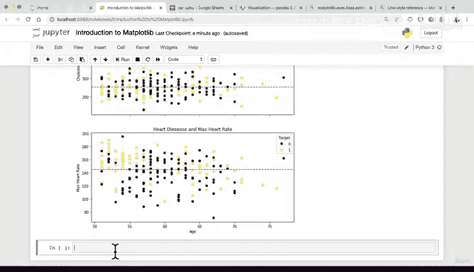
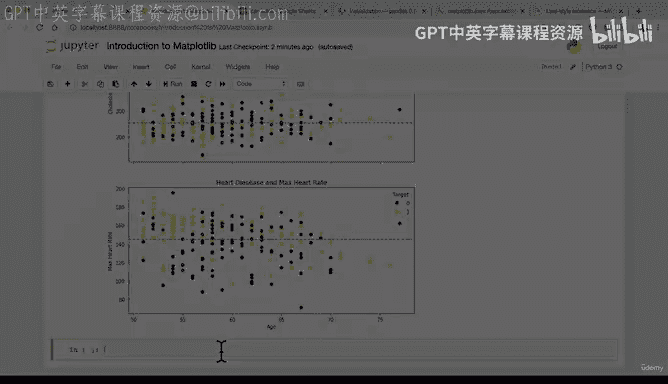

# 78：使用Matplotlib面向对象方法创建子图 📊


在本节课中，我们将学习如何使用Matplotlib的面向对象方法创建包含多个子图的复杂图表。我们将基于之前创建的“50岁以上患者”数据框，在同一张图上可视化胆固醇水平和最大心率与年龄的关系。

---

## 概述

上一节我们介绍了如何为单个图表添加自定义元素。本节中，我们将进一步探索Matplotlib面向对象方法的强大功能，学习如何创建并排显示的子图。我们将创建两个共享X轴的散点图，分别展示年龄与胆固醇水平、年龄与最大心率的关系。

## 创建基础图形和子图

首先，我们需要创建一个包含两个子图的图形。以下是具体步骤：

以下是创建图形和子图轴对象的代码：

```python
fig, (ax0, ax1) = plt.subplots(nrows=2,
                                ncols=1,
                                figsize=(10, 10),
                                sharex=True)
```

这段代码创建了一个图形（`fig`）和两个垂直排列的子图轴对象（`ax0`和`ax1`）。`sharex=True`参数让两个子图共享X轴。

## 向第一个子图添加数据

现在，我们向第一个子图（`ax0`）添加数据，绘制年龄与胆固醇水平的散点图。

以下是向`ax0`添加数据的代码：

```python
scatter = ax0.scatter(x=over_50["age"],
                      y=over_50["chol"],
                      c=over_50["target"])
```

## 自定义第一个子图

添加数据后，我们需要自定义图表，使其更清晰易懂。

以下是自定义`ax0`的代码：

```python
# 添加标题和坐标轴标签
ax0.set(title="Heart Disease and Cholesterol Levels",
        xlabel="Age",
        ylabel="Cholesterol")

# 添加图例
ax0.legend(*scatter.legend_elements(), title="Target")

# 添加胆固醇平均值水平线
ax0.axhline(y=over_50["chol"].mean(),
            linestyle="--")
```

## 向第二个子图添加数据

接下来，我们向第二个子图（`ax1`）添加数据，绘制年龄与最大心率（`thalach`）的关系。

以下是向`ax1`添加数据的代码：

```python
scatter = ax1.scatter(x=over_50["age"],
                      y=over_50["thalach"],
                      c=over_50["target"])
```

## 自定义第二个子图

我们以类似的方式自定义第二个子图。

以下是自定义`ax1`的代码：

```python
# 添加标题和坐标轴标签
ax1.set(title="Heart Disease and Max Heart Rate",
        xlabel="Age",
        ylabel="Max Heart Rate")

# 添加图例
ax1.legend(*scatter.legend_elements(), title="Target")

# 添加最大心率平均值水平线
ax1.axhline(y=over_50["thalach"].mean(),
            linestyle="--")
```

## 为整个图形添加总标题

最后，我们可以为整个图形（`fig`）添加一个总标题。

以下是添加图形总标题的代码：

```python
fig.suptitle("Heart Disease Analysis",
             fontsize=16,
             fontweight="bold")
```

## 总结

本节课中我们一起学习了如何使用Matplotlib的面向对象API创建复杂的多子图可视化。我们创建了一个包含两个垂直排列子图的图形，分别展示了年龄与胆固醇水平、年龄与最大心率的关系，并添加了标题、标签、图例和平均值参考线。虽然代码行数较多，但整个过程遵循清晰的逻辑：创建图形和轴、向轴添加数据、分别自定义每个轴、最后自定义整个图形。通过这种方法，你可以构建出适合演示或报告的专业级图表。

---





**练习建议**：尝试在不参考代码的情况下，自己创建一个包含不同图表类型（如直方图和条形图）的子图组合。