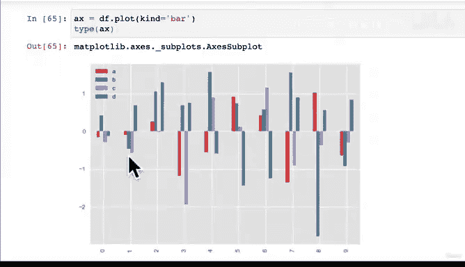

#  79：自定义你的图表 📊


在本节课中，我们将深入学习如何自定义 Matplotlib 图表。我们将探索不同的绘图样式，并学习如何为图表添加标题、坐标轴标签和图例，使图表更具信息性和视觉吸引力。

---

## 探索不同的绘图风格 🎨

上一节我们介绍了如何创建复杂的图表，但在自定义方面，我们只是简单设置了参数、标题和坐标轴标签。本节中，我们来看看如何更深入地自定义图表。

Matplotlib 的一个优点是它提供了多种可自定义的绘图样式。如果你觉得默认样式不符合你的需求，可以尝试其他样式。

以下是 Matplotlib 当前可用的不同样式：

```python
plt.style.available
```

默认情况下，我们使用的是标准样式。但如上所示，大约还有 20 种其他样式可供选择。让我们先回顾一下默认样式，以便进行比较。

```python
# 默认样式下的图表
car_sales['Price'].plot();
```

这是默认样式。现在，让我们尝试其他样式。

```python
# 使用 seaborn-whitegrid 样式
plt.style.use('seaborn-whitegrid')
car_sales['Price'].plot();
```

应用新样式后，图表出现了网格线，Y 轴范围也可能略有不同。接下来，我们尝试默认的 seaborn 样式。

```python
# 使用 seaborn 样式
plt.style.use('seaborn')
car_sales['Price'].plot();
```

seaborn 样式通常带有灰色背景。我们也可以尝试其他类型的图表。

```python
# 在 seaborn 样式下绘制散点图
car_sales.plot(x='Odometer (KM)', y='Price', kind='scatter');
```

我个人更喜欢 seaborn 样式，因此我经常在导入 Matplotlib 后立即设置此样式。让我们再尝试一种样式。

```python
# 使用 ggplot 样式
plt.style.use('ggplot')
car_sales['Price'].plot();
```

ggplot 样式提供了不同的配色，例如将线条变为红色。seaborn 样式默认包含坐标轴标题，而其他样式可能没有。

---

## 为图表添加标签和标题 ✏️

我们已经了解了如何改变图表样式。现在，如果图表本身能传达一千个信息，那么添加一些文字标签只会让它更清晰。接下来，我们学习如何添加标题、图例和坐标轴标签。

我们将创建一些虚拟数据来练习。

```python
# 创建一些随机数据
x = np.arange(10)
df = pd.DataFrame(np.random.randn(10, 4), columns=['A', 'B', 'C', 'D'])
```

现在，我们使用简化的 pyplot API 快速创建一个条形图。

```python
# 创建一个简单的条形图
ax = df.plot(kind='bar')
```

我们将使用 `set` 方法来自定义这个图表。

以下是自定义图表的主要步骤：

1.  **设置图表标题**：使用 `ax.set_title()` 方法。
2.  **设置坐标轴标签**：使用 `ax.set_xlabel()` 和 `ax.set_ylabel()` 方法。
3.  **确保图例可见**：使用 `ax.legend.set_visible()` 方法。

```python
# 自定义图表：添加标签和标题
ax = df.plot(kind='bar')
ax.set_title("随机条形图（来自数据框）")
ax.set_xlabel("行索引")
ax.set_ylabel("随机数值")
ax.legend.set_visible(True)
```

现在，我们的图表不仅展示了数据，还通过标题和坐标轴标签清晰地传达了信息。

---

## 总结 📝

本节课中，我们一起学习了如何自定义 Matplotlib 图表。我们探索了多种可用的绘图样式，并实践了如何为图表添加必要的文本元素，如标题和坐标轴标签。



记住，良好的自定义能使你的图表更具专业性和可读性。在下一节课中，我们将学习如何在同一个图表中组合不同的样式，以创建更符合特定需求的视觉效果。