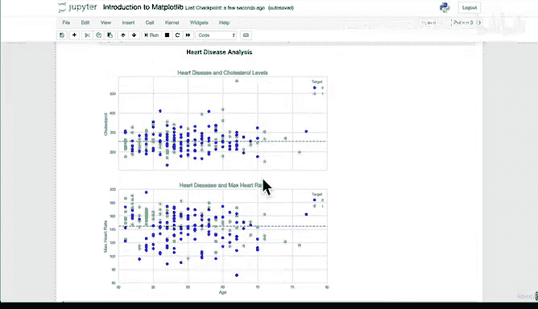

# 80：自定义图表样式进阶 🎨


在本节课中，我们将学习如何进一步自定义Matplotlib图表。我们将重点探索如何修改现有样式中的颜色映射，以及如何精确控制坐标轴的显示范围，从而创建出更专业、更美观的数据可视化图表。

---

## 从现有样式中修改颜色

上一节我们介绍了如何为图表应用不同的整体样式。本节中，我们来看看如何在已选定的样式基础上，进一步调整图表的颜色方案。

Matplotlib提供了`cmap`（颜色映射）参数，允许我们轻松更改数据点的颜色。以下是具体步骤：

首先，我们设置图表样式为`seaborn-whitegrid`，并创建一个展示50岁以上心脏病患者数据的散点图。

```python
import matplotlib.pyplot as plt
plt.style.use('seaborn-whitegrid')
# 假设 `over_50` 是包含年龄和胆固醇数据的数据框
fig, ax = plt.subplots(figsize=(10, 6))
scatter = ax.scatter(over_50["age"],
                     over_50["chol"],
                     c=over_50["target"],
                     cmap="winter") # 这里使用了winter颜色映射
ax.set(title="心脏病与年龄和胆固醇的关系",
       xlabel="年龄",
       ylabel="胆固醇")
ax.axhline(over_50["chol"].mean(),
           linestyle='--')
ax.legend(*scatter.legend_elements(), title="目标")
plt.show()
```

通过将`cmap`参数设置为`"winter"`，我们将默认的黑白散点图变成了蓝绿色系的渐变图，使得数据点的区分更加明显。

Matplotlib内置了多种颜色映射方案，例如`"summer"`、`"plasma"`、`"viridis"`等。您可以在[Matplotlib色彩映射官方文档](https://matplotlib.org/stable/tutorials/colors/colormaps.html)中查看所有选项，并选择最适合您数据展示需求的颜色。

---

## 控制坐标轴范围

自定义颜色的图表看起来更好了，但坐标轴上的多余线条（如刻度线延伸出的网格线）有时会影响美观。接下来，我们学习如何使用`set_xlim()`和`set_ylim()`方法来控制X轴和Y轴的显示范围，从而修剪掉这些多余的线条。

我们将使用之前创建的子图（subplot）代码作为例子，并为其应用颜色映射。

以下是关键代码示例，展示了如何为两个子图分别设置坐标轴范围：

```python
# 假设已创建包含两个子图（ax0, ax1）的图形
# 为两个子图应用颜色映射
scatter0 = ax0.scatter(over_50["age"], over_50["chol"], c=over_50["target"], cmap="winter")
scatter1 = ax1.scatter(over_50["age"], over_50["thalach"], c=over_50["target"], cmap="winter")

# 自定义第一个子图（ax0）的X轴范围，截断右侧多余的线
ax0.set_xlim([None, 50])

# 自定义第二个子图（ax1）的X轴和Y轴范围
ax1.set_xlim([50, 80])
ax1.set_ylim([60, 200])
```

通过上述设置，我们实现了以下效果：
*   删除了第一个子图X轴上超出50的多余部分。
*   将第二个子图的X轴范围精确限定在50到80之间。
*   将第二个子图的Y轴范围限定在60到200之间，从而移除了顶部和底部不必要的空白和线条。

最终，我们得到了一个布局干净、色彩分明、信息呈现专业的图表，非常适合于报告或分享。

---



本节课中我们一起学习了Matplotlib图表自定义的两个进阶技巧：使用`cmap`参数更改颜色映射，以及使用`set_xlim()`和`set_ylim()`方法精确控制坐标轴范围。结合之前学习的样式设置，您现在应该能够创建出高度定制化、视觉效果出色的数据可视化图表。请尝试使用不同的颜色映射和坐标轴范围，创建属于您自己的心脏病数据分析图表版本。