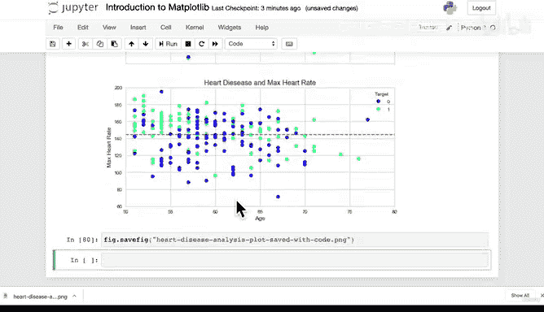

#  81：保存与分享你的图表 📊


在本节课中，我们将学习如何将使用 Matplotlib 创建的图表保存为图像文件，以便于分享或在演示中使用。这是数据可视化工作流程的最后一步，也是展示你工作成果的关键环节。

---

上一节我们介绍了如何自定义和美化图表。本节中我们来看看如何将最终的图表成果保存下来并分享给他人。

当然，如果你一直在 Jupyter Notebook 中工作，你可以在图表上方添加文字说明来阐述你的发现。例如，你可以创建一个单元格，写上“此图表展示了心脏病数据集的一些信息”。你可能会进行更深入的描述来沟通你的工作，然后直接分享你的笔记本文件。

但如果你不想分享整个笔记本，例如在做演示时无法直接运行代码展示过程，你可能需要将图表导出为独立的图像文件。

以下是保存图表的两种主要方法：

**1. 手动保存图像**
这可能是最简单的方法。你可以在 Jupyter Notebook 中生成的图表上右键点击，选择“另存为图像”。然后选择保存位置和文件名，例如 `heart_disease_analysis_plot.png`。这样你就得到了一个 PNG 格式的图像文件，可以轻松地插入到 Keynote、PowerPoint 等演示文稿中。

**2. 通过代码自动保存**
另一种更程序化的方法是使用 `savefig` 方法。当我们使用 `plt.figure()` 或类似方法创建图表时，会生成一个 `fig`（图形）对象。这个对象目前存储在内存中。我们可以调用 `fig.savefig()` 方法来将其保存到磁盘。

例如，使用以下代码：
```python
fig.savefig('heart_disease_analysis_plot_saved_with_code.png')
```
这行代码会将当前图形保存为名为“heart_disease_analysis_plot_saved_with_code.png”的 PNG 文件。PNG 是 `savefig` 方法的默认保存格式。

在实际工作中，如果你需要反复生成同类型的图表，可以将绘图和保存的代码封装到一个 Python 函数中。这样，每次调用函数后，图表都会自动导出，提高了工作效率。

---

恭喜你完成了 Matplotlib 部分的学习！我们从创建一个空白的图表开始，一路学习到如何基于处理过的数据集，制作出高度自定义的复杂子图。

如果你现在感觉有些内容还不太清晰，请不要担心。这类工作需要一些练习和时间来熟悉。通过反复编写代码、犯错和纠错，你会逐渐掌握它。最好的学习方式就是动手实践：尝试用 NumPy 数组创建自己的 DataFrame，然后尽情发挥创意绘制各种图表。试试不同的样式，试试不同的数据，可能性是无限的。

如果需要，现在可以稍作休息。我们下一章节再见 👋。

---



**本节课总结**
本节课我们一起学习了数据可视化的最后一步：保存与分享图表。我们介绍了两种保存方法：手动右键另存为，以及使用 `fig.savefig()` 通过代码自动保存。掌握这些技能能帮助你将数据分析成果有效地展示和传达给他人。