# 课程一：ChatGLM与LangChain简介及本地知识库问答原理 🧠

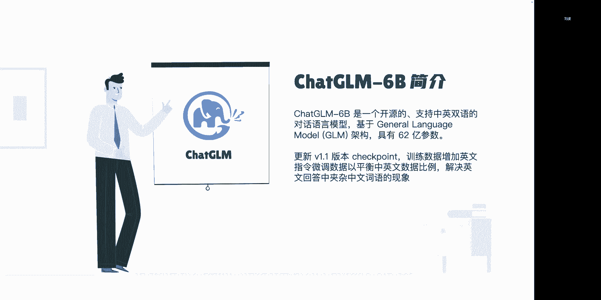

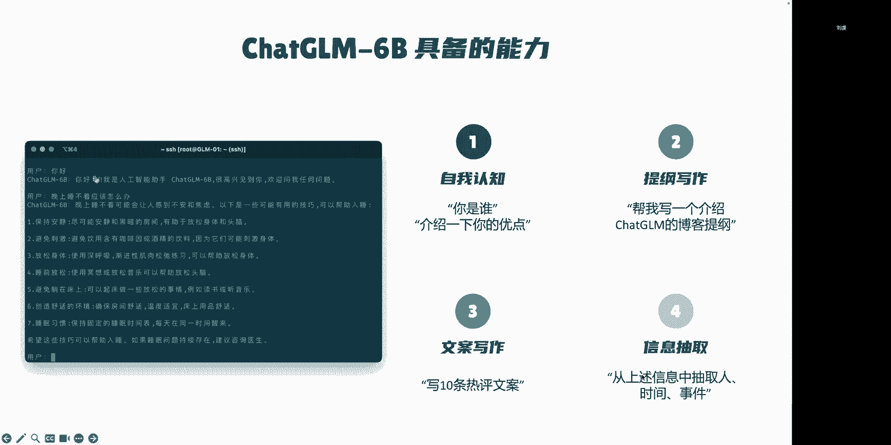

在本节课中，我们将学习ChatGLM与LangChain的基本概念，并深入探讨基于本地知识库进行智能问答的核心原理与实践流程。

## 概述

本次分享将结合ChatGLM和LangChain，介绍如何构建一个基于本地知识库的智能问答应用。内容主要分为三个部分：ChatGLM与LangChain的简介、项目原理与实践、以及问答环节。

## 第一部分：ChatGLM与LangChain简介

首先，我们来了解一下ChatGLM-6B模型。它是一个开源的支持中英双语的对话语言模型，基于GLM架构，具备62亿参数。近期该模型更新至1.1版本，解决了英文回答中夹杂中文词语的现象。

ChatGLM-6B模型具备多种能力，例如：
*   **自我认知**：回答“你是谁”等问题。
*   **提纲写作**：根据主题列出写作提纲。
*   **文案写作**：进行各类文案创作。
*   **信息抽取**：从给定文本中提取关键数据。

然而，在实际应用中，除了通识知识，我们常需要模型处理垂直领域或私有知识。这时通常有两种方法：
1.  **模型微调**：在原有模型基础上，使用特定领域的数据进行进一步训练。适用于任务明确、有足够标记数据的场景。
2.  **提示词工程**：设计自然语言指令来指导模型执行特定任务。适用于需要高精度和明确输出的任务，例如信息抽取。

我们今天介绍的基于本地知识库的应用，就属于提示词工程的范畴。

## 第二部分：LangChain框架与项目原理

上一节我们介绍了提示词工程，本节中我们来看看实现它的一个流行框架——LangChain。

LangChain是一个用于开发由语言模型驱动的应用程序的框架。它的主要功能包括调用语言模型、将不同数据源接入交互，并允许模型与运行环境互动。

LangChain框架包含以下核心组件：
*   **模型**：支持各类语言模型和向量化模型。
*   **提示词**：管理、优化和序列化提示模板。
*   **索引**：连接外部数据与语言模型。
*   **链**：将多个组件组合成序列化的工作流。
*   **代理**：赋予模型使用工具和链的能力，以执行复杂任务。

LangChain适用于多种场景，例如：
*   **文档问答**：基于特定文档回答问题。
*   **个人助理**：基于日历等信息提供行动建议。
*   **查询表格数据**：查询CSV、SQL等结构化数据。
*   **API交互**：让模型获取最新信息。
*   **信息提取**：从文本中提取结构化信息。
*   **文档总结**：对长文档进行内容压缩和总结。

本节课我们将聚焦于**文档问答**场景。

### 基于本地知识库的问答原理

在文档问答中，我们希望实现的效果是：当用户提出一个问题时，系统能从本地文档中检索出相关信息，并将这些信息与问题一起，按照预设的模板组合成最终的提示词，再交给语言模型生成答案。

这个过程可以类比为考试：
*   **直接提问模型**：相当于闭卷考试，依赖模型自身的知识。
*   **基于知识库提问**：相当于开卷考试，模型可以“翻阅”提供的资料（本地文档）来回答问题。

基于单一文档的问答实践通常包含五个步骤：

**1. 加载文档**
将本地文件（如TXT、PDF）读取为文本格式。

**2. 文本拆分**
由于语言模型有输入长度限制，需要将长文本拆分为较短的段落。拆分方式包括：
*   **按字符拆分**：例如按句号、问号划分。
*   **按长度拆分**：例如每500字为一段。
*   **按语义拆分**：使用NLP模型理解语义后进行划分。

**3. 匹配相关文本**
获取用户提问后，在拆分后的文本段落中寻找相关内容。匹配方式有：
*   **字符匹配**：进行精确或模糊的字符串搜索。
*   **语义检索**：将文本转化为向量，在向量空间中进行相似度检索。这种方式能更好地理解语义，支持跨语言检索。

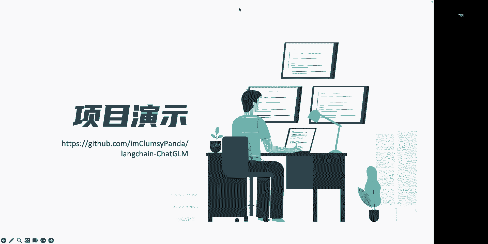

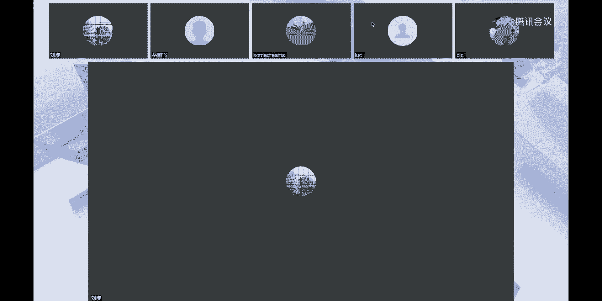

**4. 构建提示词**
将匹配到的相关文本和用户问题，填入预设的提示词模板中。

**5. 生成答案**
将构建好的提示词发送给语言模型，获得基于文档内容的回答。

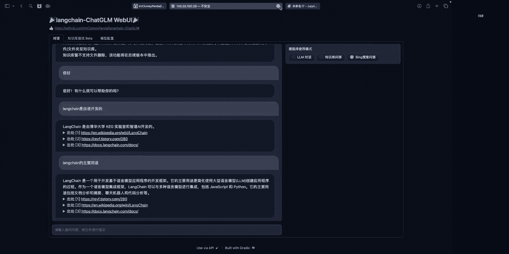

以上是基于单一文件的流程。对于**本地知识库**，我们需要处理多个文档。其核心原理是构建一个**向量数据库**。

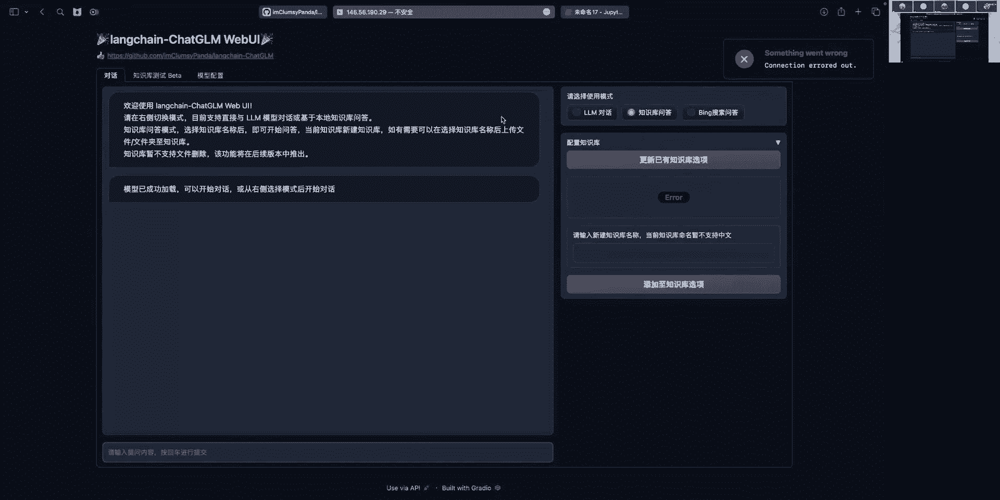

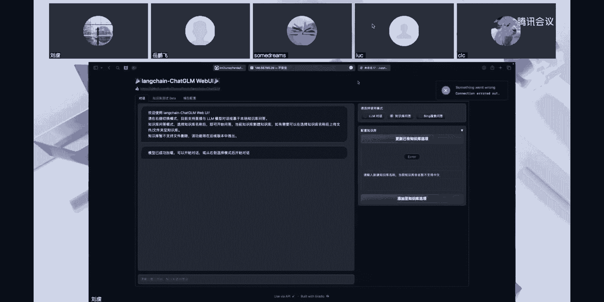

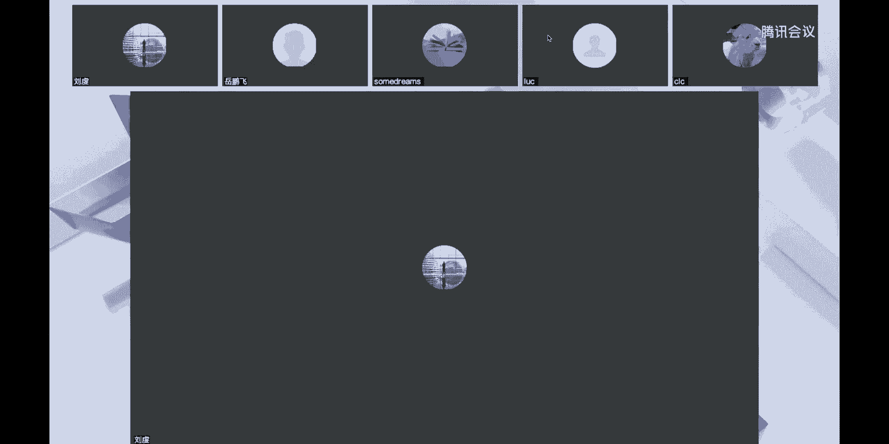

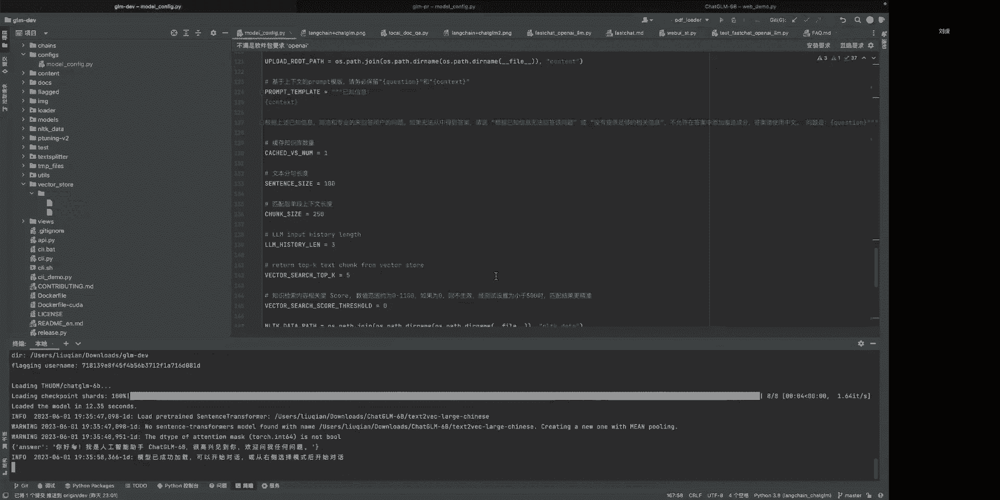

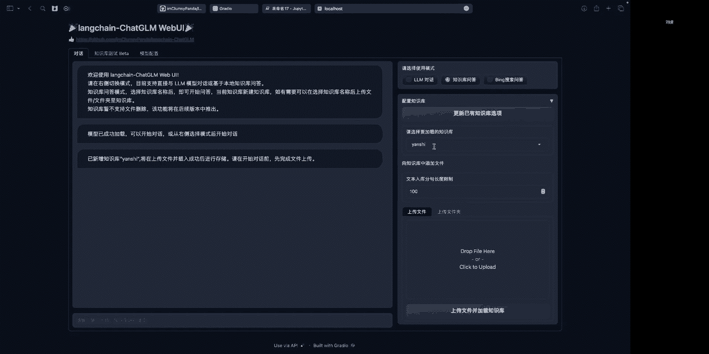

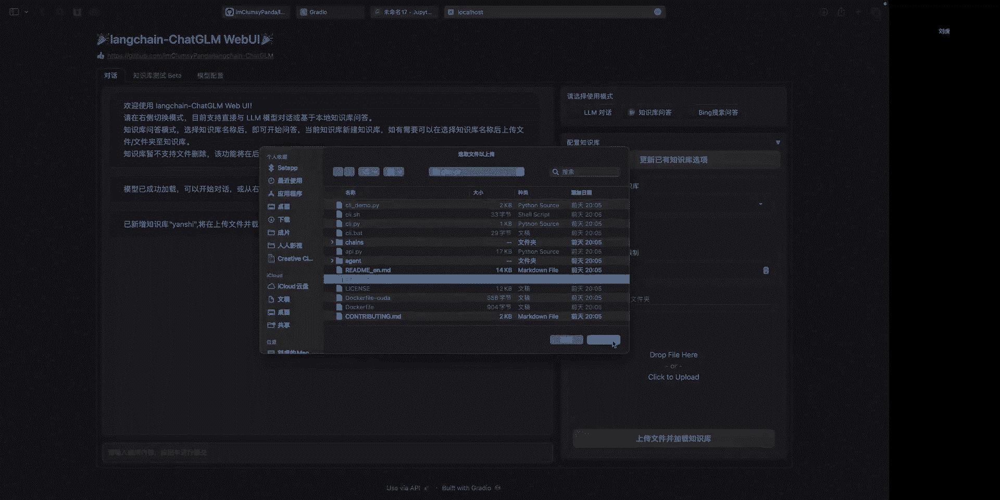

以下是构建和使用向量数据库的完整流程：

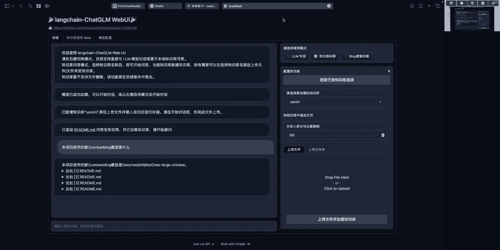


```
1. 加载本地多个文件 -> 2. 文本拆分 -> 3. 段落向量化 -> 4. 存储到向量数据库
5. 用户提问 -> 6. 将问题向量化 -> 7. 在向量库中检索相似段落 -> 8. 构建提示词 -> 9. 模型生成答案
```

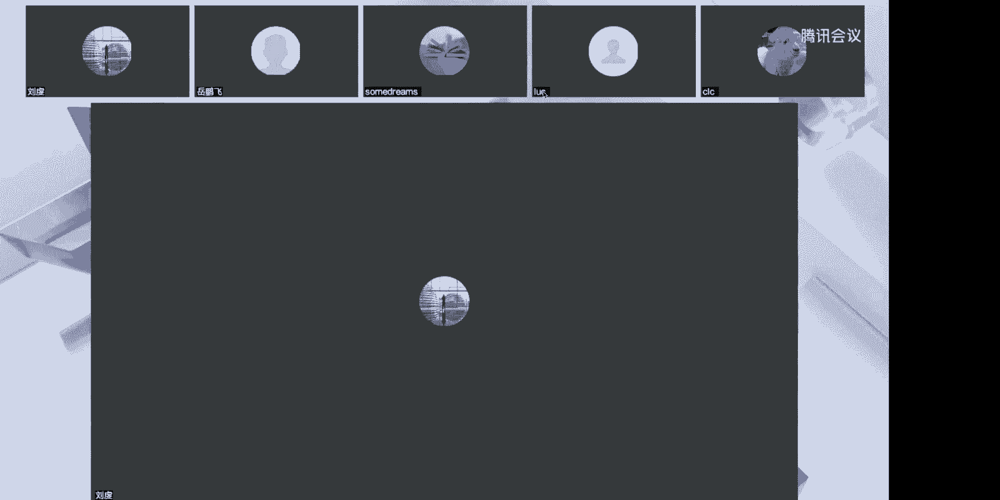

简单来说，就是将文档内容转化为向量并存储。当用户提问时，将问题也转化为向量，然后在向量数据库中查找最相似的文档片段，最后将这些片段作为“已知信息”提供给模型来生成答案。

## 第三部分：代码实践与项目演示

上一节我们介绍了原理，本节中我们通过代码和项目演示来看看具体如何实现。

### 代码流程解析

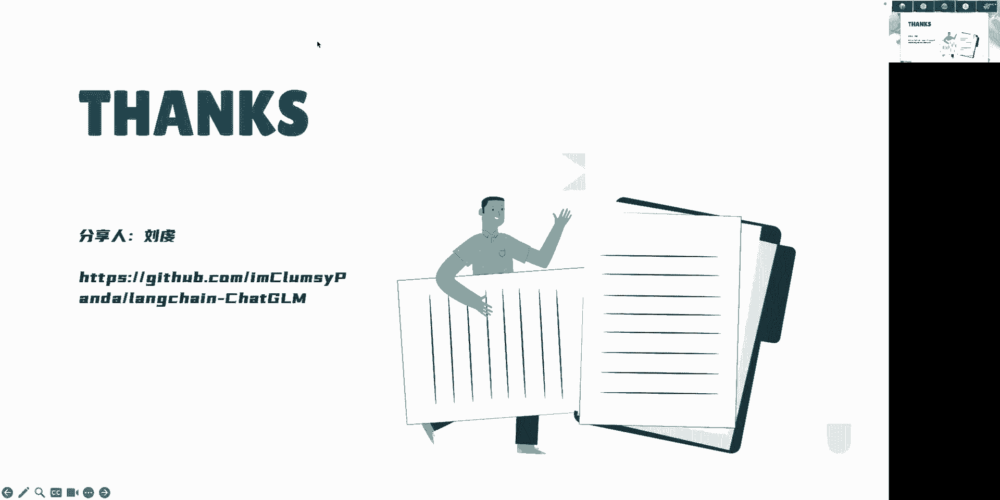

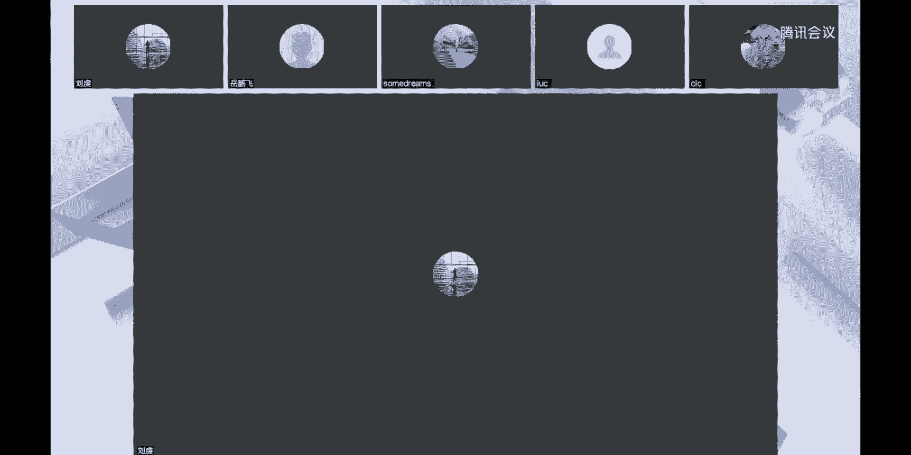


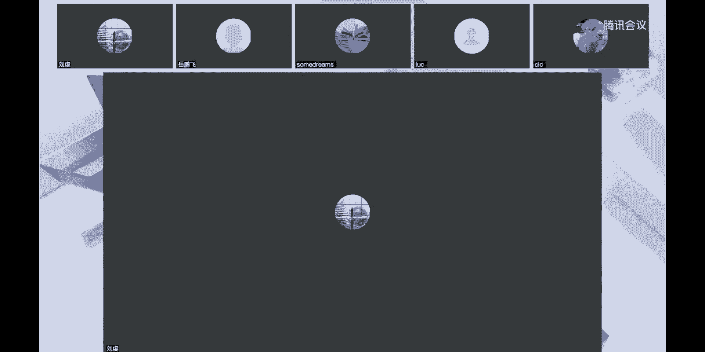

以下是使用LangChain和ChatGLM实现基础文档问答的关键代码步骤：


**1. 初始化大模型**
首先加载ChatGLM-6B模型。
```python
# 示例：初始化ChatGLM模型
from transformers import AutoTokenizer, AutoModel
tokenizer = AutoTokenizer.from_pretrained("THUDM/chatglm-6b", trust_remote_code=True)
model = AutoModel.from_pretrained("THUDM/chatglm-6b", trust_remote_code=True).half().cuda()
```


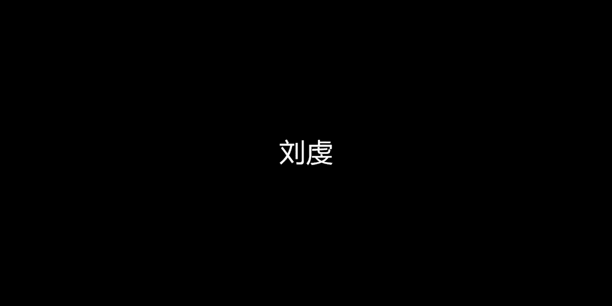

**2. 加载与拆分文档**
使用`DocumentLoader`加载文件，并用`TextSplitter`进行拆分。
```python
from langchain.document_loaders import UnstructuredFileLoader
from langchain.text_splitter import CharacterTextSplitter

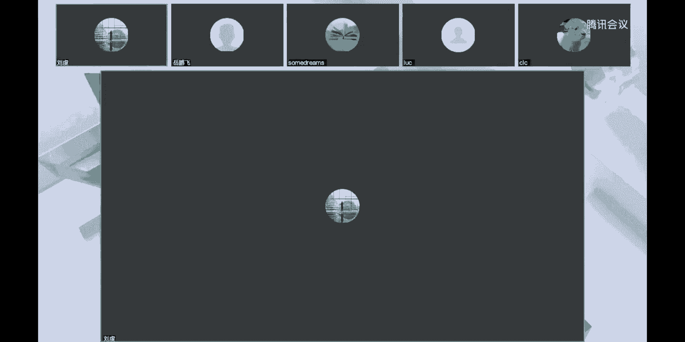

# 加载文档
loader = UnstructuredFileLoader("test.txt")
documents = loader.load()


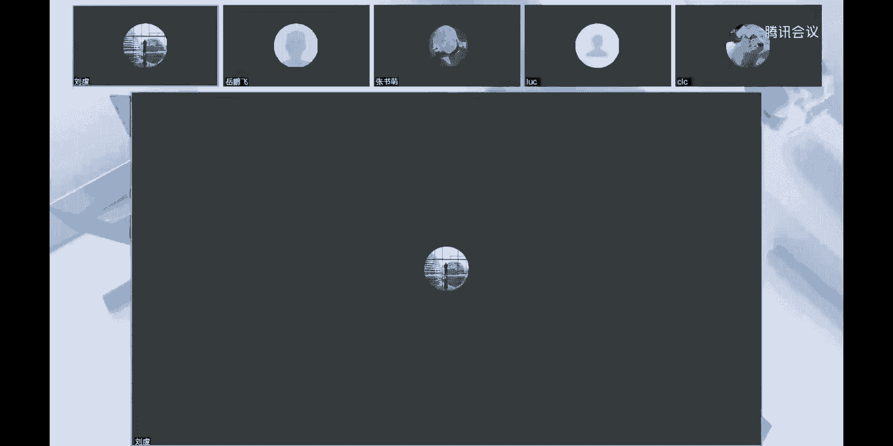


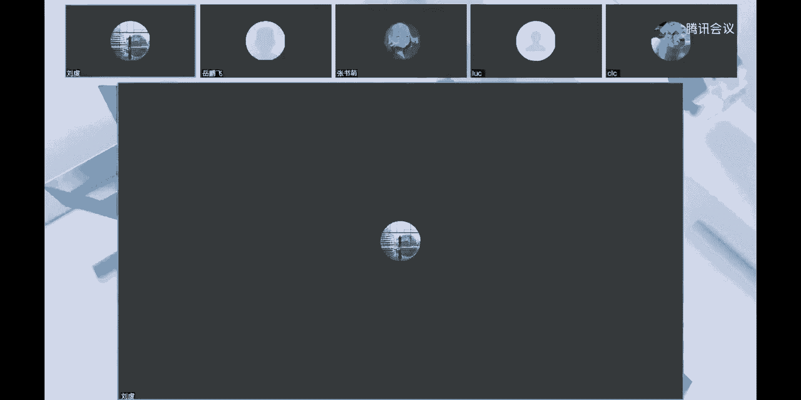

# 拆分文本
text_splitter = CharacterTextSplitter(chunk_size=500, chunk_overlap=200)
split_docs = text_splitter.split_documents(documents)
```
`chunk_overlap`参数用于设置段落间的重叠字符数，以防止完整的句子被切散。


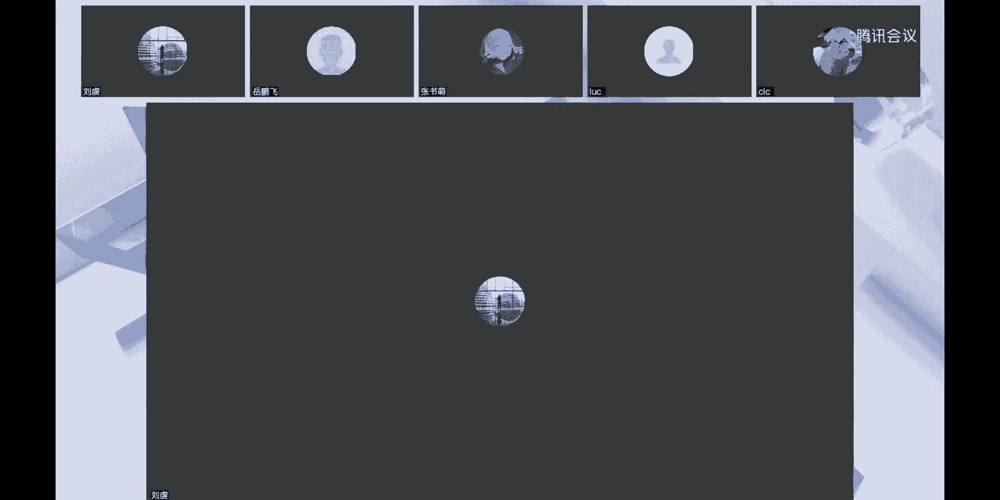


**3. 构建向量数据库**
使用Embedding模型将文本段落向量化，并存储到向量库中。
```python
from langchain.embeddings import OpenAIEmbeddings
from langchain.vectorstores import FAISS

# 加载Embedding模型（此处为OpenAI，实践中可替换为本地模型）
embeddings = OpenAIEmbeddings()
# 从文档创建向量存储
vector_store = FAISS.from_documents(split_docs, embeddings)
```

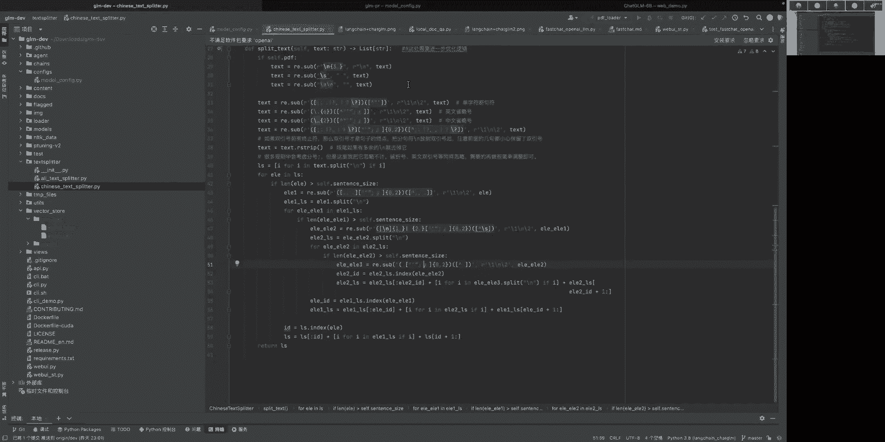

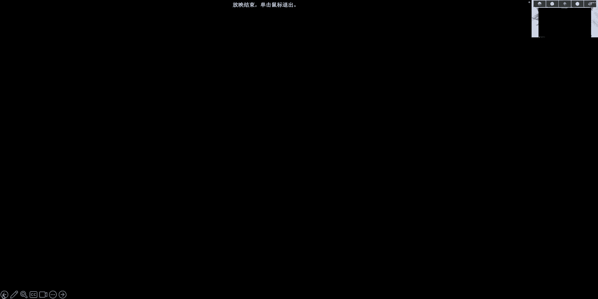

**4. 检索与构建提示词**
用户提问后，在向量库中检索相关段落，并构建最终提示词。
```python
# 检索相关文档
query = "LangChain能够接入哪些数据类型？"
matched_docs = vector_store.similarity_search(query, k=3) # k为返回的相似段落数量

# 构建上下文
context = "\n".join([doc.page_content for doc in matched_docs])

# 构建提示词模板
prompt_template = f"""已知信息：
{context}

根据上述已知信息，回答以下问题：
{query}
"""
```

**5. 调用模型生成答案**
将构建好的提示词发送给ChatGLM模型。
```python
response, history = model.chat(tokenizer, prompt_template, history=[])
print(response)
```

### LangChain-ChatGLM 项目介绍

基于上述原理，我们开发了 **LangChain-ChatGLM** 项目。它是一个基于开源大模型的本地知识库问答应用，特点包括：
*   **离线部署**：依托ChatGLM等开源模型，可完全离线运行。
*   **快速接入**：基于LangChain，能快速接入多种数据源。
*   **中文优化**：针对中文场景优化了文档加载、文本拆分和提示词模板。

项目已支持的文件格式包括：PDF、TXT、Markdown、Docx以及包含文字的JPG/PNG图片（通过OCR识别）。

**项目核心优化点：**
*   **文本拆分**：针对中文标点（句号、问号、叹号）进行分句，并控制每段长度（默认100字符左右），以适应本地Embedding模型。
*   **上下文扩充**：检索到核心句段后，会向上向下扩充相邻句子，以形成语义更完整的段落。
*   **去重与排序**：当检索到多个相关段落时，会对扩充后的内容进行重排和去重，避免信息重复。

## 总结

本节课我们一起学习了以下内容：
1.  **ChatGLM-6B模型**的基本特点及其在提示词工程中的应用。
2.  **LangChain框架**的核心组件及其在文档问答等场景下的作用。
3.  基于**向量数据库**的本地知识库问答系统的完整工作原理，从文档加载、文本拆分、向量化到检索和生成答案。
4.  通过代码示例了解了如何使用LangChain和ChatGLM搭建一个简单的问答流程。
5.  介绍了 **LangChain-ChatGLM** 项目如何对中文场景进行优化，并演示了其Web界面的基本操作。

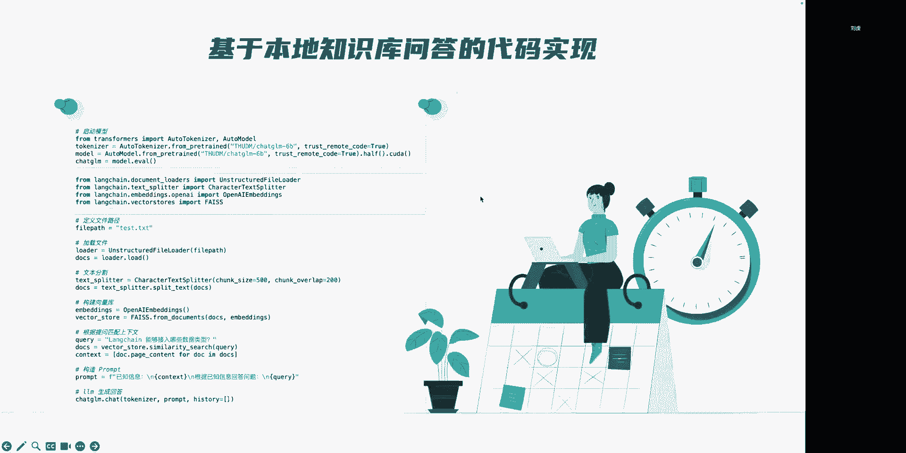

通过本课程，你应该对如何利用ChatGLM和LangChain构建私有知识库问答系统有了一个基本的认识。核心思想是将非结构化的文档知识通过向量化进行管理，从而让大模型能够“有据可依”地回答问题。