# 🚀 官方教程：GLM-4-9B 实战部署和微调 - P1


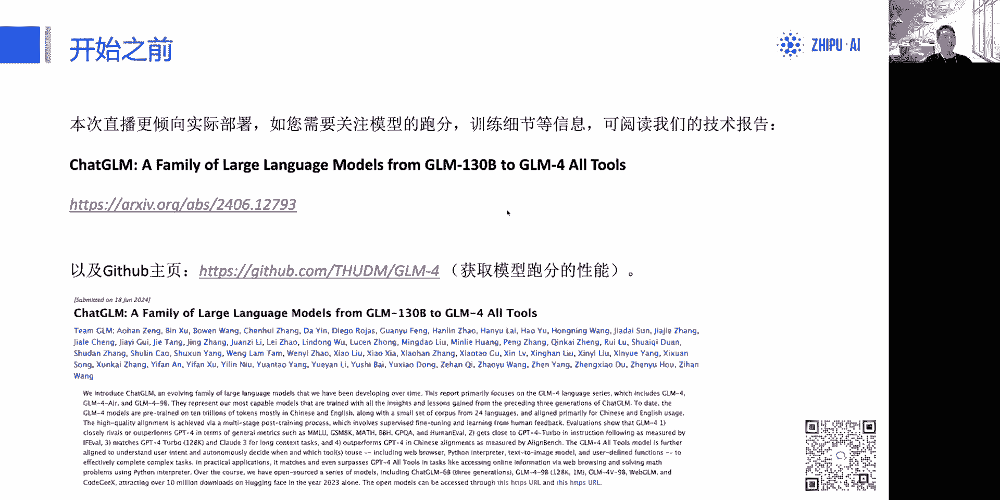


在本节课中，我们将学习如何部署和微调 GLM-4-9B 开源模型。课程内容涵盖模型下载、部署配置、常见问题解决以及微调数据集的构建与训练。

---


## 📥 模型下载与简介

首先，我们需要获取 GLM-4-9B 模型。模型可以从 **ModelScope** 或 **Hugging Face** 平台下载，两个平台的模型权重是同步的。

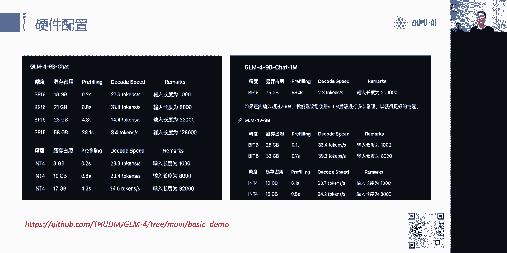

以下是不同模型文件的区别：
*   **glm-4-9b**：这是一个基座模型，不支持对话，上下文长度为 8K。
*   **glm-4-9b-chat** 与 **glm-4-9b-chat-1m**：这两个都是对话模型，具备工具调用能力。前者支持 128K 上下文，后者支持 1M 上下文。
*   **glm-4v-9b**：这是一个视觉问答模型，支持 8K 上下文，在一个对话中仅支持处理一张图像。

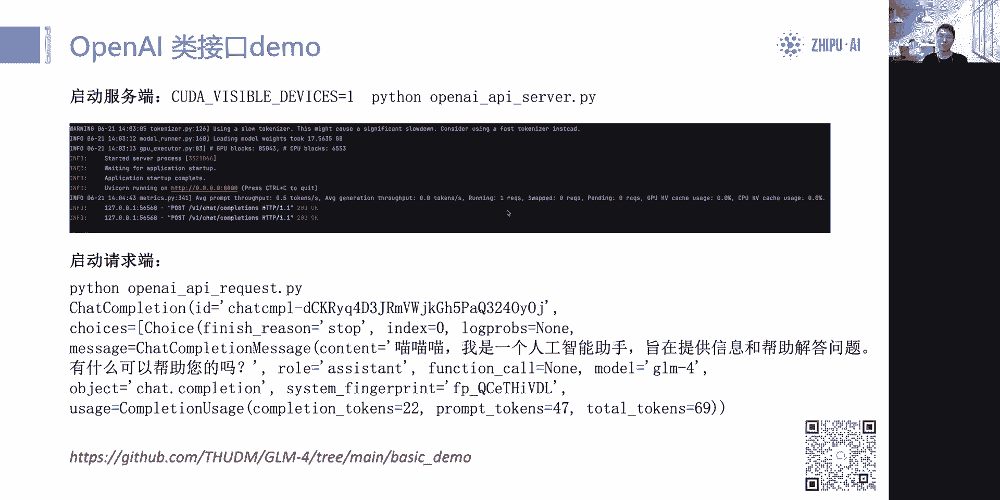

在下载时，请确保使用最新的代码仓库（例如支持 Flash Attention 2 的版本），模型权重本身无需更新。

---

## ⚙️ 模型部署实践

上一节我们介绍了如何下载模型，本节中我们来看看如何进行部署。我们重点推荐使用类 **OpenAI API** 的服务器进行部署，这能极大地方便与 LangChain 等开源框架的集成。

该部署方案基于 **vLLM** 后端，支持流式与非流式输出。以下是部署时需要注意的几个核心点：

1.  **工具调用限制**：在当前的演示中，单次请求仅支持调用一个工具。
2.  **上下文长度设置**：默认设置为 8K 以适配 24G 显存的显卡。如果你的显存更大（如 80G），可以适当调高此值，反之则需调低以防显存溢出。
3.  **微调模型加载**：此演示未直接适配微调后的模型（如 LoRA 权重）。如需加载，请参考 vLLM 官方教程合并权重，并仅修改模型加载部分的代码。
4.  **停止符设置**：为确保模型正常停止生成，必须正确设置停止符。GLM-4-9B 包含三个特殊的停止符 ID：`1511329` (end of text), `1511336` (user), `1511338` (observation)。在官方演示代码中已正确配置。
5.  **推理精度**：强烈推荐使用 **BF16** 精度进行推理。FP16 有极低概率出现问题，而训练/微调时则必须使用 BF16，使用 FP16 会导致损失值变为 NaN（精度溢出）。

部署的核心代码示例如下，展示了如何设置 GPU 内存限制、上下文长度和停止符：


```python
# 设置 vLLM 引擎参数
from vllm import LLM, SamplingParams

llm = LLM(
    model="THUDM/glm-4-9b-chat",
    tensor_parallel_size=1,  # 使用单张 GPU
    gpu_memory_utilization=0.9,  # GPU 显存利用率，可根据需要调整
    max_model_len=8192,  # 最大模型长度，防止显存溢出
    stop_token_ids=[1511329, 1511336, 1511338]  # 设置停止符 ID
)

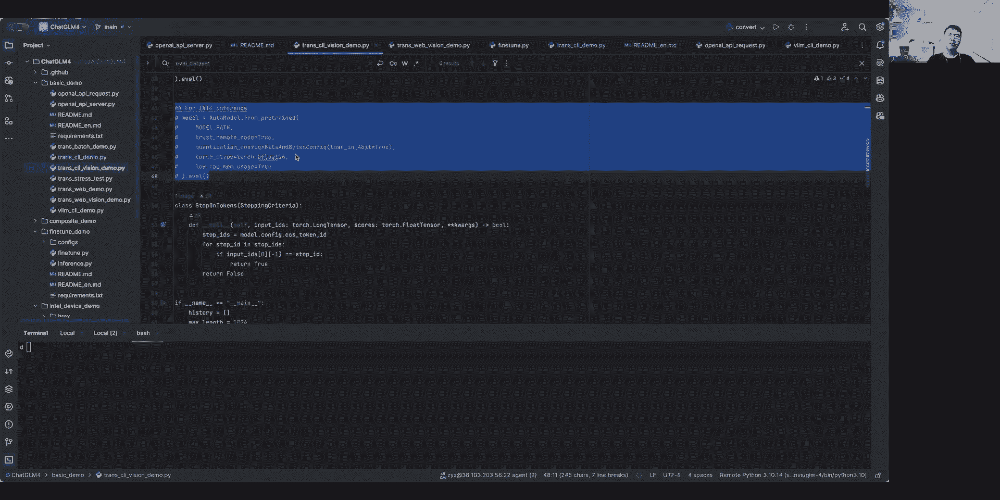

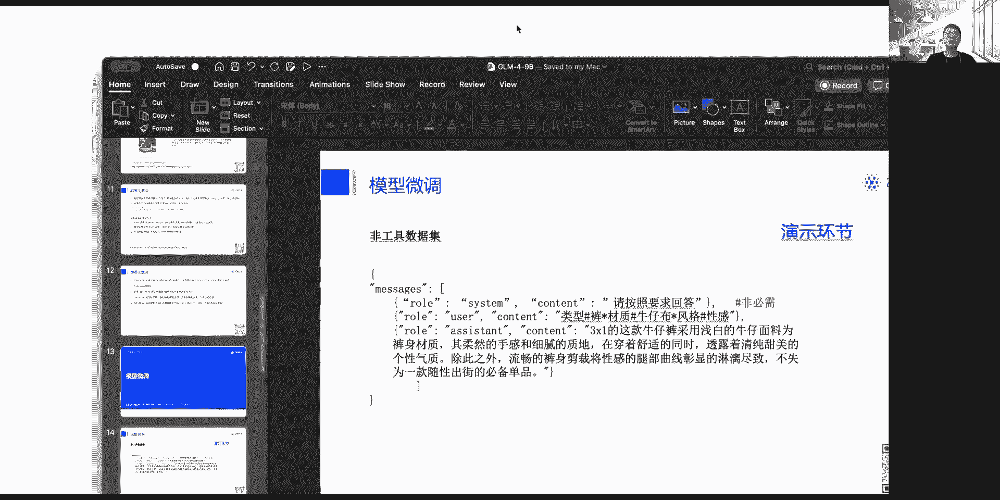

# 启用 Flash Attention 2 (需在 BF16/FP16 下)
# llm = LLM(..., enforce_eager=True, ...) # 通常无需手动设置
```

---

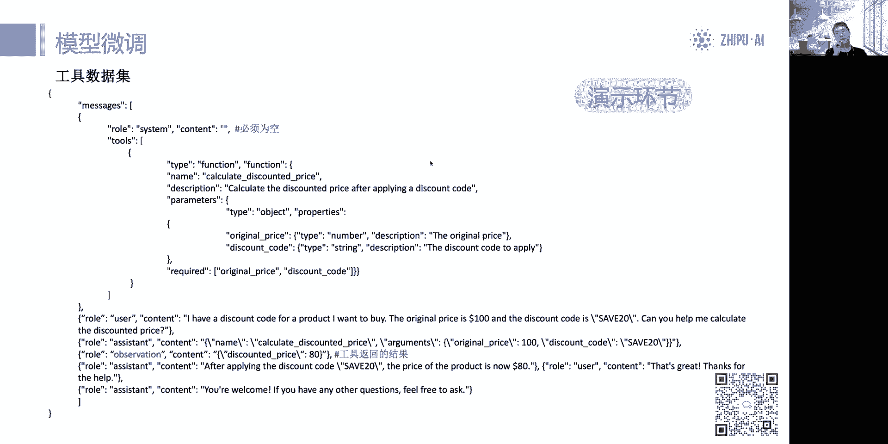

## 🛠️ 模型微调指南

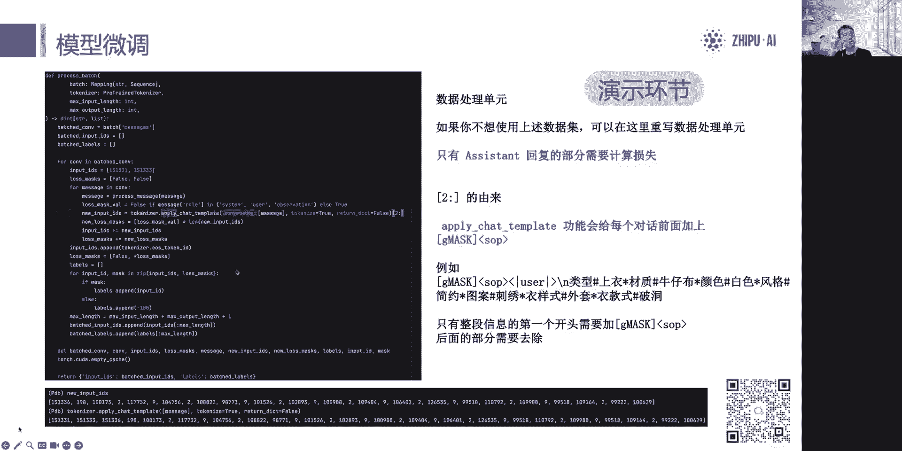

了解了部署后，我们进入模型微调环节。微调的关键在于准备格式正确的数据集。


### 数据集格式

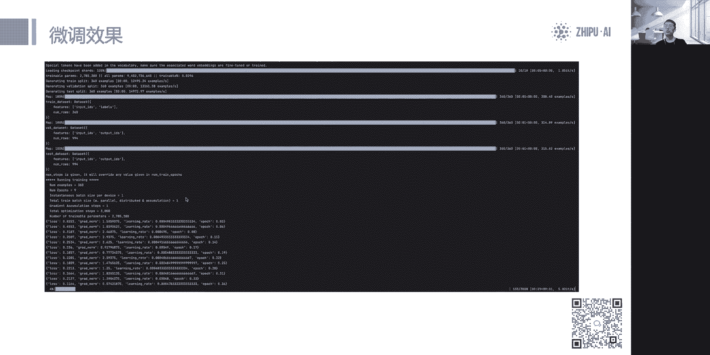

数据集的构建有两种类型：

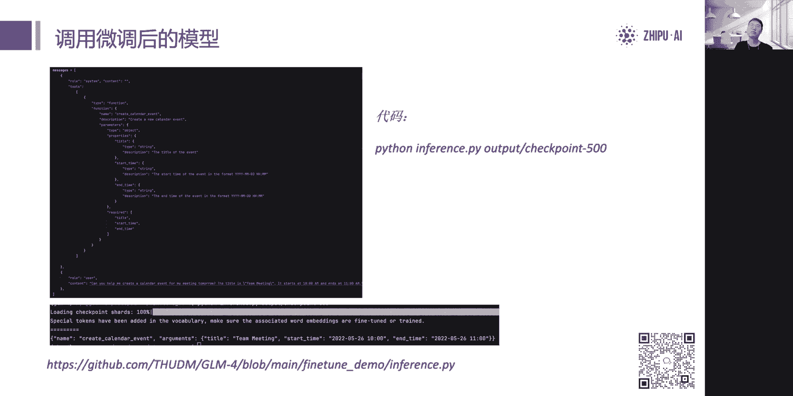

**1. 非工具微调数据集**
格式与 OpenAI 的 `messages` 格式完全一致，角色包括 `system`, `user`, `assistant`。多条这样的对话组成一个 JSONL 文件。

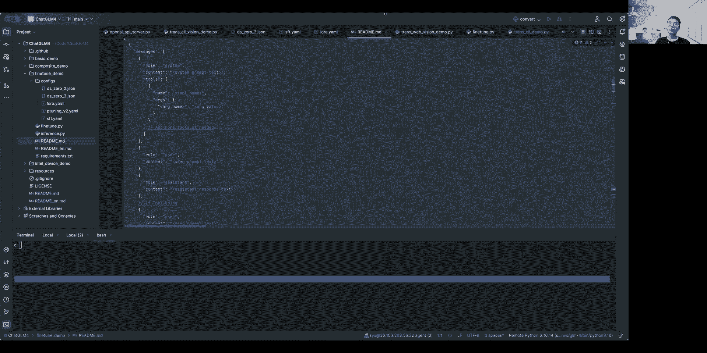

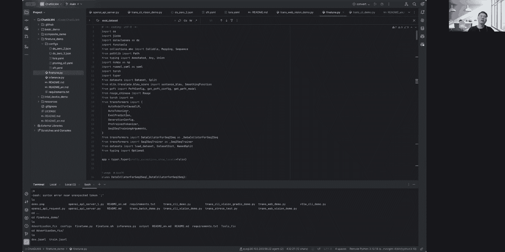

**2. 工具微调数据集**
格式相对复杂，核心结构如下：
*   `system` 的 `content` 必须为空字符串。模型会使用内置的系统提示词来处理工具调用。
*   `tools` 字段描述工具的定义，格式与 OpenAI API 相同。
*   工具执行结果的返回角色是 `observation`，而非 OpenAI 格式中的 `tool`。

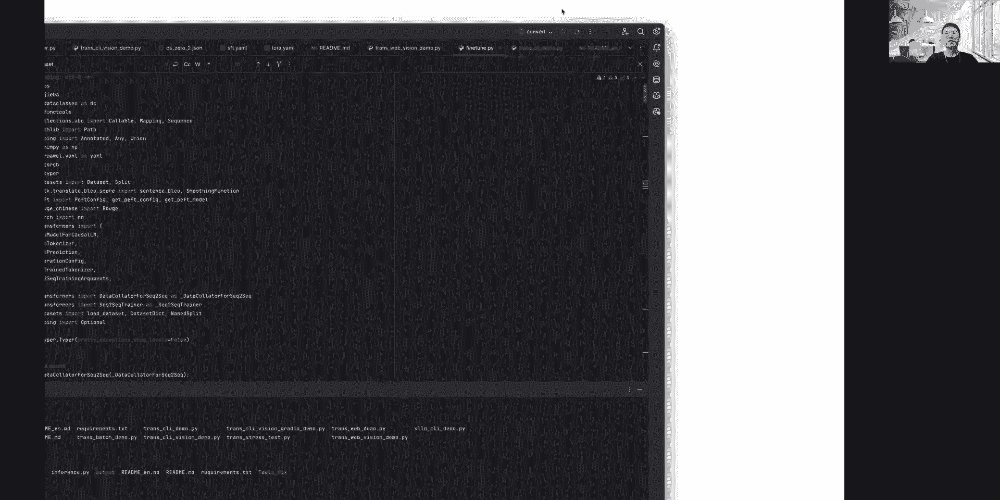

一个最小的工具调用数据单元示例：
```json
{
  "messages": [
    {"role": "system", "content": ""},
    {"role": "user", "content": "查询北京今天的天气。"},
    {"role": "assistant", "content": null, "tool_calls": [{"function": {"name": "get_weather", "arguments": {"city": "北京"}}}]},
    {"role": "observation", "content": "{\"weather\": \"晴朗\", \"temperature\": 22}"},
    {"role": "assistant", "content": "北京今天天气晴朗，气温22摄氏度。"}
  ],
  "tools": [
    {
      "type": "function",
      "function": {
        "name": "get_weather",
        "description": "获取指定城市的天气信息",
        "parameters": {...}
      }
    }
  ]
}
```

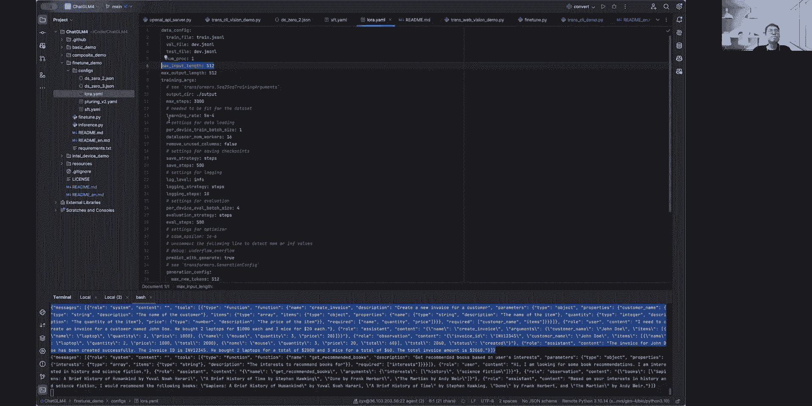

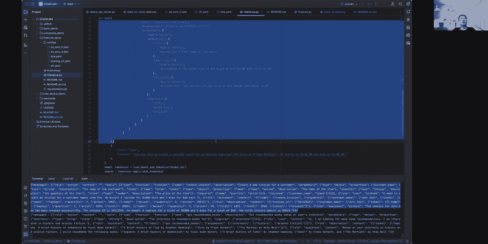

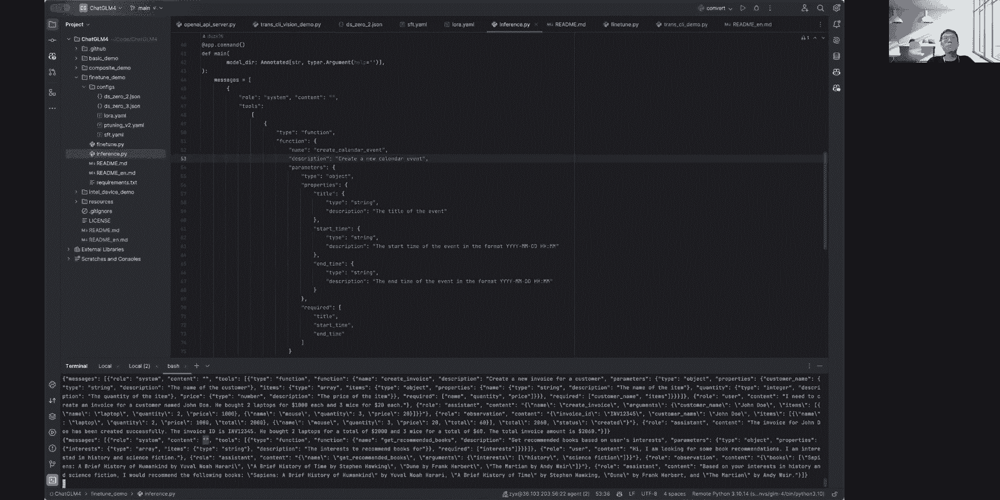

### 数据处理与训练

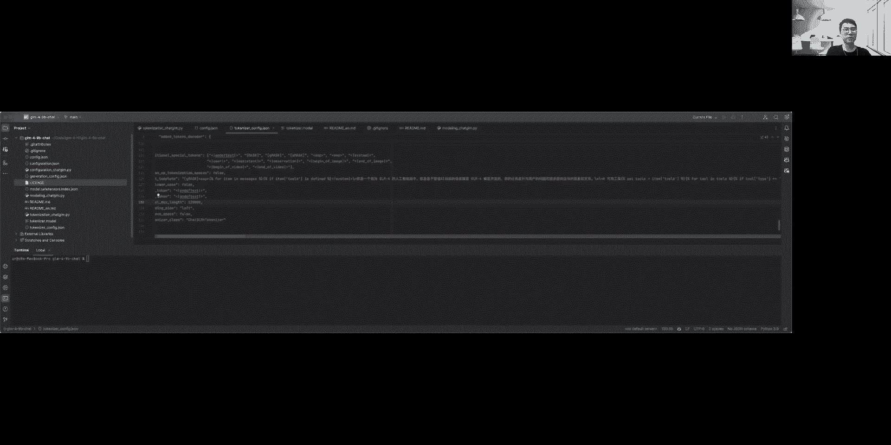

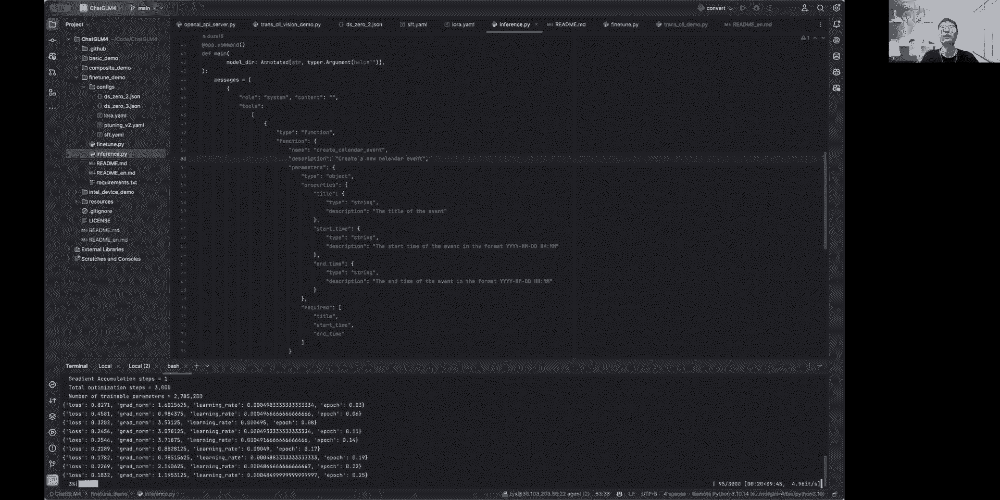

我们的代码库提供了完整的数据处理和训练脚本。数据处理的核心是 `apply_chat_template` 方法，它会为每条消息添加特殊的起始符（如 `1511331`, `1511333`），并正确设置损失掩码（不计算损失的部分标签设为 `-100`）。

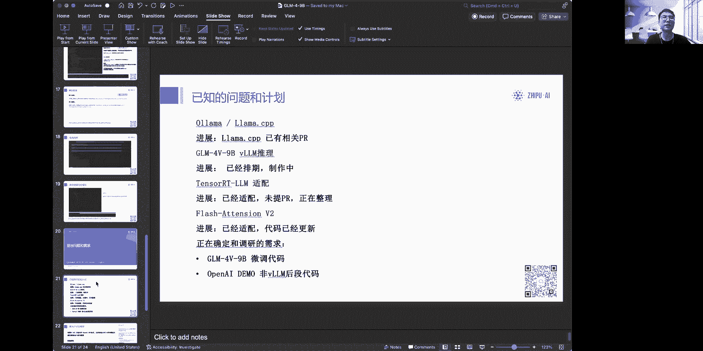

训练启动非常简单。以下是单卡启动 LoRA 微调的示例命令：
```bash
CUDA_VISIBLE_DEVICES=0 python src/train_bash.py \
    --dataset_dir /path/to/your/data \  # 数据集路径
    --model_name_or_path THUDM/glm-4-9b-chat \  # 基础模型路径
    --stage sft \  # 训练阶段
    --do_train \
    --finetuning_type lora \  # 微调类型
    --output_dir /path/to/save/output \  # 输出目录
    --overwrite_cache \
    --per_device_train_batch_size 4 \
    --gradient_accumulation_steps 4 \
    --lr_scheduler_type cosine \
    --logging_steps 10 \
    --save_steps 1000 \
    --learning_rate 5e-5 \
    --num_train_epochs 3.0 \
    --plot_loss \
    --fp16  # 注意：此处应为 bf16，示例命令可能需调整
```

训练完成后，可以使用提供的推理脚本加载微调后的模型进行检查。

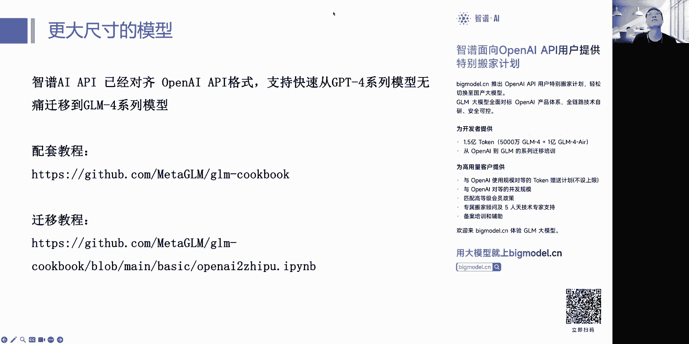


---

## 📝 总结与答疑

本节课中我们一起学习了 GLM-4-9B 模型的下载、部署和微调全流程。

**核心要点总结：**
1.  **部署**：推荐使用类 OpenAI API 的服务器，便于集成，需注意停止符、上下文长度和推理精度的设置。
2.  **微调**：严格按照指定格式准备数据集，工具微调时 `system` 内容需留空。代码库提供了开箱即用的训练脚本。
3.  **硬件**：请根据模型类型和上下文长度需求评估显存。例如，GLM-4V-9B 需按 13B-14B 量级的模型来估算显存。

**常见问题与未来计划：**
*   **已知问题**：正在适配 Ollama、llama.cpp、TensorRT-LLM 等推理框架。
*   **未来计划**：将推出支持 Windows 的 OpenAI 格式演示，并持续优化多模态模型微调等。

如果在实践过程中遇到问题，欢迎在项目的 GitHub Issue 中提出，我们会尽快响应和处理。

---

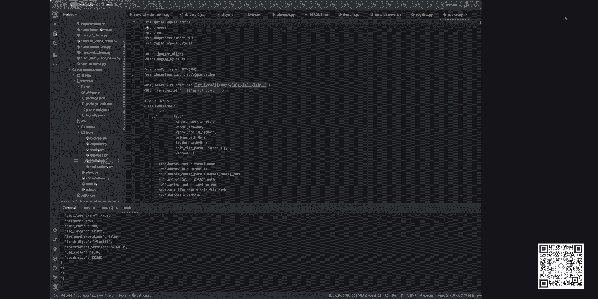

本节课到此结束。希望这份教程能帮助你顺利开始使用 GLM-4-9B 模型。