# 课程 P1：智谱AI新一代视频生成模型 CogVideoX 🎬

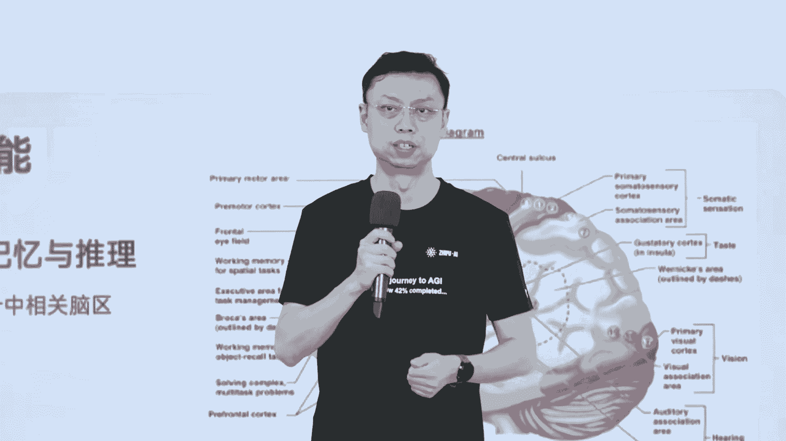

在本节课中，我们将学习智谱AI发布的新一代生成式视频模型 **CogVideoX** 及其核心应用 **“清影”**。我们将探讨其技术特点、背后的多模态理念，并了解如何实际使用它来生成视频。

## 概述：为什么需要多模态大模型？🧠

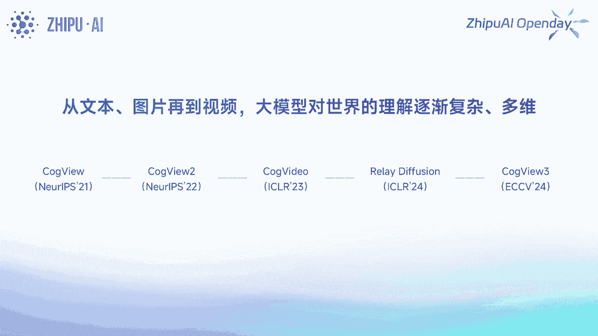

上一节我们介绍了课程主题，本节中我们来看看多模态大模型的重要性。人类大脑是一个复杂系统，其认知功能通过各脑区相互配合完成，不仅包括文字语言，还包括视觉理解、听觉等。因此，多模态的感知和理解与认知能力的发展有非常密切的关系。

作为一家以AGI为目标的人工智能公司，智谱AI一直非常重视多模态技术。物理学大师费曼曾说过：“不创造一个东西就不会理解一个东西。”这句话非常适合用来形容智谱在多模态领域的观点。从文字、图像到视频内容，这既是一个模态逐渐丰富的过程，也是一个大模型对世界的理解逐渐复杂化、多维化的过程。

智谱的团队从2021年开始布局文生图和文生视频模型，先后研发了 **CogView**、**CogVideo**、**Relay Diffusion** 等多个模型。

## 技术演进：从 CogView 到 CogVideoX 🚀

上一节我们探讨了多模态的重要性，本节中我们来看看智谱AI在多模态领域的技术发展路径。

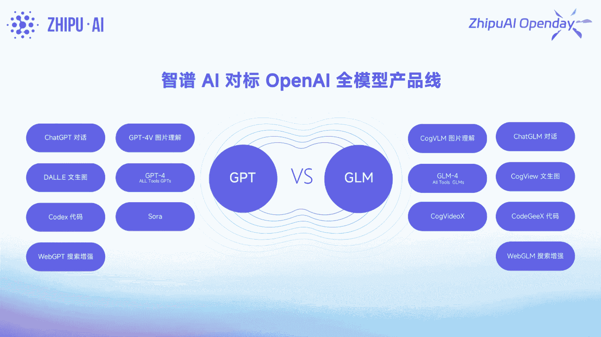

第一代的 **CogView** 使用了单向的Transformer结构，对成对的文本和图像进行了深层次的预训练。它在2021年发布时，在所有指标上都超过了OpenAI同期推出的DALL·E模型。而最新的 **CogView3** 的性能也与 **DALL·E 3** 旗鼓相当。

今天，我们很高兴向大家汇报在多模态领域的又一阶段性成果：全新升级的生成式视频模型 **CogVideoX**。

## CogVideoX 的核心技术特点 ⚙️

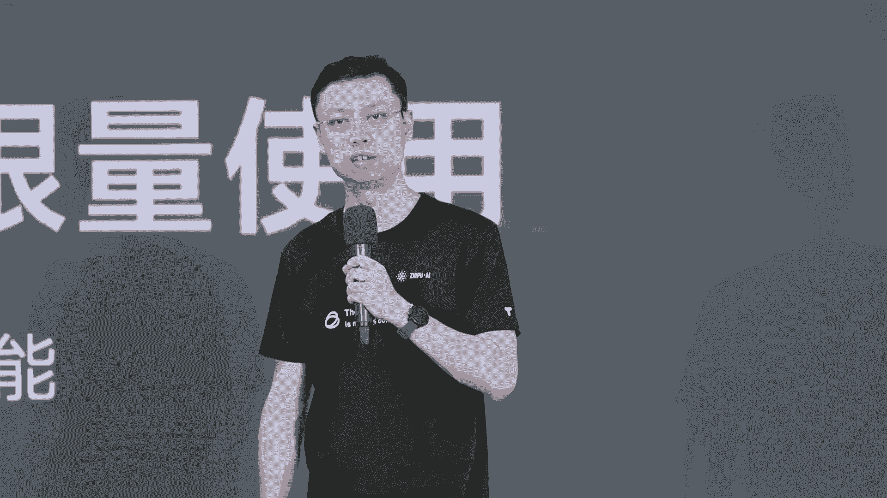

上一节我们回顾了技术演进，本节中我们将深入剖析CogVideoX的几个关键技术突破。

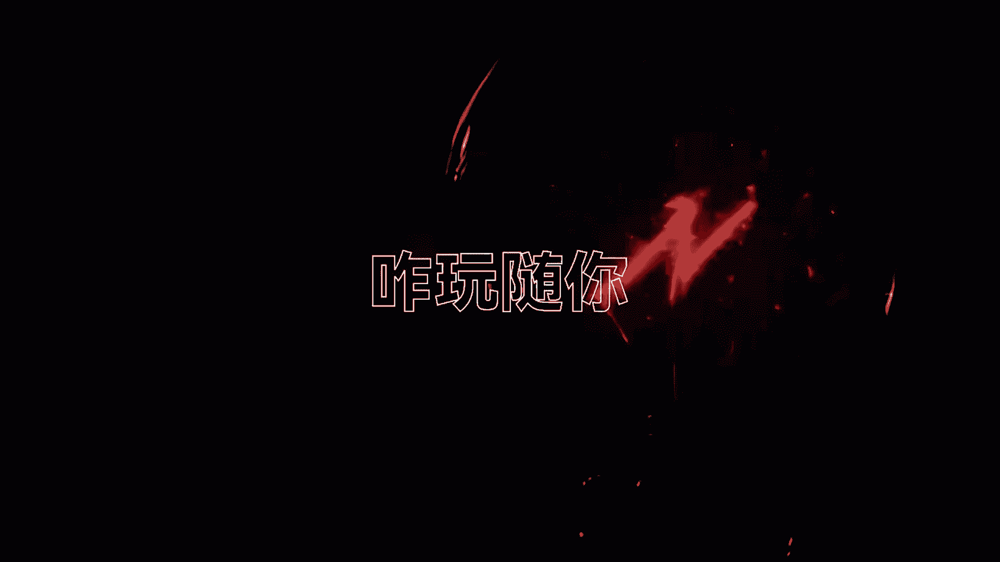

以下是CogVideoX的主要技术特点：

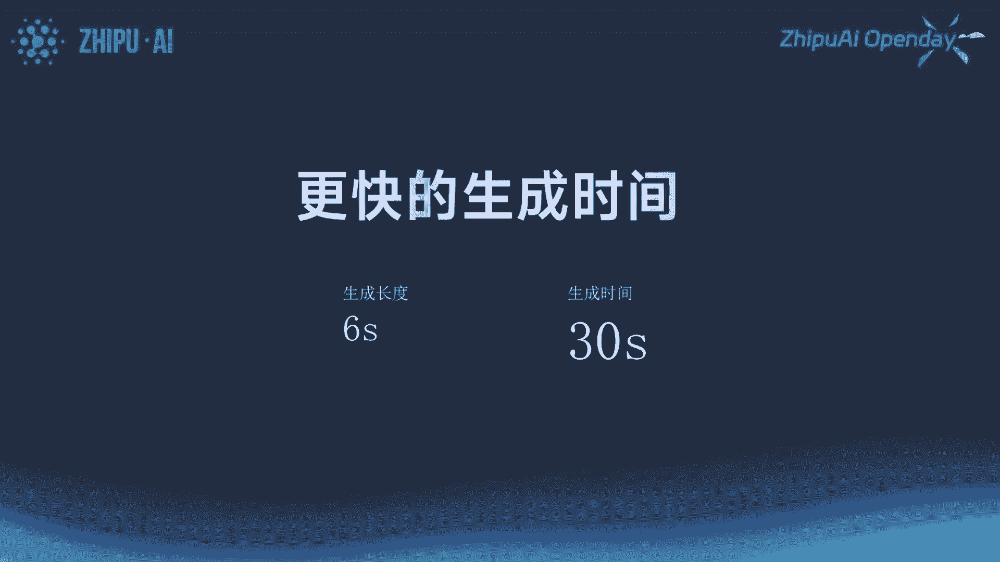

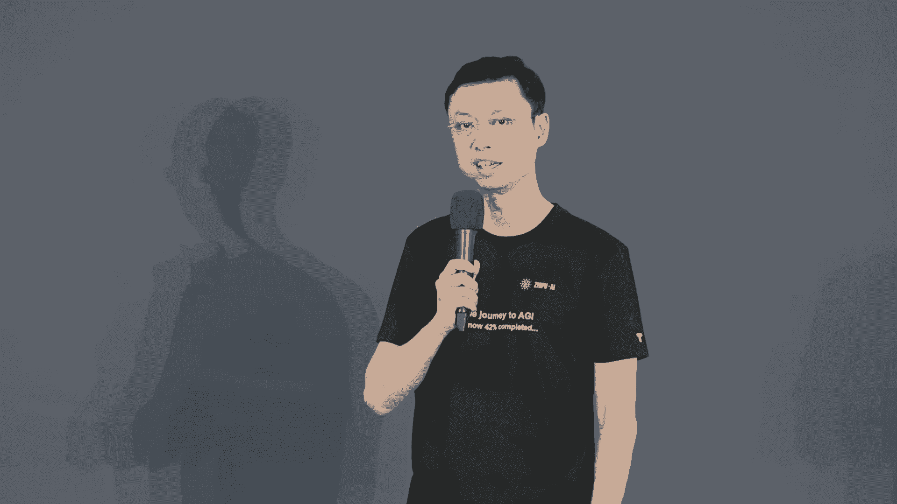

1.  **高效三维视频压缩与长程依赖建模**
    为了解决内容连贯性的问题，智谱自研了一个高效的三维变分自编码器结构，称为 **3D-VAE**。该结构能将原始视频空间压缩至原大小的2%，大大减少了视频扩散生成模型的训练成本和难度。配合上 **3D RoPE** 位置编码模块，更有利于在时间维度上捕捉帧间关系，建立起视频中的长程依赖。

2.  **强大的指令遵循与可控性**
    智谱自研了一个端到端的视频理解模型，用于为海量的视频数据生成详细且贴合内容的描述文本。这样可以增强模型的文本理解和指令遵循能力，使得生成的视频更符合用户的输入，能够理解超长、超复杂的Prompt指令。

3.  **创新的多模态融合架构**
    模型采用了将文本、时间、空间三个维度全部融合起来的Transformer架构。它摒弃了传统的Cross-Attention模块，并设计了 **Expert Block** 来将文本和视频两个不同模态的空间进行对齐，以及进行更好的模态交互。

当然，这个技术的研发过程本身充满各种挑战和难度。但今天，智谱又一次验证了 **Scaling Law** 在视频生成方面的有效性。未来，智谱会在继续扩大数据规模和模型规模的同时，探究更具突破性创新的新型模型架构，更高效地压缩视频信息，更充分地融合文本和视频内容。

## 产品发布：AI视频生成功能“清影”正式上线 🎉

上一节我们了解了核心技术，本节中我们来看看这些技术如何转化为用户可用的产品。

俗话说，百闻不如一见。从此刻开始，**“清影”** 视频生成功能在智谱清言的PC、APP端以及小程序端全面正式上线。所有用户都能通过清言APP，免费体验AI文生视频、图生视频的能力。

这就是智谱AI的风格：全量上线，不限量使用。

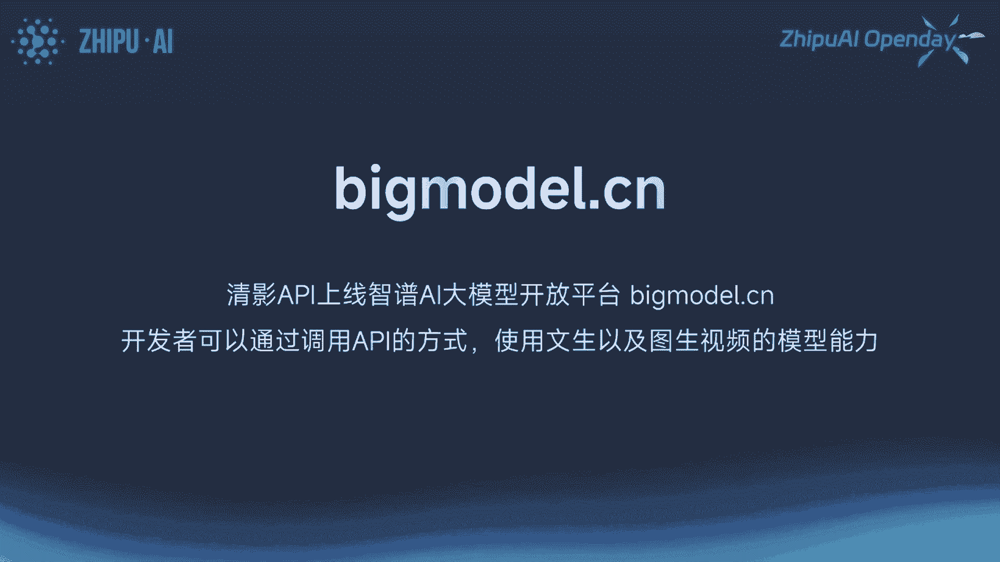

无论是没有视频制作基础的普通用户，还是专业的视频内容创作者，大家现在就可以在PC端和移动端进行体验。

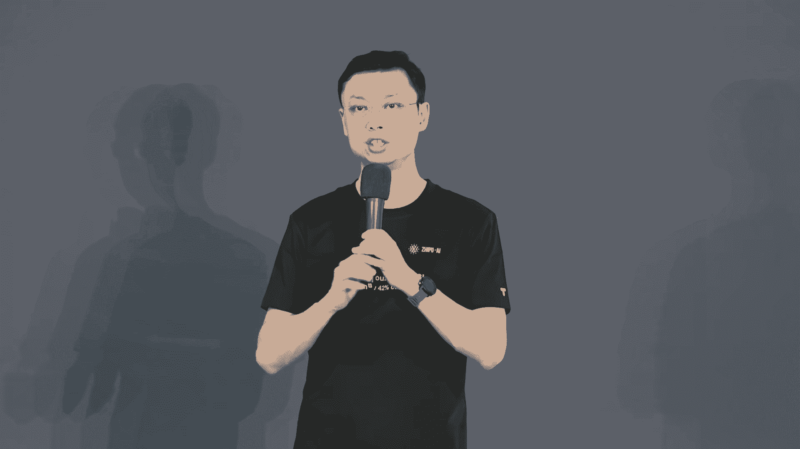

## “清影”功能特点与演示 🎬

上一节我们宣布了产品上线，本节中我们通过具体演示来看看“清影”的几个突出特点。

以下是“清影”的几个核心特点：

1.  **生成速度快**
    理论上，清影每生成6秒的视频，只需要花费约30秒的时间。现场演示了输入Prompt“写实地描绘近距离猎豹卧在地上睡觉，身体微微的起伏”，模型在短时间内就生成了符合描述的视频。

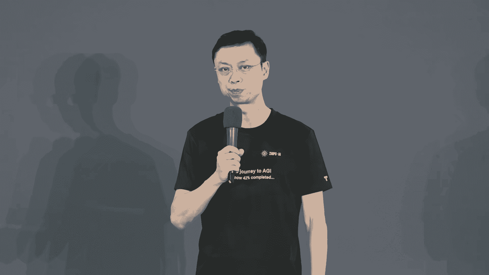

2.  **支持多种输入方式**
    除了用文字作为Prompt输入生成视频，还可以利用图片作为输入来生成动态视频。现场演示了输入一张花的图片，模型生成了花朵在几秒钟内盛开的逼真场景。

3.  **优秀的指令遵循能力**
    基于强大的技术，清影能够很好地理解并执行复杂的Prompt指令。例如，对于描述“赛博朋克城市夜景中，机械小猴子用高科技设备维修……”的长Prompt，生成的视频对所有描述元素都进行了很好的呈现。

4.  **良好的内容连贯性**
    基于自研技术，生成的视频可以较好地还原物理世界中的运动过程。例如，让古画中的杜甫自然地端起一杯咖啡。

5.  **支持大幅度的画面调度**
    生成的视频可以实现流畅的镜头移动，例如镜头跟随三只狗移动，效果如同真人跟拍。

当然，今天的生成式视频模型才刚刚起步，整体还有很大的进步空间。但我们已经收到了来自电商广告、影视特效等众多产业场景的实际需求。

## 开放生态：面向开发者与企业 🏢

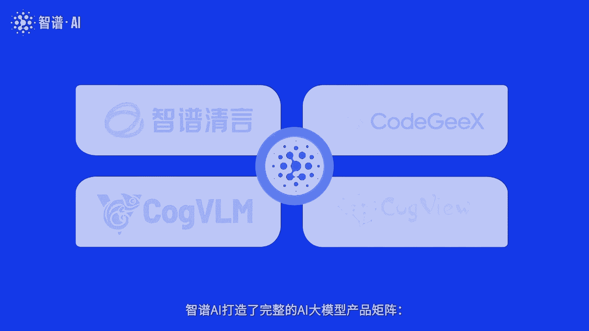

上一节我们展示了C端产品的特点，本节中我们来看看面向开发者和企业的开放能力。

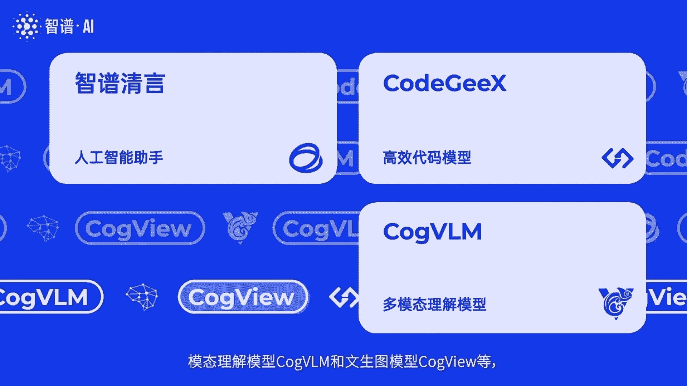

除了面向普通用户的“清影”，智谱AI同样在大模型开放平台 **bigmodel.cn** 上上线了生成式视频模型的API。企业和开发者可以通过调用API的方式，体验并使用 **CogVideoX** 的文生视频以及图生视频能力。这在国内尚属首次。

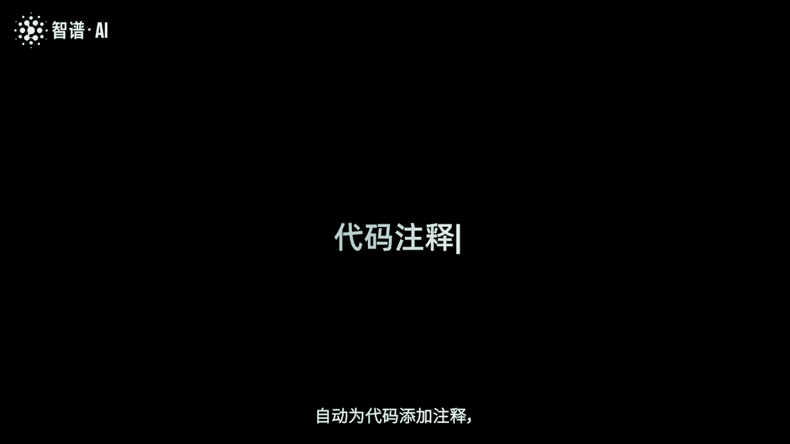

近期，我们也邀请了部分第三方创作者提前内测模型能力，并看到了许多优秀的创作作品。

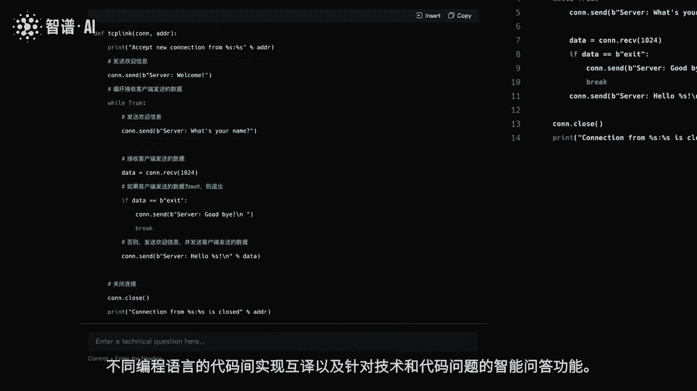

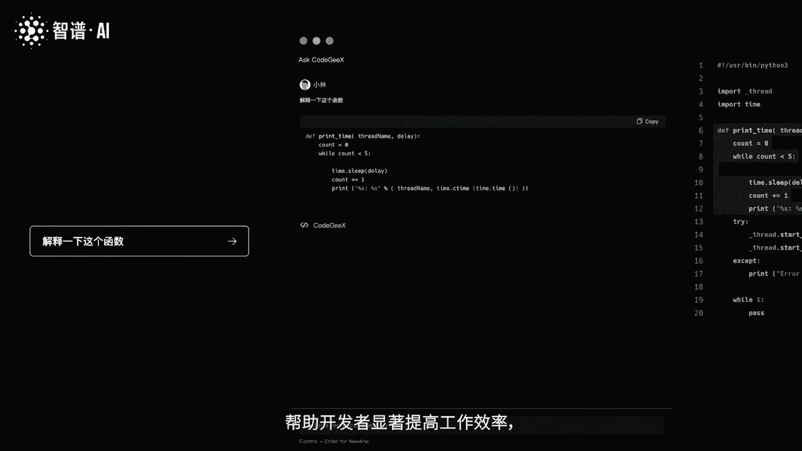

## 未来展望与总结 🌟

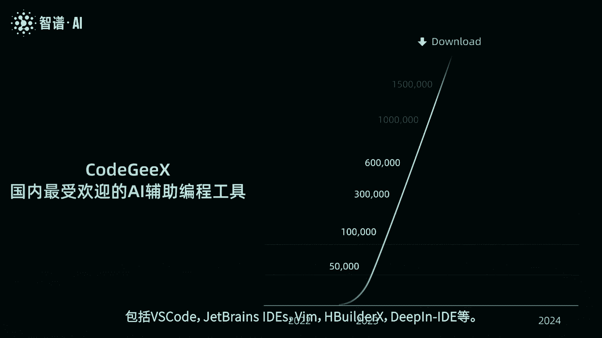

在本节课中，我们一起学习了智谱AI新一代视频生成模型 **CogVideoX** 及其产品“清影”。

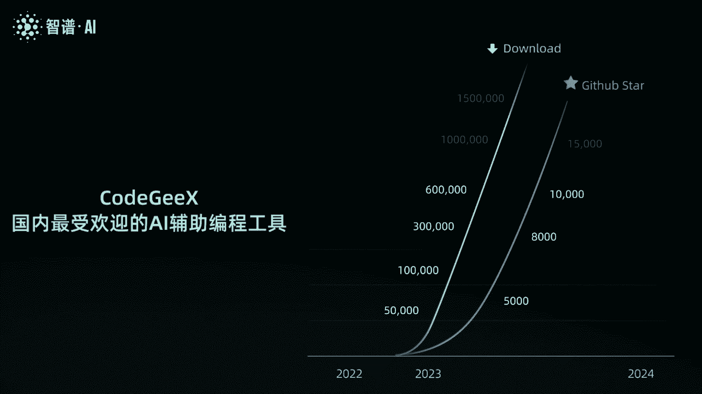

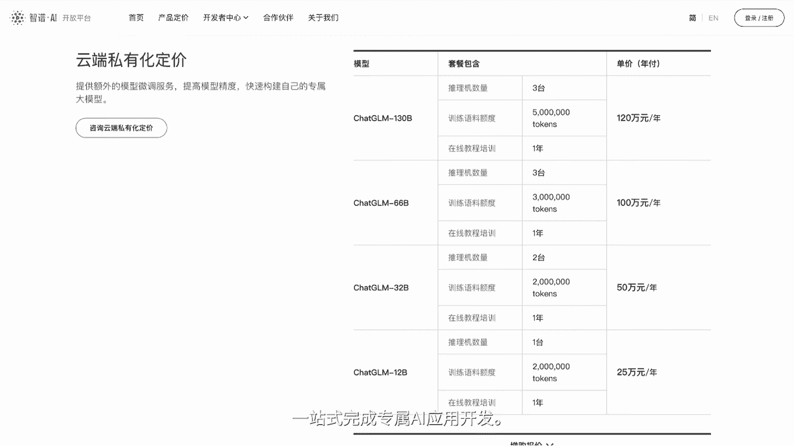

我们首先探讨了多模态大模型对于实现通用人工智能（AGI）的重要性。接着，回顾了智谱从 **CogView** 到 **CogVideoX** 的技术演进路径。然后，深入剖析了 **CogVideoX** 在视频压缩（**3D-VAE**）、指令遵循和模态融合架构（**Expert Block**）等方面的核心技术突破。

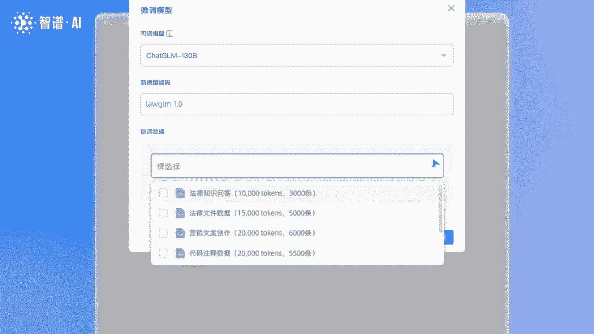

我们看到，这些技术最终落地为面向广大用户的“清影”产品，它具备生成速度快、指令理解强、画面连贯性好等特点，并支持文生视频和图生视频。同时，智谱也通过开放平台将能力提供给开发者和企业，构建更丰富的应用生态。

随着“清影”功能的加入，智谱清言已成为市场上少有的集对话、代码、智能体、生成式图片和视频于一体的全功能AI智能助手。未来，我们将继续迭代，推出更高分辨率、更长时长的生成式视频功能。

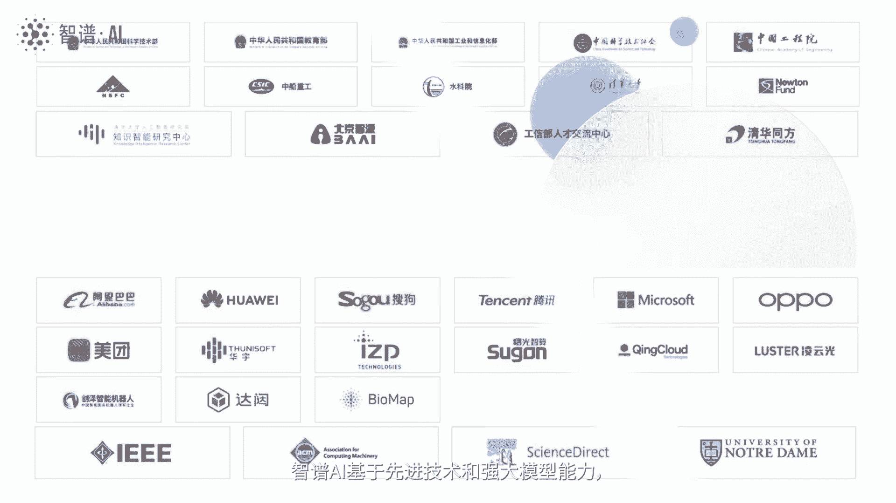

人工智能行业对多模态模型的探索还处于初级阶段，**CogVideoX** 还将不断迭代。智谱AI会继续努力，为大家提供更好的模型和产品。